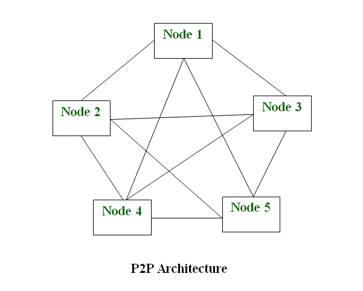

# 什么是 P2P(对等进程)？

> 原文:[https://www . geeksforgeeks . org/what-is-p2ppeer 对等进程/](https://www.geeksforgeeks.org/what-is-p2ppeer-to-peer-process/)

对等网络是简单的计算机网络。它最早出现在 20 世纪 70 年代末。这里，每台计算机都充当形成的网络中文件共享的节点。这里，每个节点都充当服务器，因此网络没有中央服务器。这允许共享大量数据。任务在节点间平均分配。网络中连接的每个节点共享相同的工作负载。要使网络停止工作，所有节点都需要单独停止工作。这是因为每个节点都独立工作。

**P2P 网络历史:**
在 P2P 发展之前，1979 年就有了 USENET。网络使用户能够阅读和发布信息。与我们今天使用的论坛不同，它没有中央服务器。它用于将新消息复制到节点的所有服务器。在此之后，Napster 被开发出来，这是一个文件共享 P2P 软件。它也可以用来共享音频文件。由于非法共享文件，该软件被关闭。但是网络共享的概念，即 P2P 变得流行起来。

**P2P 网络类型:**

1.  **非结构化 P2P 网络–**
    在这种类型的 P2P 网络中，每个设备都能够做出同等的贡献。该网络易于构建，因为设备可以在网络中随机连接。但是由于缺乏结构，很难找到内容。
2.  **结构化 P2P 网络–**
    它是使用创建虚拟层的软件设计的，以便将节点放在特定的结构中。这些不容易设置，但可以让用户轻松访问内容。
3.  **混合 P2P 网络–**
    它结合了 P2P 网络和客户端-服务器架构的特点。这种网络的一个例子是使用中央服务器查找节点。

**P2P 网络特点:**
这些网络不涉及大量节点，通常少于 12 个。网络中的所有计算机都存储自己的数据，但该组可以访问这些数据。与客户端-服务器网络不同，P2P 使用资源，也提供资源。如果节点数量增加，这将导致额外的资源。它需要专门的软件。它允许网络间的资源共享。由于节点也充当服务器，因此存在持续的攻击威胁。现在几乎所有的操作系统都支持 P2P 网络。

**如何高效使用 P2P 网络:**
首先通过隐私解决方案保护你的网络。设计一个适合底层架构的策略，以便管理应用程序和底层数据。检查网络中可能存在的网络安全威胁。投资于高质量的软件，能够承受攻击并防止网络被利用。定期更新你的软件。

**P2P 网络优势:**

*   网络易于维护，因为每个节点彼此独立。
*   由于每个节点充当服务器，因此节省了中央服务器的成本。
*   在这个网络中添加、删除和修复节点很容易。

**P2P 网络的劣势:**

*   由于没有中央服务器，数据总是容易因为没有备份而丢失。
*   因为每个节点都是独立的，所以很难保证整个网络的安全。

**P2P 网络的例子:**
P2P 网络基本上可以分为三个层次。第一层是基本层，使用一个通用串行总线在两个系统之间创建一个 P2P 网络。第二个是中间层次，它涉及使用铜线来连接两个以上的系统。第三个是高级层次，使用软件建立协议，以便管理互联网上的众多设备。