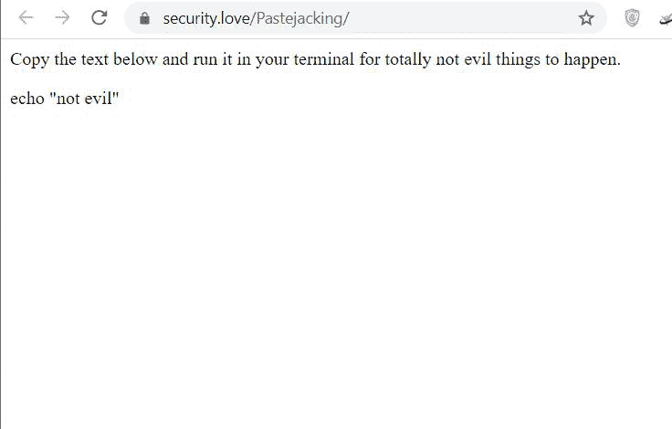
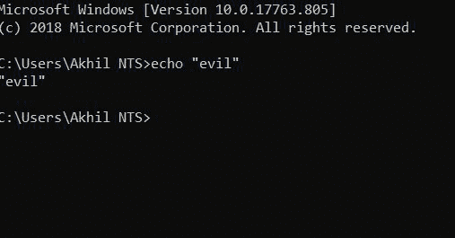
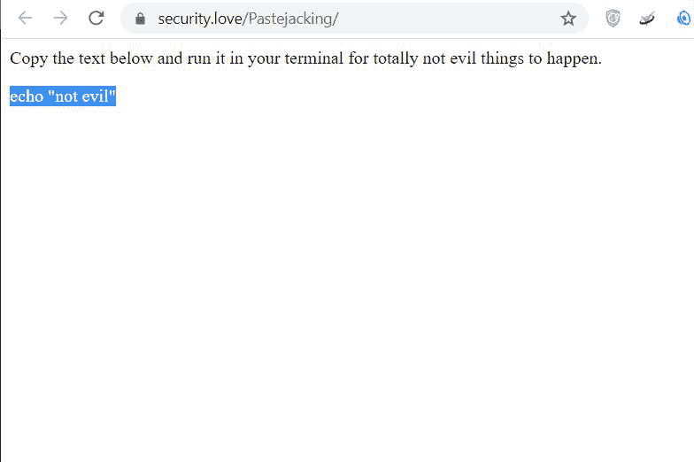
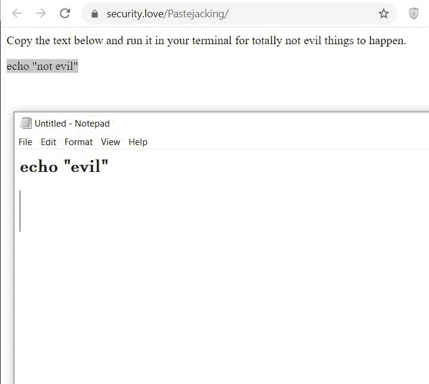

# 什么是粘贴膏？

> 原文:[https://www.geeksforgeeks.org/what-is-pastejacking/](https://www.geeksforgeeks.org/what-is-pastejacking/)

**粘贴板劫持**是恶意网站使用的一种方法或技术，目的是获取计算机中剪贴板的控制权，然后在未经许可的情况下将剪贴板内容更改为某种恶意内容。

粘贴劫持是剥削受害者的一种非常强大的技术。由于受害者复制的命令被更改，任何可能对受害者的信息、凭证和私人数据有害的命令都可能面临风险。

1.  所有的浏览器都允许用户在电脑上运行命令，这就是粘贴纸的漏洞。
2.  此方法更改剪贴板中的命令，并用任何其他恶意代码替换它。
3.  这种方法是一个漏洞，其中剪贴板数据被一些恶意数据替换，例如恶意网站的链接或恶意命令。
4.  对于这种方法，这样的网站是由我们复制的文本被一些隐藏的恶意代码或命令替换而成的，当用户使用这些代码或命令时，系统就会受到攻击，安全性也会受到损害。
5.  这项技术适用于任何操作系统，是利用他人系统的非常强大的技术。

### **演示**

现在让我们看看粘贴纸是如何工作的。

**第一步:**去[网站*这里*](https://security.love/Pastejacking/) *。*

**第二步:**当我们复制代码时，一些其他的代码将被复制到剪贴板。

在这里，我们可以看到我们复制的代码不同于被复制的代码。你可以在你的电脑上尝试上面的演示来更好地理解它。

### **为什么粘贴膏有害？**

假设您复制了一个要在控制台或命令提示符下运行的代码(Ctrl+C)，然后将其粘贴到您的控制台窗口中(Ctrl+V)，但这里有一个陷阱，您复制的代码被一些恶意代码替换并执行一些其他有害代码。当您将代码直接粘贴到控制台窗口中时，它会自动执行，用户不能选择“是”或“否”，并且窗口命令提示符不会要求确认。在这种情况下，恶意代码会自动运行(Ctrl+V)，如果该代码有害，您的系统安全、数据将面临风险。

### **如何避免粘贴**

有一个非常简单的方法可以避免粘贴纸。

**第一步:**复制代码。

**第二步:**先贴在记事本上。与其直接粘贴到命令提示符下，不如先粘贴到记事本上，检查代码中到底有什么。

在这里我们可以清楚地看到，我们复制的代码不同于我们粘贴的代码，因此这种技术将帮助我们避免 Pastejacking。复制代码并粘贴到记事本中，而不是直接粘贴到命令提示符中，会增加一个步骤，但比直接将代码粘贴到命令提示符中安全得多。