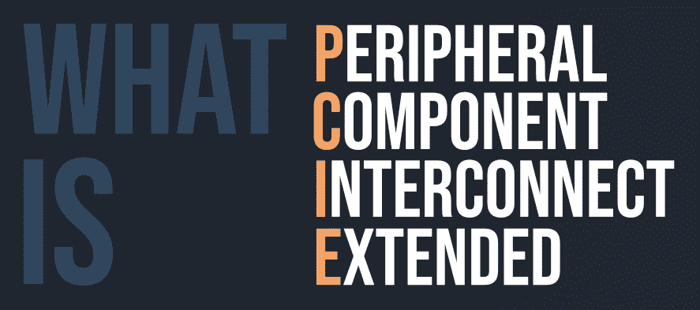

# 什么是 PCIX(外围组件互连扩展)？

> 原文:[https://www . geesforgeks . org/what-is-pcipexperiheral-component-interconnect-extended/](https://www.geeksforgeeks.org/what-is-pcixperipheral-component-interconnect-extended/)

**PCIX** ，代表**外围组件互连扩展**。它是一种计算机总线和扩展卡标准，支持 32 位 PCI 本地总线的增强，以满足服务器和工作站对更高带宽的需求。

PCI-X 基本上对 32 位和 64 位 PCI 连接器都有完整的规范，PCI-X 2.0 为嵌入式应用增加了 16 位变体。在现代设计中，它已经被 PCI Express 所取代，具有完全不同的连接器和真正不同的电气设计，具有一个或多个狭窄但快速的串行连接通道，而不是多个较慢的并行连接。
PCI-X 是 PCI 常规总线的复杂版本。它的工作原理就像一个在设备之间传输数据的管道。它将时钟速度从 66 MHz 提高到 133 MHz，本质上为数据流动提供了一个更大、更快的管道。

#### PCI-X 的历史

PCI-X 于 1999 年推出，由 IBM、惠普和康柏开发，速度比 PCI 更快，并稳步提高到第一条 PCI 总线的 30 倍。PCI-X 总线的峰值带宽在 133 到 4262 兆字节/秒之间。尽管在 2002 年引入了一个大大增强的 2.0 版本，但它并没有被广泛使用，PCI-X 及其版本完全被 PCI Express (PCIe)所取代。用于所有 PCI 技术的数据速率比较。建立时间的改善允许频率上升到 133 兆赫。

#### PCI-X 的特点

*   **总线类型**
    PCI-X，就像最初的 PCI 标准一样，可能是共享总线技术，所有连接的外设使用一条等效的总线并行。这意味着，当外设开始与 pc 通信时，它们通常需要激活总线，当更多的设备需要总线时，外设的整体性能会下降，而 PCI-E 使用点对点技术，为特定的外设提供自己的专用总线。
*   **带宽**
    大多数 PCI-X 总线都是 64 位的，运行在 100 兆赫兹或 133 兆赫兹，最高传输速度为每秒 1066 兆字节。PCI-X 技术的进步已经允许理论上的加速达到每秒 5GB，尽管主要的速度有一些干扰问题。
*   **速度**
    PCI-E 技术可在一个和 32 个车道内支持，运行速度从每秒 500 MB 开始，理论上最高可达每秒 16GB。请注意，由于 PCI-E 不像 PCI-X 那样有管理不同连接的信息开销要求，所以即使在理论速度相同的情况下，真实速率最终也会更高。
*   **插槽大小**
    当涉及到电脑主板上插槽的尺寸时，PCI-E 和 PCI-X 标准差别很大。PCI-X 插槽相当于原来的 PCI 插槽，尽管多了一个扩展，允许 64 位通信。这意味着这些插槽以及相应的外围卡占用了主板上相当多的空间。然而，使用这些类型的插槽允许 PCI-X 插槽简单地接受最老的 PCI 卡。

#### PCI-X 相对于 PCI 的优势

*   将 PCI 的带宽翻倍
*   向后兼容性
*   速度比 PCI 快得多

PCI-X 和 PCI express 差异化的误区。它们有非常相似的名字，但是这两者在功能、形状、速度或特性方面没有相似之处。然而，两者都用于计算机内部的高速数字通信。