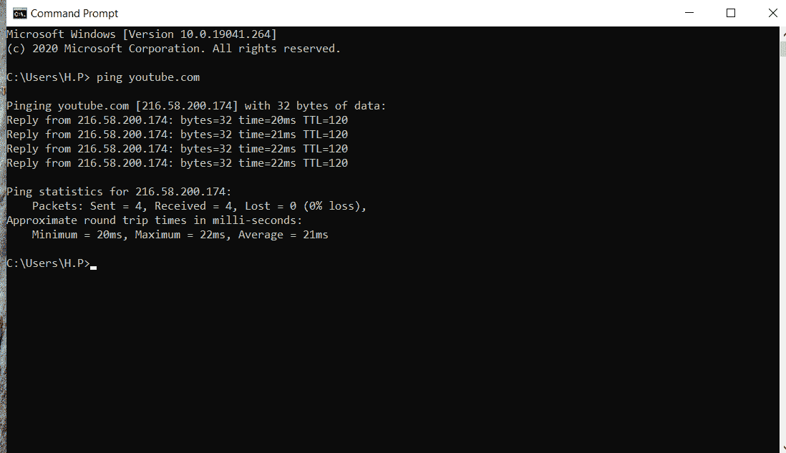

# 什么是平？

> 原文:[https://www.geeksforgeeks.org/what-is-ping/](https://www.geeksforgeeks.org/what-is-ping/)

**什么是网络？**
我们先来定义一个网络。网络只是链接在一起的人或物的集合或系统。计算机网络也可以定义为互连计算机的集合或系统。当连接了多台计算机时，就形成了计算机网络。

**真实生活中的网络示例:**
计算机网络通常包括打印机、局域网和其他设备，但我们现在生活在一个智能世界中，有大量智能设备连接到我们的系统，包括智能手机、智能照明、安全摄像头、平板电脑和其他设备。当智能手机、个人电脑、交换机、路由器和无线接入点都连接到同一个网络时，这是一种流行的家庭设置。

**局域网** ( **局域网):**
局域网(LAN)是建立在单个物理位置内的网络。您的互联网服务提供商安装了一个墙壁插座，通过局域网(广域网)将您连接到广域网。广域网连接多个局域网，例如大型公司用来连接多个地点的专用广域网。

**什么是 Ping 和 Latency？**
Ping(分组互联网协议)是一种确定两个网络之间通信延迟的方法。简而言之，ping 是一种确定延迟或数据在两台设备之间或通过网络传输所需时间的方法。随着通信延迟的减少，通信效率也会提高。

在数据的及时交付比所需信息的数量和质量更重要的情况下，低 ping 时间至关重要。

**将 ping 与真实世界的示例联系起来:**

1.  假设两个人相距 100 米，第一个人问候另一个人。第一个人的问候需要一秒钟才能到达 100 米外的第二个人。然后第二个人回应第一个人的问候，这需要一秒钟才能到达站在那里的第一个人。由此我们可以推断，站在那里的两个人都获得了 1 秒的 ping，总延迟为 2 秒。
2.  假设你家里有无线安全摄像头，可以让你从世界任何地方看到你家的准确实时画面。然而，这里的主要问题是延迟，因为如果 ping 非常高，观众会在一段时间后看到他或她的手机被抢劫，从而导致问题。因此，及时反馈至关重要；任何滞后或延迟都是不可接受的。

还值得注意的是，您用来连接两个网络的互联网连接速度与 ping 没有关系。例如，如果你在 YouTube 上播放游戏，你会希望延迟尽可能低，这样观众就可以实时观看。

因此，我们可以将 ping 定义为一种用于确定计算机系统延迟和网络强度的协议。

**如何获取服务器对应的任意站点的 Ping 值？**

*   ping 值代表两台计算机或一个网络之间的连接强度。您可以使用 Windows 的命令提示符或 Mac 的终端检查与您的计算机相对应的任何网站的 ping。
*   只需在命令提示符或终端中键入“ping <space>网站名称”，让您的系统向该特定网站发送一些数据包，然后用您的系统和该特定网站内发生的 ping 值来确认您。</space>

**示例–**

*   如下图所示。我输入“> ping youtube.com”，然后我的系统从 youtube 发送和接收四个数据包，以确定最小、最大和平均 ping 值，分别为 20 毫秒、22 毫秒和 21 毫秒。

*   所以，如果一款网络游戏 streamer 有两个网络选项，一个是 10ms 的 ping 和 10mbps 的网速，另一个是 100ms 的 ping 和 500mbps 的网速，游戏玩家显然会选择第一个，因为他或她想和观众实时互动。然而，如果一个人想看 YouTube 视频并下载，他或她显然会选择第二个选项，以加快下载过程。