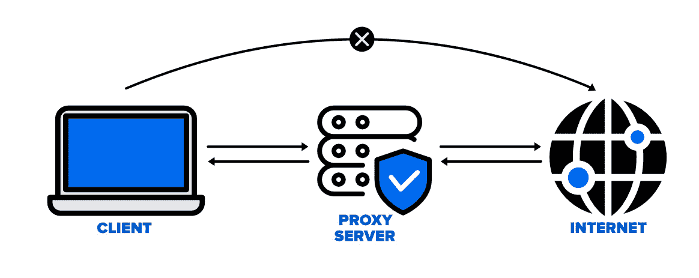

# 什么是代理服务器？

> 原文:[https://www.geeksforgeeks.org/what-is-proxy-server/](https://www.geeksforgeeks.org/what-is-proxy-server/)

代理服务器是指在客户端请求和特定服务器的某些服务或某些资源请求之间充当中介的服务器。根据客户端向服务器发出请求的目的，可以使用不同类型的代理服务器。代理服务器的基本目的是保护互联网客户端和互联网资源的直接连接。当客户端向任何其他服务器发出任何请求时，代理服务器还会阻止识别客户端的 IP 地址。

*   **互联网客户端和互联网资源:**对于互联网客户端，代理服务器还充当内部网络的屏障，防止客户端请求访问存储在服务器上的数据。它使节点的原始 IP 地址在从该服务器访问数据时保持隐藏。
*   **保护真实主机身份:**在这种方法中，传出流量似乎来自代理服务器，而不是互联网导航。它必须针对特定的应用程序进行配置，例如 HTTPs 或 FTP。例如，组织可以使用代理来观察员工的流量，从而高效地完成工作。它还可以用来检查任何高度机密的数据泄露。有些人还可以用它来提高他们的网站排名。

### 需要私有代理:

1.  **击败黑客:**为了保护组织数据不被恶意使用，使用了密码并设置了不同的架构师，但在 IP 地址易于访问的情况下，这些信息仍有可能被黑客窃取。为了防止这种对数据的误用，设置了代理服务器来防止跟踪原始的 IP 地址，而数据显示为来自不同的 IP 地址。
2.  **内容过滤:**通过缓存网站的内容，Proxy 有助于快速访问经常访问的数据。
3.  **检查数据包报头和有效载荷:**内部服务器中的用户节点访问社交网站的请求的有效载荷和数据包报头可以很容易地被跟踪和限制。
4.  **控制员工和孩子的互联网使用:**在这种情况下，代理服务器用于控制和监控他们的员工或孩子如何使用互联网。组织使用它来拒绝访问某个特定的网站，而是用一个漂亮的便条来重定向你，要求你不要在公司网络上查看所述网站。
5.  **节省带宽和提高速度:**代理通过一个好的代理服务器帮助组织获得更好的整体网络性能。
6.  **隐私优势:**代理服务器用于更私密地浏览互联网。它将改变 IP 地址并识别 web 请求包含的信息。
7.  **安全性:**代理服务器用于加密您的网络请求，以防止窥视者读取您的交易，因为它提供了顶级安全性。

### 代理服务器的类型

1.  **反向代理服务器:**反向代理服务器的工作，用于侦听客户端发出的请求，并重定向到不同服务器上的特定网络服务器。
    示例–监听 TCP 端口 80 网站连接，该连接通常位于非军事区(DMZ)内，用于公众可访问的服务，但它也保护主机的真实身份。此外，它对外部用户是透明的，因为外部用户将无法识别内部服务器的实际数量。因此，反向代理的主要职责是根据内部服务器的配置来重定向流量。通过受防火墙保护的专用网络的请求将需要不遵守任何本地策略的代理服务器。来自客户端的此类请求是使用反向代理服务器完成的。这也用于限制客户端对驻留在特定服务器上的机密数据的访问。
2.  **网络代理服务器:**网络代理转发 HTTP 请求，只传递 URL，不传递路径。请求被发送到特定的代理服务器进行响应。例子，Apache，HAP 代理。
3.  **匿名代理服务器:**这种类型的代理服务器不会产生原始的 IP 地址，相反，这些服务器是可检测的，并且仍然为客户端设备提供合理的匿名性。
4.  **高度匿名代理:**此代理服务器不允许检测原始 IP 地址及其作为代理服务器的身份。
5.  **透明代理:**这种类型的代理服务器无法向客户端提供任何匿名性，相反，使用这种代理可以很容易地检测到原始的 IP 地址。但它被投入使用，作为网站的缓存。当透明代理与网关结合时，会产生一个代理服务器，其中连接请求由客户端发送，然后 IP 被重定向。重定向将在没有客户端 IP 地址配置的情况下发生。服务器端的 HTTP 头很容易检测到它的重定向。
6.  **CGI 代理:**开发 CGI 代理服务器，让网站更易访问。它使用网络表单接受对目标网址的请求，并在处理后将其结果返回给网络浏览器。由于一些隐私政策，如虚拟专用网，它不太受欢迎，但它仍然收到很多请求。由于通过本地过滤后可能导致网站流量过大，从而导致组织受损，其使用量减少。
7.  **后缀代理:**后缀代理服务器基本上是在 URL 后面附加代理的名称。这种类型的代理没有保持任何更高的匿名性。它用于绕过网络过滤器。它很容易使用，也很容易实现，但使用较少，因为它有更多的数字或网络过滤器。
8.  **扭曲代理:**一旦被检测为代理服务器，代理服务器更倾向于生成不正确的客户端原始 IP 地址。为了保持客户端 IP 地址的机密性，使用了 HTTP 头。
9.  **Tor 洋葱代理:**该服务器旨在对用户的个人信息进行在线匿名。它用于通过世界各地的各种网络路由流量，以增加跟踪用户地址的难度，并防止任何匿名活动的攻击。这使得任何试图追踪原始地址的人都很困难。在这种类型的路由中，信息在多层中加密。在目的地，每一层都被逐个解密，以防止信息加扰和接收原始内容。这个软件是开源的，免费使用。
10.  **12P 匿名代理:**它使用加密来隐藏各个级别的所有通信。然后，这些加密数据通过位于不同位置的各种网络路由器进行中继，因此 I2P 是一个完全分布式的代理。这个软件是免费的，开源使用，它也抵制审查。
11.  **域名系统代理:**域名系统代理以域名系统查询的形式接收请求，并将其转发到域名服务器，域名服务器也可以缓存这些请求，此外，请求流也可以重定向。

### 代理服务器如何运行？

每台计算机都有其唯一的 IP 地址，用于与另一个节点通信。同样，代理服务器也有您的计算机知道的 IP 地址。当一个 web 请求被发送时，你的请求首先被送到代理服务器。代理代表您向互联网发送请求，然后收集数据并提供给您。代理可以改变你的 IP 地址，因此，网络服务器将无法获取你在世界上的位置。它还保护数据免受黑客攻击。此外，它还可以阻止一些网页。

### 代理服务器的缺点

1.  **代理服务器风险:**免费安装在后端硬件或加密方面投入不多。这将导致性能问题和潜在的数据安全问题。如果你安装了一个“免费”的代理服务器，小心对待，其中一些可能会窃取你的信用卡号码。
2.  **浏览历史日志:**代理服务器存储您的原始 IP 地址，web 请求信息可能是未加密的形式，保存在本地。始终检查您的代理服务器是否记录并保存了这些数据，以及他们在保存数据时遵循何种保留或执法合作策略。
3.  **无加密:**无加密意味着您以纯文本形式发送请求。任何人都可以轻松获取用户名、密码和账户信息。随时检查代理是否提供完全加密。