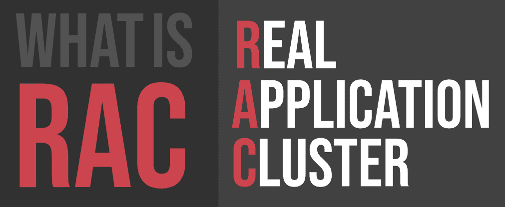
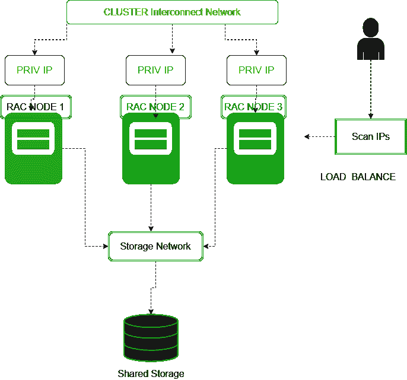

# 什么是 RAC(真实应用集群)？

> 原文:[https://www . geeksforgeeks . org/what-is-racreal-application-cluster/](https://www.geeksforgeeks.org/what-is-racreal-application-cluster/)

**RAC** 代表**真实应用集群**。这是一个适用于**甲骨文数据库**的高可用性解决方案。这里，通过使用共享磁盘，两个或更多节点(实例)被群集为单个数据库。因此，数据库方面没有单点故障。集群由不同的互连计算机或服务器组成，这些计算机或服务器以一台服务器的形式出现，从而结束客户端和应用程序。Oracle RAC 使您能够对 Oracle 数据库进行集群。

Oracle RAC 使用 Oracle 集群件作为基础来连接众多服务器，使它们作为一个单一的系统工作。Oracle 集群件可能是与 Oracle 数据库相协调的一种方便的集群管理安排。此外，Oracle 集群件是利用 Oracle RAC 的必需组件。在扩展中，Oracle 集群件支持单实例 Oracle 数据库和 Oracle RAC 数据库利用 Oracle 高可用性基础。Oracle 集群件使您能够创建一个集群化的容量池，供单实例和 Oracle RAC 数据库的任意组合使用。

#### RAC 架构

#### RAC 的应用

*   自主健康框架
*   甲骨文应用程序连续性
*   甲骨文数据库服务质量管理

#### RAC 的特点

*   **高可用性**
    真实应用集群通过将个人数据库服务器排除在单点故障之外，为客户端提供了最值得注意的数据库可访问性。在群集服务器环境中，数据库本身在一个服务器池中共享，这意味着服务器池中的任何服务器都有可能崩溃，数据库将继续在幸存的服务器上运行。Oracle RAC 不仅使客户端能够在服务器出现故障的情况下继续准备数据库工作负载，还通过减少数据库因安排的维护操作而离线的时间来帮助降低停机成本。
*   **数据库即服务**
    真实应用集群提供了在服务器池中有效发送 Oracle 数据库所需的所有计算机程序组件，并充分利用集群提供的执行能力、多功能性和可访问性。甲骨文 RAC 利用甲骨文网格框架作为先知 RAC 数据库框架的建立。甲骨文网络基金会整合了甲骨文集群件和甲骨文程序化容量管理(ASM)，支持在高度可访问和适应性强的数据库云环境中有效共享服务器和容量资产。

#### RAC 的优势

***   某些补丁可以在其滚动模式下应用。**

*   **它是负载平衡的，以获得更好的性能**
    借助 Oracle RAC，管理部门通过登记其工作负载来促进其会话。他们也可以把正在处理的工作汇总起来。有了这些数据，客户可以转移到负载最少的中心，为他们的特定管理运行一个场合。包括两种堆栈调整:客户端和服务器端。这使得以您要求的速度继续工作而没有数据丢失的危险成为可能。
*   **除非连接不知道 RAC，否则不需要重新连接。**
    由于甲骨文 RAC 可能是一个基于节点的框架，与类似的管理相比，即兴的失望对用户的影响可以忽略不计。为了保持可访问性，与失败事件相关联的客户端会迅速与数据库中幸存的事件建立新的连接。在大多数情况下，重新连接并不重要，因为你基本上是在把你的中枢移近。只要基本位置保持凹雕，这种优势就经常保持。
*   **DML 进程能够回滚。**
    有时候，当您在“也是 SQL”环境中工作时，您的信息控制方言发音并不像安排的那样。这个框架不是让你的发音快速不变，而是让你在《工程师》中看到 DML 解释的影响。它不会持久，直到你完成一次合并它的交易。

#### RAC 的缺点

*   **它需要特定的网络配置才能正常工作**
    使用 Oracle RAC，您必须将您的 Check IPs、VIPs 和您的开放 IP 地址都放在同一个开放的安排上，数据库才能正常运行。私人投资项目的安排必须不同于公开组织。你必须让你的私人和开放的 IP 能够在最近的某个时候建立。如果这个链中的一个环节没有被输入，此时，你可能会产生一个错误的组织安排错误。
*   **共享存储上必须有 Oracle RAC**
    有了 Oracle RAC，您的数据库记录、OCR 区域和投票磁盘都必须在共享容量上。如果你没有这样做，在那一点上，它将不会适当地工作。您对共享磁盘排列的任何问题都不可避免地会导致框架崩溃，从而产生错误的共享磁盘设置错误报告。
*   **必须完成的前提条件很多。**
    为 Oracle RAC 和集群件设计组织后，您会发现集群中的每个中心都有必须满足的特定先决条件。您必须至少有 2 个排列接口卡，每个集线器的开放接口名称，以及所有集线器的相同专用接口名称。您的排列连接器必须支持 TCP/IP，专用接口必须支持 UDP，以便使用至少支持千兆以太网的交换机来高速组织连接器。