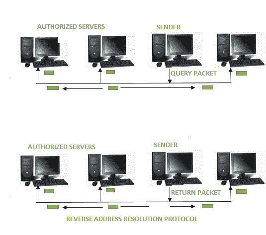

# 什么是 RARP？

> 原文:[https://www.geeksforgeeks.org/what-is-rarp/](https://www.geeksforgeeks.org/what-is-rarp/)

[RARP](https://www.geeksforgeeks.org/arp-reverse-arprarp-inverse-arp-inarp-proxy-arp-and-gratuitous-arp/) 是**反向地址解析协议**的缩写，这是一种基于计算机网络的协议，客户端计算机使用该协议从网关服务器的地址解析协议表或缓存中请求其 IP 地址。网络管理员在网关路由器中创建一个表，用于将 MAC 地址映射到相应的 [IP 地址](https://www.geeksforgeeks.org/introduction-of-classful-ip-addressing/)。

该协议用于服务器中两点之间的数据通信。客户端不一定需要能够为其请求提供服务的服务器身份的先验知识。[媒体访问控制(MAC)地址](https://www.geeksforgeeks.org/introduction-of-mac-address-in-computer-network/)需要管理员在服务器上进行单独配置。RARP 仅限于提供 IP 地址。
安装替换机器时，机器可能有也可能没有永久存储 IP 地址的附加磁盘，因此 RARP 客户端程序会从路由器上的 RARP 服务器请求 IP 地址。RARP 服务器会将 IP 地址返回给机器，因为路由器表中已经设置了一个条目。

**RARP 的历史:**
RARP 由大学网络集团于 1984 年提出。该协议为工作站提供了 IP 地址。这些无盘工作站也是太阳微系统公司主要工作站的平台。

**RARP 的工作:**
RARP 位于网络接入层，用于在一个非常大的网络中的两个点之间发送数据。
每个网络参与者都有两个唯一的地址:- IP 地址(逻辑地址)和 MAC 地址(物理地址)。

IP 地址由软件分配，然后媒体访问控制地址被构建到硬件中。
响应 RARP 请求的 RARP 服务器，甚至可以是网络内的任何一台普通计算机。但是，它必须保存所有媒体访问控制地址及其分配的 IP 地址的数据。如果网络收到一个 RARP 请求，只有这些 RARP 服务器可以回复。信息包需要在非常便宜的网络层上发送。这意味着数据包在同一时间传输给所有参与者。

客户端使用以太网广播地址和自己的物理地址广播 RARP 请求。服务器通过通知客户端它的 IP 地址来响应。

**RARP 和 ARP 有什么不同？**

| 怪怪的 | 空袭预防措施 |
| --- | --- |
| 代表反向地址解析协议 | ARP 代表地址解析协议 |
| 在 RARP 中，我们找到自己的 IP 地址 | 在 ARP 中，我们找到远程机器的 IP 地址 |
| 媒体访问控制地址是已知的，并且请求 IP 地址 | IP 地址是已知的，并且正在请求 MAC 地址 |
| 它对请求使用值 3，对响应使用值 4 | 它对请求使用值 1，对响应使用值 2 |

**RARP 的用途:**
RARP 用于将以太网地址转换为 IP 地址。
适用于 FDDI、令牌环网等局域网技术。

**RARP 的缺点:**
反向地址解析协议的缺点不多，最终被 BOOTP 和 DHCP 取代。下面列出了一些缺点:

*   RARP 服务器必须位于同一物理网络中。
*   计算机在非常便宜的网络层发送 RARP 请求。因此，路由器转发数据包是不可实现的，因为计算机在非常便宜的网络层发送 RARP 请求。
*   RARP 无法处理子网划分过程，因为没有发送子网掩码。如果网络分成多个子网，每个子网都必须有一台 RARP 服务器。
*   不可能在非常现代化的网络中配置电脑。
*   它没有充分利用像以太网这样的网络的潜力。

RARP 现在已经成为一个过时的协议，因为它运行在低水平。因此，它需要网络的直接地址，这使得构建服务器变得困难。