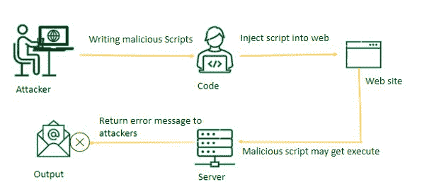

# 什么是远程代码执行(RCE)？

> 原文:[https://www . geesforgeks . org/什么是远程代码执行-rce/](https://www.geeksforgeeks.org/what-is-remote-code-execution-rce/)

如今，由于业务需求的满足和消费者需求的满足，web 应用的普及速度越来越快。有几种服务是通过 web 应用程序提供的，它们的性能是通过服务处理时间和信息功能来衡量的。但与此同时，由于验证不当，我们可能会面临威胁。

目前，网络攻击已经成为全球每一次数字化转型的关键风险。安全知识的缺乏和编码的粗心是 web 系统中残留的不同类型[应用层漏洞](https://www.geeksforgeeks.org/14-most-common-network-protocols-and-their-vulnerabilities/)的根本原因。其中，远程代码执行(RCE)是一个严重的漏洞。

### **远程代码执行(RCE)**

如果攻击者通过某种漏洞获得了对目标计算机的控制，并且他们还获得了在远程计算机上执行命令的能力，则此过程称为远程代码执行(RCE)

*   这是一种网络攻击，攻击者可以在某人的计算机上远程执行命令
*   它通常是由主机下载的恶意恶意软件引起的，无论设备的地理位置如何，都会发生这种情况。

### RCE 袭击怎么可能发生？

在 RCE 的帮助下，黑客可以编辑或销毁重要文件，窃取机密数据，执行 DDoS(分布式拒绝服务)攻击，并危及整个系统。

发生攻击的原因可能是:

*   外部用户输入未选中
*   访问控制很差
*   身份验证措施没有正确完成
*   缓冲区溢出。

### **RCE 的工作及原因:**

实际上，远程代码实现中的 Joule 攻击是最流行的远程代码实现之一。恶意软件通常利用任意代码实现在处理器上运行，而不需要用户的批准。

任意代码实现通常通过管理程序的教学指针来执行，该指针指向要处理的下一行代码，这是攻击者感染计算机的主要手段。攻击者首先需要获取可执行代码到您的网站。您网站上的漏洞，如允许文件包含的漏洞，允许他们这样做。然后他们在你的服务员身上远程运行。

抵御这些攻击的防御措施是使源代码变得易受攻击。使用安全的防火墙可以大大减少黑客从头到尾注入恶意软件的次数。

### **如何防范 RCE 袭击？**

我们可以通过考虑以下措施来防止 RCE:

*   通过验证用户输入
*   身份验证方法配置正确。
*   通过安装缓冲区溢出保护
*   并尝试应用防火墙

攻击者可以采用几种技术来利用 RCE 网站的漏洞，它们可以分为两类:

**1。基于网络的远程代码执行:**基于网络的 RCE 漏洞是一个帮助攻击者在网络服务器上执行系统命令的网络应用程序。这些类型的应用程序包含系统缺陷。

基于开发过程的 [GET 方法](https://www.geeksforgeeks.org/get-method-python-requests/)和基于开发过程的 [Post 方法](https://www.geeksforgeeks.org/post-method-python-requests/)是 RCE 的两种方法，有助于攻击者利用 RCE 漏洞。

1.  **GET 基于方法的开采:**在这种开采方法中，RCE 会存在。由于配置错误或用户请求，此应用程序将被利用 RCE。web 应用程序中最重要的事情是用户输入验证。
2.  **基于后方法的利用:**该过程最好描述为远程物理攻击正在执行的代码并利用易受攻击的应用程序框架的活动。RCE 是因为滥用了毫无防备的应用程序而被养大的。

**2。基于系统的 RCE 漏洞-** 运行在任何系统(如安卓、mac、windows)上的服务都存在漏洞，使得攻击者能够执行系统命令，这种漏洞被称为基于系统的 RCE 漏洞。为了利用该漏洞，攻击者连接到计算机系统并使用包括 SQL 注入、缓冲区溢出、跨站点脚本和一些开源利用工具包在内的方法。

### **RCE 近期病例:**

例如，在谷歌发布的最新文章中，它修复了影响其安卓手机的两个关键错误，即远程代码执行和拒绝服务，这两个错误允许远程攻击者执行任意代码。

关键缺陷包括谷歌安卓系统组件中的远程代码执行，该组件是安卓操作系统的核心。另一个缺陷是拒绝服务问题，存在于安卓框架组件中，允许开发人员轻松为安卓手机编写应用程序。