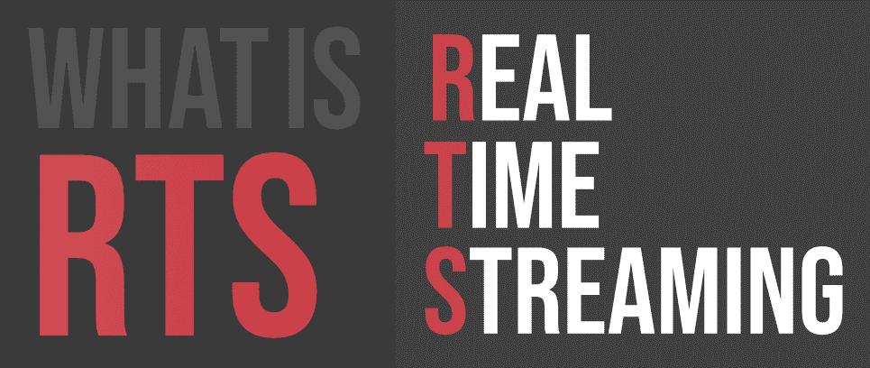

# 什么是 RTS(实时流)？

> 原文:[https://www . geesforgeks . org/what-is-RTS real-time-streaming/](https://www.geeksforgeeks.org/what-is-rtsreal-time-streaming/)

实时流处理是在数据生成时对其采取行动的过程。这是一个快速处理大量数据的过程。历史上，实时处理意味着根据需要频繁处理。处理时间可以用微秒来衡量。

实时流在电子商务、网络监控、欺诈检测等方面有很多应用。

**例如:**
如果我们有一个仓库般的蜂巢，里面有千兆字节的数据。但是它只允许我们仅仅分析我们的历史数据和预测未来。
处理这种类型的海量数据是远远不够的。我们还需要实时处理这类数据。这在欺诈检测、情报和监视系统等方面是必需的。

#### 即时战略系统的工作

RTSP 是一个应用层协议，允许客户端控制服务器上的实时媒体流。RTSP 本身不处理数据的传输。该协议有助于实时流处理。
开源平台多种多样:

*   Apache SparK
*   阿帕奇顶点
*   Apache 很不错

#### 优势

*   租赁云基础架构、软件、平台和服务降低了成本。
*   使用托管云提供商支持人员降低了成本。

#### 不足之处

*   **安全性:**确实存在对云中数据安全性的担忧。
*   托管云提供商依赖性。
*   “天意”中断。