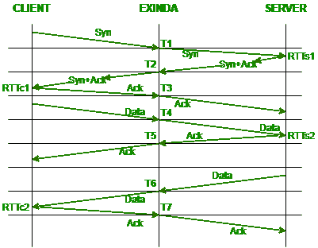

# 什么是 RTT(往返时间)？

> 原文:[https://www.geeksforgeeks.org/what-is-rttround-trip-time/](https://www.geeksforgeeks.org/what-is-rttround-trip-time/)

RTT 还称往返时间/延迟是确定网络健康状况的重要工具。它是请求数据和显示数据之间的时间。它是以毫秒为单位测量的持续时间。RTT 可以通过查验某个地址来分析和确定。它指的是网络请求到达目的地并恢复到原始源所花费的时间。在这种情况下，源是计算机，目的地是捕获到达信号并将其还原的系统。


<center>**Figure –** RTT Measurement</center>

**影响 RTT 的因素:**
有一定的因素可以带来 RTT 价值的巨大变化。下面列出了这些:

```
1. Distance,
2. Transmission medium
3. Network hops
4. Traffic levels
5. Server response time 
```

**应用:**
往返时间是指各种各样的传输，如无线互联网传输和卫星传输。在互联网传输中，可以使用 ping 命令识别 RTT。在卫星传输中，可以利用雅各布森/卡雷尔算法计算 RTT。

**优势:**
计算 RTT 是有利的，因为:

1.  它允许用户和运营商识别信号需要多长时间才能完成传输。
2.  它还决定了网络的工作速度和网络的可靠性。

**例:**
假设有两个用户，其中一个想联系另一个。其中一个位于加利福尼亚，另一个位于德国。当加州的服务器发出请求时，网络流量会在到达位于德国的服务器之前通过多台路由器传输。一旦请求返回加州，就可以对传输时间进行粗略估计。发送请求所用的时间称为 RTT 时间。

往返时间只是一个估计。随着通道和网络拥塞的出现，两个位置之间的路径可能会发生变化，从而影响传输的总周期。

**RTT 的计算:**
考虑一个拓扑，其中名为“外壁”的设备位于客户端和服务器之间。
下图描述了 RTT 的概念是如何运作的:



计算平均 RTT 时，服务器和客户端的 RTTS 需要单独计算。执行的计算如下所示:

```
Server RTT:
RTT1 = T2 - T1
RTT2 = T5 - T4

Client RTT:
RTT3 = T3 - T2
RTT4 = T7 - T6 

Average RTT:
Avg Server RTT = (RTTs1 + RTTs2) / 2
Avg Client RTT = (RTTc1 + RTTc2) / 2
Avg Total RTT = Avg Server RTT + Avg Client RTT 
```

**减少 RTT 的措施:**
使用内容交付网络(CDN)可以显著减少 RTT。CDN 指的是由各种服务器组成的网络，每个服务器获取特定网站上内容的副本。它从以下几个方面阐述了影响 RTT 的因素:

```
1. Points of Presence (PoP)
2. Web caching
3. Load distribution
4. Scalability
5. Tier 1 access 
```

CDN 已经在很大程度上成功地降低了 RTT 的价值，因此，RTT 的价值降低 50%是可以实现的。