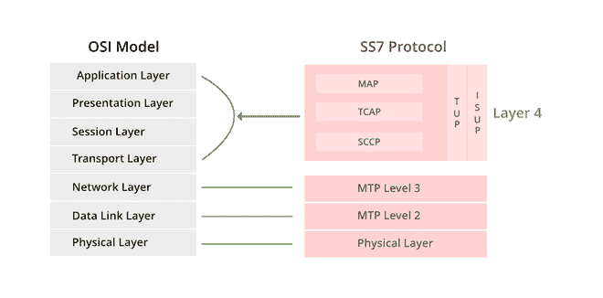

# 什么是 SS7 协议栈？

> 原文:[https://www.geeksforgeeks.org/what-is-ss7-protocol-stack/](https://www.geeksforgeeks.org/what-is-ss7-protocol-stack/)

协议被称为一组规则，而协议栈意味着一组同时运行的协议，用于实现网络协议套件。就像分层网络模型的 [OSI](https://www.geeksforgeeks.org/layers-of-osi-model/) 和 [TCP/IP 模型](https://www.geeksforgeeks.org/tcp-ip-model/)一样，它决定了互联规则。

协议栈中的每个模块都与两层通信，使工作和设计更加容易。下层为上层添加了更多功能。

SS7 的完整形式是 [*信令系统 7*](https://www.geeksforgeeks.org/what-is-signaling-system-7/) ，这个协议栈像多层堆栈一样排列，对应于标准 OSI 模型的各个层。

### SS7 协议栈

SS7 协议栈

**1。SS7 1 级[物理层]:**[物理层](https://www.geeksforgeeks.org/physical-layer-in-osi-model/)的 SS7 协议栈支持 56 或 64kbps 的数据速率，并承载原始信令数据，它定义了链路的物理和电气特性。它实际上与现场视察模型的第 1 层(称为级别连接)相同。

**2。SS7 级[数据链路，MTP 2 级]:** 消息传输部分 2 级提供链路层功能，确保消息可靠交换。它提供流量控制、顺序检查和错误检查。在这一层，我们使用顺序编号来确定在传输过程中是否有任何消息丢失。

**3。SS7 第 3 层[网络层，MTP 第 3 层]:** 该层依赖于第 2 层的服务来提供路由、消息分发和消息鉴别，它包括节点寻址、路由和拥塞控制以及备用路由。从 SPC 到 DPC 通过网络，MTP 3 级通过考虑链路负载和可用性使用多条并行路由。这个 MTP 3 级网络层有助于创建通过 SS7 链路互连的电话网络节点。

### **【上层】**

**4。电话用户部分:**该层用于在两个 SS7 节点之间建立电话呼叫。它提供电话来建立和拆除。它将在呼叫建立之前和终止之前立即建立。当呼叫正在进行时，不会交换任何 TUP 消息。这是第一个支持模拟电话的协议。

**5。ISUP(综合业务用户部分):**它与 TUP 相同，但它是一种更复杂的功能，可与一级速率综合业务数字网一起使用。
综合服务包括:

1.  呼叫和被叫号码通知，
2.  它可以控制计费率，
3.  执行电话功能，以及
4.  控制语音通道是用于语音、数据还是传真。

**6。SCCP(信令连接控制部分):**它运行在 MTP 层之上，提供类似于 TCP/IP 的 UDP 和 TCP 层的设施。MTP 不处理软件应用程序，它只从一个节点接收和传递消息，SCCP 允许呼叫处理、高级智能网络(AIN)、呼叫返回服务、重复拨号，所有这些都可以明确寻址，它还在全球标题翻译(GTT)功能的帮助下执行增量路由。

SCCP 提供四种信息类别:

1.  **0 级**:表示无连接无顺序消息。
2.  **第 1 类**:表示消息的无连接顺序传递。
3.  **2 级**:表示面向连接，无流量控制。
4.  **3 级**:表示面向连接，流量控制。

**7。TCAP(交易能力应用部分):** TCAP 用于实现与 SS7 网络中实际电话呼叫的发起和终止无关的功能。它还提供了可以从交换机位置的应用程序传输到另一个网络实体中的另一个应用程序的信息。

**8。MAP(移动应用部分)**:是最复杂的 SS7 组件，主要用于 GSM 移动电话系统中，在网络组件之间传递信息。

**9。INAP(智能网络应用部分):**它用于在网络中实现服务，允许访问 SCP，还包括使用智能外设(IP)。借助于 TCAP 交易，在网络实体之间发送 INAP 消息。

**10。OMAP(运营和管理应用部分)**:网络管理员使用 OMAP 从一个中心点控制整个网络。OMAP 提供的设施包括系统数据库管理、性能监控和维护访问。

### **使用的术语**

1.  **SSP:** 信号交换点执行呼叫的组织、终止和交换
2.  **SCP:** 信号控制点是一个负责高级呼叫处理功能的数据库。
3.  **STP:** 信号传输点执行路由功能，并允许彼此交换信令信息。
4.  **汇接:**它被称为中继自动交换机，允许没有直接中继的两个交换机之间的连接。
5.  **中继线:**两个交换机之间的链路。

### **SS7 的优势**

1.  SS7 激活了更好的语音电路利用率。
2.  与语音传输相比，它具有很高的可靠性。
3.  即使在现有通话期间，信号链路也可用。
4.  不需要更换旧设备进行服务扩展。
5.  高速连接设置。
6.  数据可以在没有丢失或复制的情况下传输。

### **SS7**的缺点

1.  使用复杂的开关。
2.  由于增加了子网，成本也在增加。
3.  需要持续的测试程序。