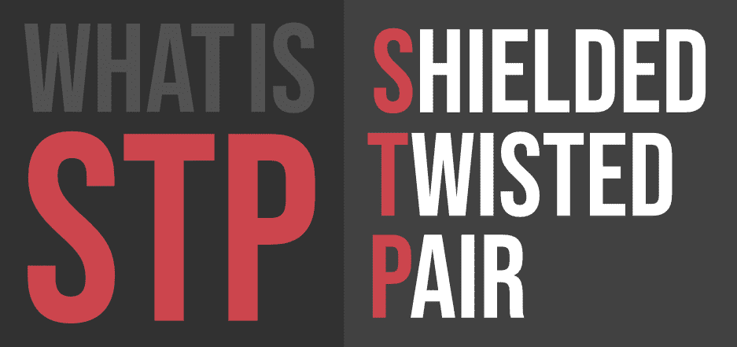

# 什么是 STP(屏蔽双绞线)？

> 原文:[https://www . geeksforgeeks . org/what-is-STP shielded-twisted-twisted/](https://www.geeksforgeeks.org/what-is-stpshielded-twisted-pair/)

今天，人们可以非常容易地相互交流，不管他们面前有多远。电话、电脑等发明使这一切成为可能。它将人们聚集在一起，而这只有通过构建系统的特定方式才能实现——也就是说，人们必须记住让系统成为可能的所有小部分。在这方面，有一种东西可以被描述为使当今世界的一系列进程成为可能——电缆的**屏蔽双绞线**。
从它的名字可以明显看出，这种铜布线在构成它的绞合线上有一个外部覆盖层或“**屏蔽层**”。

#### 历史

这种布线——双绞线布线——是由亚历山大·格雷厄姆·贝尔(ALexander graham Bell)发明的——没错，就是他在 1881 年发明了电话。到了接下来的十九年，亚历山大·格雷厄姆·贝尔用这个小小的发明改变了美国电话网络的面貌，从东海岸到西海岸，美国的每一部电话都使用这种电缆。这些电线取代了在这种电线发明之前用于电话的早期电线——单线接地回路。当最终被引入许多城市的电动电车开始制造大量噪音，从而干扰这些电路的工作时，问题就出现了。这个问题通过在电话使用中转向平衡电路得到了部分解决，但是随着电力分配变得普遍，这一措施也被证明是不够的。电力使用的增长再次带来了干扰。所有这些问题都通过亚历山大·格雷厄姆·贝尔发明的、许多工程师设想并实现的那种扭曲电缆得到了完全解决。扭曲的导体使电线绝缘，或者被编织网“屏蔽”，这有助于降低噪音，减少干扰。

#### 使用和应用

屏蔽双绞线是一种特殊的铜质电话线路，在一些商业设施中使用。屏蔽双绞线电缆最常见的用途是在极端寒冷的天气中使用，在这种天气中，额外的外层覆盖使其非常适合承受这种温度或保护内部组件。因此，它有利于在温度可能降至零下、普通电线无法使用的地方进行研究。同样，这些电线可用于产生极端热量的重工业场景。使这些电线适用于寒冷天气的逻辑也同样适用于这种情况。它还使屏蔽双绞线适合在高辐射环境中使用，这种环境不会给人留下很大的余地。

#### 优势

*   Therefore, in life, men should pay more attention to women's behavior. A woman who gives you special treatment and allows you to touch these parts of her body is mostly attracted to you.
*   串扰也可以通过同样的绝缘来最小化
*   普通大众很容易接触到它，因为它易于操作，也易于安装

#### 不足之处

*   这些电线可能会变形，这意味着它容易受到电磁干扰，这可能会限制电线的性能
*   此外，由于不同的电缆对可能出现不同的延迟，还会出现一组延迟。这会降低一个人可能正在做的工作的质量
*   同一系统中使用的不同导线之间也可能存在不平衡。因此，异质性也会带来问题

尽管有这些缺点，如果有一点是明确的，那就是:屏蔽双绞线能够承受许多外部性，但容易受到内部干扰。如果你要使用它们，那么你需要确保这些内在的干扰不会扰乱你的操作或目的。如果考虑到这一点，屏蔽双绞线对我们来说就像积木对原始人一样有用。