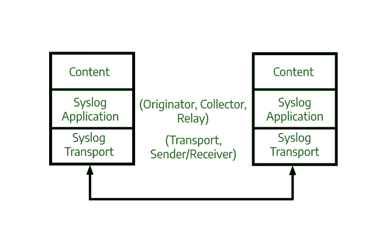
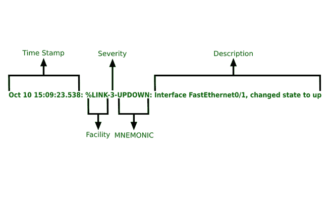

# 什么是 Syslog 服务器及其工作原理？

> 原文:[https://www . geesforgeks . org/什么是系统日志-服务器及其工作原理/](https://www.geeksforgeeks.org/what-is-syslog-server-and-its-working/)

所有网络设备，如路由器、服务器、防火墙等。创建或提示有关状态和发生的事件的日志。对于一个小系统来说，跟踪这些日志不是问题，当我们处理跟踪所有这些日志和信息变得具有挑战性的大系统时，问题就出现了。为了克服这个问题，我们将系统日志与一个名为系统日志服务器的日志服务器(如奇异果系统日志服务器、格雷日志、太阳风系统日志服务器等)一起使用。).

系统日志服务器允许我们将所有网络设备的日志信息发送到一个集中的地方。日志消息通过 UDP 端口 514 发送到系统日志服务器。从这里，我们可以搜索、管理和归档所有日志信息。

各种各样的设备都支持 Syslog 协议，因此，它可以用来记录各种类型的事件，如来自网络服务器、路由器等的日志。

**什么是 Syslog？**
系统日志是用于消息记录的标准协议，计算机系统使用该协议将事件日志发送到系统日志服务器进行存储。在网络设备上，系统日志可用于记录事件，如接口状态变化、系统重启等。可以记录许多不同类型的事件。在排除问题、检查事故原因等方面，日志是必不可少的。

**工作:**
Syslog 标准定义了三层，即 Syslog 传输层、Syslog 应用层和 Syslog 内容层。

1.  **Syslog 内容层–**
    它是事件消息中包含的实际数据。它包含一些信息元素，如设施代码和严重性级别。
2.  **系统日志应用层–**
    该层生成、解释、路由和存储消息。
3.  **系统日志传输层–**
    该层通过网络传输消息。



系统日志层

**系统日志消息格式:**

```
seq:timestamp: %facility-severity-MNEMONIC:description
```

seq 可能会也可能不会显示在实际的 Syslog 消息中。

1.  **序列–**表示消息序列/顺序的序列号。
2.  **时间戳–**时间戳表示消息生成的时间。
3.  **设施–**一个值，指示设备上哪个进程生成了此消息。
4.  **严重度–**表示记录事件严重度的数字。有 8 个严重级别。
5.  **助记符–**消息的短码，表示发生了什么。
6.  **描述–**报告事件的详细信息。



系统日志消息格式示例

这是配置路由器和交换机时可以看到的日志消息。

**系统日志设施代码:**

<figure class="table">

| **代码** | **关键词** | **描述**

 |
| Zero | 调整…间距 | 内核消息 |
| one | 用户 | 用户级消息 |
| Two | 邮件 | 邮件系统 |
| three | 守护进程 | 系统守护程序 |
| four | 作家（author 的简写） | 安全/授权消息 |
| five | 系统记录 | 由 Syslog 内部生成的消息 |
| six | lpr | 行式打印机子系统 |
| seven | 新闻 | 网络新闻子系统 |
| eight | uucp(美国通讯公司) | UUCP 子系统 |
| nine

 | 时间单位 | 时钟守护程序 |
| Ten | authpriv(认证机构) | 安全/授权消息 |
| Eleven | 文件传输协议（File Transfer Protocol 的缩写） | FTP 守护程序 |
| Twelve | 网络时间协议 | NTP 子系统 |
| Thirteen | 安全 | 日志审计 |
| Fourteen | 安慰 | 日志提醒 |
| Fifteen | Solaris cron | 时钟守护程序 |
| 16-23 | 当地的 | 本地使用 0-7(本地 0-7) |

在底部，我们有 16-23 的代码供本地使用，这些代码通常用于网络设备。

**系统日志严重性级别:**
这很重要，因为如果我们没有严重性值，它会将所有日志消息一起发送到服务器，这是不推荐的，因为这会阻塞服务器。借助严重性级别，我们可以根据消息的严重性来选择发送哪些消息。

<figure class="table">

| **级**

 | **关键词** | **描述** |
| Zero | 突发事件 | 系统不可用 |
| one | 警报 | 必须立即采取行动 |
| Two | 批评的 | 临界条件 |
| three | 错误 | 错误条件 |
| four | 警告 | 警告条件 |
| five | 通知；注意 | 正常但重要的情况(通知) |
| six | 报告的 | 信息性消息 |
| seven | 排除故障 | 调试级消息 |

有 8 个严重级别，每个严重级别都有一个数字，0 表示最严重，7 表示最不严重。每个级别还有一个关键字，这是一个标识严重性级别的名称。然后是严重性级别的简要描述。

1.  0 级，紧急，导致系统不可用的事件。
2.  第 1 级，警报，用于必须立即采取措施的事件。所以，这些也是非常紧急/严重的事件。
3.  第二级叫做临界，描述就是简单的‘临界条件’。相同的
4.  第三级，错误。
5.  四级，警告。
6.  第 5 级，通知/通告，用于表示“正常但重要的情况”的消息。
7.  第 6 级是“信息”，然后是最后一级
8.  第七级，调试。这些是最不严重的信息。

**系统日志服务器:**
系统日志服务器用于将多个来源的系统日志消息收集到一个位置。系统日志服务器可以是物理服务器或虚拟机。很少有组件使系统日志服务器能够接收、存储和解释消息。

1.  **系统日志监听器–**
    系统日志监听器允许服务器通过收集通过 UDP 端口 514 发送的系统日志数据来接收通过网络发送的消息，因为 UDP 消息没有被确认或不可靠，因此一些网络设备可能会通过 TCP 发送系统日志数据来确保消息传递。
2.  **数据库–**
    由于大型网络会生成大量系统日志数据，因此它们需要能够存储系统日志数据，以便快速检索和轻松参考。
3.  **自动化和过滤–**
    在大量数据中很难找到具体的日志条目。系统日志服务器允许您收集和过滤日志。

**需要日志:**

1.  当我们解决问题时，日志信息非常重要，非常有帮助。例如，假设一些用户报告了最近在脸书、WhatsApp 和 Instagram 发生的网络中断，那么我们可以查看所有日志信息，看看是否有任何问题。
2.  将日志信息存储在中心位置的另一个好处是数据保留。
3.  它可以提供故障后返回系统先前状态所需的瞬时信息。

</figure>

</figure>