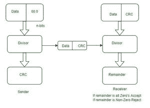
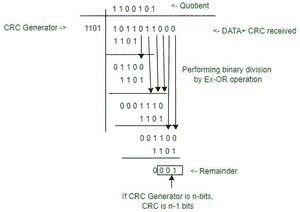
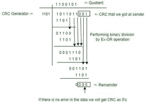
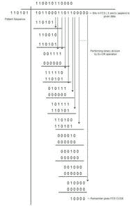

# CRC 和 FCS 有什么区别？

> 原文:[https://www . geesforgeks . org/CRC-和-fcs 的区别是什么/](https://www.geeksforgeeks.org/what-is-the-difference-between-crc-and-fcs/)

**循环冗余校验(CRC):** [循环冗余校验](https://www.geeksforgeeks.org/modulo-2-binary-division/)通常被称为错误检测机制，因为特殊的数字被附加到数据块中，以便针对存储中引入的任何变化来检测变化。
这是一种更复杂的算法，它是从简单的校验和(CHECKSUM，模算术)导出的，对每个输入字进行处理，因为它是多项式的一组系数。
CRC 通常用于数字网络和存储设备，以检测原始数据的意外变化。如果循环冗余校验生成器是 n 位，则循环冗余校验是(n-1)位。

**华润工况:**

启用循环冗余校验的设备为要发送或存储的每个数据块计算一个短的、固定长度的二进制序列，称为校验值或循环冗余校验，并将其附加到数据中，形成一个码字。如果循环冗余校验值不匹配，则该块包含数据错误。

儿童权利委员会正在工作

**示例:**

*问题:*构造 CRC 报文，让除数为 1101，数据为 1011011。

*解法*:由于除数的长度是 4，我们要在字尾加上 4-1=3 个零。
给定数据为 1011011，循环冗余校验位为 000，即 1011011000 {收到数据+循环冗余校验}

**发送方:**

发送方

因此，CRC，001 被添加到消息 1011011 中。
发送的消息为 1011011001

**接收方:**

接收方

上面的例子解释了发送方将数据无误地发送给接收方，接收方接收到正确的数据。
假设如果接收方收到一个损坏的数据包，提醒不会在接收方得到零。

**帧检查序列**:帧检查序列(FCS)是协议中添加到帧中的错误检测代码。帧用于将有效负载数据从源发送到目的地，也就是说，该帧用于将数据从源发送到目的地。

*   FCS 是唯一一个提供错误检测和恢复的系统。它是通过协议的各种不同方式来执行的。
*   一般来说，当接收机能够计算整个帧的运行和以及预期看到固定结果的大多数尾部 FCS 时，就发送 FCS。
*   以帧校验序列(FCS)结束的帧有助于检测 32 位循环冗余校验数据的传输中损坏。

**示例:**

*问题*–考虑 1011 0001 1011 位的消息和 110101 的除数，然后找到帧校验序列(FCS)？

*解决方案*–如果除数是 n 位，我们在消息末尾追加 n-1 位。这里，除数是 6 位，所以在消息的末尾添加 5 个零，并执行异或运算。
给定的模式序列或除数是 110101

**FCS 中的位=位模式序列的位数-1**
= 6-1
= 5 位。

假设给定的数据是 101100011011

填充 5 个零，因为 FCS 位是 5。

为了找出 FCS 码，通过执行异或运算应用循环冗余校验方法。

*注意-在 FCS 中，当 MSB 位为零时，我们插入一个长度与**除数相同的零位序列，并执行*和*异或运算。*

FCS 示例

因此，帧检查顺序为 **1 0 0 0 0** 。剩余部分给出了 FCS 代码。

传输序列为*报文+ FCS 码*
因此，传输序列为 101100011011 **10000**

## **CRC 和 FCS 的区别**

<figure class="table">

|   | 循环冗余检验 | 火控系统(Fire Control System) |
| --- | --- | --- |
| 1. | 循环冗余校验的完整形式是循环冗余校验。 | FCS 的完整形式是帧校验序列。 |
| 2. | 循环冗余校验不仅限于网络，它被许多技术使用。 | FCS 专用于以太网成帧。 |
| 3. | CRC 是一种校验和类型，它使用特定的算法来检查计算或传输完整性。 | FCS 是使用算法检查帧的方法。 |
| 4. | 这是一种错误检测机制。 | 它提供错误检测和恢复。 |
| 5. | 循环冗余校验错误指示数据何时损坏。 | FCS 错误指示数据帧在传输过程中何时损坏。 |
| 6. | 在循环冗余校验中，数据可能被破坏。 | 中间数据没有损坏。 |

</figure>