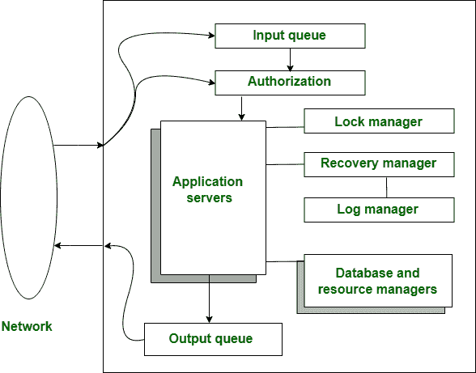

# 什么是事务处理监视器(TPM)？

> 原文:[https://www . geesforgeks . org/什么是事务处理-监视器-tpm/](https://www.geeksforgeeks.org/what-is-transaction-processing-monitors-tpm/)

**交易处理监视器**是在 20 世纪 70 年代和 80 年代设计和开发的系统，用于从单个系统或计算机支持大量的航空公司终端。它是为构建具有大量客户端和服务器的复杂事务处理系统而开发的。

事务处理监视器充当中间件*(中间件是帮助和桥接两个或多个应用程序之间的各种通信/连接的软件*)它的主要任务是支持和处理各种计算机平台上应用程序之间的交互。

事务处理监视器通常也称为 **TP 监视器**，它提供管理、部署和开发事务分布式信息系统等功能。当数据以有组织的面向事务的方式从流程的一个阶段传递到另一个阶段时，它控制监视或管理数据事务的程序。

事务监视器可用于各种系统组件，如通信系统和受事务保护的应用程序的操作系统。它在现有操作系统的基础上提供了一个操作系统，将数千台计算机与一个共享服务器进程池实时连接起来。

最古老的中间件形式之一来自 IBM，它旨在为在线事务处理应用程序提供丰富的运行时环境。然后，新版本的 tp 监视器出现了，并在客户端-服务器上工作，因为它们在当时是最好的，它们在今天的世界中仍然是相关的，例如银行交易的处理。

### **特征:**

*   它提供了创建用户界面的便利。
*   它将输入的内容/数据解包成数据包。
*   它为来自服务器的客户端请求和响应提供了连续的行/队列。
*   它将客户端数据路由到服务器。
*   它为服务提供了安全的回报。
*   它对程序员隐藏了内部传输细节。
*   有助于保持程序的负载。

### **工作:**

全员生产性维护的工作

*   传入的消息来自队列管理器或输入队列，如上图所示。
*   传出信息队列的持久性是至关重要的，因此应用服务器向输出队列发送确认消息作为事务的一部分。
*   一旦事务完成，TP 监视器保证消息被完美地传递。
*   很多 TP 监视器都有锁定和恢复功能，让应用服务器自己实现 [ACID 属性](https://www.geeksforgeeks.org/acid-properties-in-dbms/)。

### **组件:**

*   **Monitor:** 它提供了一个渲染环境，有助于为系统提供安全性和快速响应时间。它由用于安装组件的不同工具组成。
*   **通信服务:**这包括系统的协议和机制，有助于继续消息和[对等通信](https://www.geeksforgeeks.org/what-is-p2ppeer-to-peer-process/)。
*   **事务 RPC:** 提供基本的关系机制。
*   **事务服务:**它为并发控制、恢复和事务编程提供支持。

### **功能:**

*   消息管理器
*   请求控制
*   应用服务器
*   进程管理
*   进程间通信
*   排队通信
*   系统管理和恢复
*   TP 监视器还可以执行与会计和安全相关的系统管理功能

### **优势:**

*   TP-Monitors 充当在多台计算机上运行的应用程序的开发平台。
*   它的软件允许运行 TP 程序。
*   作为中间件本身的模型(即面向消息的中间件)
*   有助于在没有任何中断的情况下立即处理事件的循环
*   帮助提供输入设备和数据库管理系统之间的接口。
*   它提供用户数据安全性，并以不被操纵的方式建立事务。