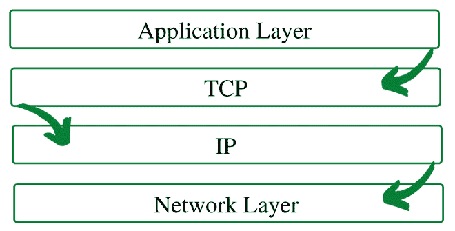
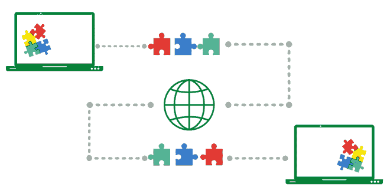

# 什么是传输控制协议(TCP)？

> 原文:[https://www . geesforgeks . org/什么是传输控制协议-tcp/](https://www.geeksforgeeks.org/what-is-transmission-control-protocol-tcp/)

传输控制协议是互联网协议套件的主要协议之一。它位于应用层和网络层之间，用于提供可靠的交付服务。这是一种面向连接的通信协议，有助于网络上不同设备之间的消息交换。

TCP/IP 层

### TCP 的工作原理

为了确保每条消息完好无损地到达其目标位置，TCP/IP 模型将数据分解成小的包，然后在另一端将包重新组装成原始消息。与一次性发送所有信息相比，以小信息包的形式发送信息更容易保持效率。

当一个特定的信息被分解成包后，如果一条路线被堵塞，但目的地保持不变，这些包可能会沿着多条路线传播。

我们可以看到消息被分解，然后在目的地按照不同的顺序重新组装

*例如，*当用户在互联网上请求网页时，在世界的某个地方，服务器处理该请求并向该用户发回一个 HTML Page。服务器使用一种称为 HTTP 协议的协议。然后，HTTP 请求 TCP 层设置所需的连接并发送 HTML 文件。

现在，TCP 将数据分解成小数据包，并将其转发到互联网协议层。然后，数据包通过不同的路由发送到目的地。

用户系统中的 TCP 层等待传输完成，并在收到所有数据包后进行确认。

### 传输控制协议的特点

传输控制协议的一些最突出的特征是

#### **1。分段编号系统**

*   TCP 通过为每个数据段分配编号来跟踪正在传输或正在接收的数据段。
*   特定的*字节号*被分配给要传输的数据字节，而段被分配*序列号*。
*   *确认号*被分配给接收的段。

#### **2。流量控制**

*   流量控制限制发送方传输数据的速率。这样做是为了确保可靠的交付。
*   接收者不断提示发送者可以接收多少数据(使用滑动窗口)

#### **3。错误控制**

*   TCP 实现了可靠数据传输的错误控制机制
*   错误控制是面向字节的
*   检查段的错误检测
*   错误控制包括–*损坏段&丢失段管理、无序段、重复段*等。

#### **4。拥塞控制**

*   TCP 考虑了网络中的拥塞程度
*   拥塞程度由发送方发送的数据量决定

### **优势**

*   这是一个可靠的协议
*   它提供了错误检查机制和恢复机制
*   它提供流量控制
*   它确保数据按照发送的确切顺序到达正确的目的地
*   开放协议，不归任何组织或个人所有
*   它为网络上的每台计算机分配一个 IP 地址，为每个站点分配一个域名，从而使每个设备站点在网络上都是可区分的。

### **缺点**

*   TCP 是为广域网设计的，因此它的大小可能会成为低资源小型网络的一个问题
*   TCP 运行几层，因此它可以降低网络速度
*   它本质上不是通用的。也就是说，它不能代表除了 TCP/IP 套件之外的任何协议栈。例如，它不能与蓝牙连接一起工作。
*   自大约 30 年前开发以来没有任何修改。