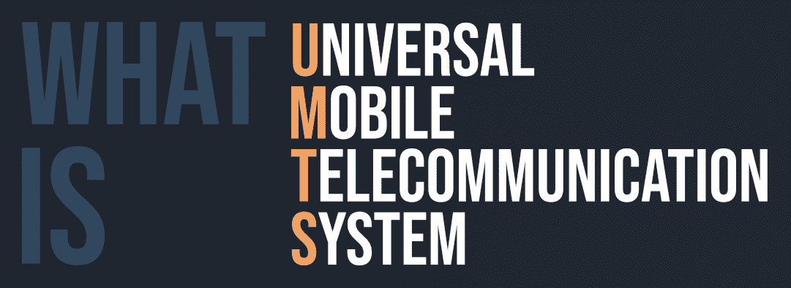

# 什么是 UMTS(通用移动通信系统)？

> 原文:[https://www . geesforgeks . org/what-is-umtsuniversal-mobile-telecom-system/](https://www.geeksforgeeks.org/what-is-umtsuniversal-mobile-telecommunication-system/)

**UMTS** 或**通用移动电信框架**，是 GSM 系列措施(包括 GPRS 和 EDGE)的 3G 继承者。3G UMTS 采用完全不同的无线电接口，其基础是利用坐标分组扩展范围，如码分多址或码分多址。虽然 3G UMTS 采用完全不同的无线电标准，但中心安排与用于 GPRS 和 EDGE 的相同，以承载分区电路交换的语音和捆绑数据。

通用移动通信系统采用一种宽带码分多址适配技术，拥有一个 5 兆赫宽的信道。比竞争对手 CDMA2000 更广泛，因为它使用的是 1.25 兆赫兹的信道，这种调整被称为宽带码分多址或 WCDMA/W-码分多址。这个标题经常被用来暗示整个框架。它可以是用于远程收集和传输的媒体传输框架。这是从更成熟的 2G 传输速度标准提升的速度，可以增加小工具和服务器之间的信息传输时间。

#### 通用移动通信系统应用

*   流/下载(视频、音频)
*   视频会议。
*   快速互联网/内部网。
*   移动电子商务
*   远程登录
*   背景类应用
*   多媒体消息、电子邮件
*   文件传输协议访问
*   移动娱乐(游戏)

#### 城市轨道交通的特点

*   UMTS 可以是由 3GPP 创建的通用广播通信联盟(ITU)的 IMT-2000 标准的一个组成部分。
*   采用宽带码分多址讨论接口。
*   它提供内容、数字化语音、视频和多媒体的传输。
*   它为便携式运营商提供了很高的传输容量。
*   它给出了 2Mbps 的高信息速率。
*   对于高速下行链路包裹到达(HSDPA)手机，下行链路连接中的数据速率高达 7.2 Mbps。
*   它还被称为移动多媒体接入的灵活性(FOMA)。

#### 城市轨道交通的优势

*   通用移动通信系统可能是基于 2G 的移动通信系统的继承者，包括 GPRS 和 EDGE。获得 3GSM 第三名，因为这可能是全球移动通信系统的 3G 迁移
*   支持 2 兆位/秒的信息速率。
*   以更低的增量成本获得更高的信息率。
*   程序化通用漫游的好处还必然包括安全性和充电能力，允许管理员从 2G 迁移到 3G，同时保留许多现有的后台框架
*   使管理员能够向交易客户和购买者展示未使用的混合媒体管理
*   这并不是说给了客户一部有价值的手机，而是为管理员解读了更高的收入。

#### 通用移动通信系统的缺点

*   比 GSM 贵。
*   通用移动通信系统的视频体验较差。
*   通用移动通信系统仍然没有宽带。