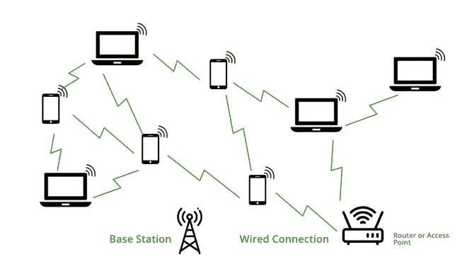
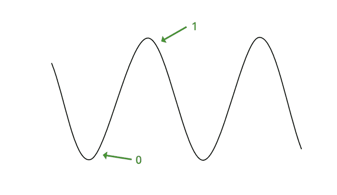
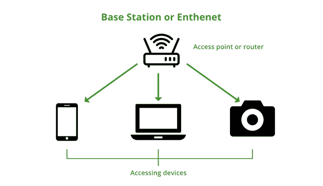

# 什么是 Wi-Fi？

> 原文:[https://www . geeksforgeeks . org/what-is-wi-fi wireless-fidelity/](https://www.geeksforgeeks.org/what-is-wi-fiwireless-fidelity/)

我们都知道 **Wi-Fi** ，在我们的移动、笔记本电脑上处处都支持 Wi-Fi。无线网络是一种无线网络技术，通过它我们可以使用无线介质访问网络或与其他计算机或移动设备连接。在无线网络中，数据通过无线电频率在圆形范围内传输。

**Wi-Fi** 、是 Wi-Fi 联盟(原无线以太网兼容性联盟)给出的品牌名称，是一个通用术语，指的是无线网络的通信标准，该网络作为局域网运行，无需使用电缆和任何类型的布线。它被称为**无线局域网**。通信标准为 **IEEE 802.11** 。无线网络使用物理数据链路层工作。

如今在所有的移动计算设备中，比如笔记本电脑、手机，还有数码相机，智能电视都有 Wi-Fi 的支持。Wi-Fi 连接是在特定范围内从接入点或基站建立到客户端的连接或任何客户端到客户端的连接，该范围取决于通过 Wi-Fi 提供射频的路由器。这些频率目前工作在 2.4 千兆赫和 5 千兆赫两种带宽上。

所有现代笔记本电脑和手机都能够使用这两种带宽，它依赖于设备内部的无线适配器来捕捉无线信号。2.4 GHz 是所有设备支持的默认带宽。2.4 GHz 可以覆盖很大范围的区域来传播 Wi-Fi 信号但是频率低，所以简单来说，互联网的速度比较少，5 GHz 带宽是针对范围比较低的区域但是频率高所以速度很高。

假设有一个 60 MB/s 带宽的互联网连接，那么对于 2.4 GHz 带宽，它提供大约 30 到 45 MB/s 的带宽连接，对于 5 GHz 带宽，它提供大约 50 到 57 MB/s 的带宽。

### 历史:

Wi-Fi 的概念很古老，但它的实现并没有那么古老。最初 **ALOHA 系统**是 1971 年通过网络连接夏威夷岛的无线网络系统。这里使用的协议是 ALOHA 协议，网络使用分组传输。后来转换成 IEEE 802.11 协议。

然后在 1985 年，联邦通信委员会(FCC)发布了一个新的通用网络，工作在 900 Mhz、2.4 GHz 和 5.8 GHz 带宽上。这就是著名的 *ISM 乐队*。此外，IBM 推出了一个连接多台计算机的*令牌环网*网络，它可以以 4 Mb/s 的速度传输数据。然后在 1988 年，基于令牌环网络的无线收银系统被发明出来，称为*波兰*，它在 900 兆赫兹或 2.4 千兆赫兹的频段下工作，提供 1 到 2 兆比特每秒的速度。然后在 1989 年转换为 *IEEE 802.11LAN/MAN* 标准。？然后在 1990 年，被称为**“Wi-Fi 之父”**的**维克·海斯**成立了 IEEE 802.11 无线局域网工作组。

然后在 1994 年，【Alex Hills 博士介绍了一个关于无线网络的研究项目，该项目无线覆盖了 7 栋建筑。

然后在 1996 年*英联邦科学与工业研究组织(CSIRO)* 推出了基于相同协议 802.11 的无线网络，后来被称为 IEEE 802.11a 标准。

然后经过这一切在 1997 年第一个版本的 Wi-Fi 正式发布，这是 802.11，它可以支持最大 2 Mb/s 的链接速度。然后在 1999 年，链路速度在 2.4 GHz 频段上提高到 11 Mb/s，这个版本被称为 *802.11b*

然后一个月后，IEEE 802.11a 标准正式获批，在 5 GHz 频段提供高达 54 Mb/s 的链路速度，但信号范围弱于 2.4 GHz 频段。

然后到了 2003 年，速度又增加了一个新版本，叫做 *802.11g* 。该速度在 2.4 GHz 上提供高达 54 至 108 Mb/s 的速度。
之后又推出了两个版本，分别是 *802.11i 和 802.11e* 。802.11i 增加了安全机制，802.11e 涉及无线局域网语音和多媒体流。

然后在 2009 年开发了 802.11n，同时支持 2.4 GHz 和 5 GHz 射频。并且这些被双频路由器同时使用，最高速度可达 600 Mbps。

然后在 2014 年，推出了一个新版本，在 5 GHz 频段提供 1733 Mb/s 的潜在速度。这个版本被称为 *802.11ac* 。到目前为止，这是无线网络的最新版本。

### 无线网络的应用:

无线网络有许多应用，它被用于所有使用计算机或任何数字媒体的领域，也用于娱乐无线网络。下面提到了一些应用–

*   接入互联网:使用无线网络，我们可以在任何支持无线网络的设备上无线接入互联网。
*   为了娱乐，我们可以在任何使用无线网络的设备上无线传输音频或视频。
*   我们可以使用 Wi-Fi 在两台或多台电脑或手机之间共享文件、数据等，数据传输速率的速度也很高。此外，我们可以使用无线打印机打印任何文件，这是现在非常常用的。
*   我们可以使用无线网络作为热点，也可以将无线互联网接入指向特定范围的区域。使用热点，主网络连接的所有者可以为支持无线网络的设备提供临时网络访问，这样用户就可以在不了解主网络连接的情况下使用网络。Wi-Fi 适配器主要是利用所有者网络连接来传播无线电信号，以提供热点。
*   使用无线网络或无线局域网，我们可以构建从一个点到另一个点的简单无线连接，称为点对点网络。这对于连接两个难以通过电线到达的位置非常有用，例如两栋公司大楼。
*   一个更重要的应用是 **VoWi-Fi** ，它被称为**语音无线**。几年前，电信公司引入了长期演进语音。现在他们被介绍到了 VoWi-Fi，通过它我们可以用家里的 Wi-Fi 网络给任何人打电话，唯一的一点就是手机需要和 Wi-Fi 连接。然后使用 Wi-Fi 网络传输语音，而不是使用移动 SIM 网络，所以通话质量非常好。很多手机已经得到了 VoWi-Fi 的支持。
*   办公室里的无线网络:在办公室里，所有的电脑都是通过无线网络相互连接的。对于无线网络，没有复杂的布线。还有，网速不错。对于无线网络，一个项目可以以 excel 表格、ppt 等形式一次呈现给所有成员。对于无线网络，不存在电缆断裂导致的网络损耗。
*   此外，使用无线网络，整个城市可以通过在特定区域部署路由器来访问互联网，从而提供网络连接。由于无线网络的灵活性，学校、学院和大学已经开始提供无线网络。
*   Wi-Fi 也被用作*定位系统*，通过它我们可以检测 Wi-Fi 热点的位置来识别设备位置。

### 无线网络的类型:

Wi-Fi 有几种类型的标准，前面已经讨论过了，这里只是定义了标准的名称，

<figure class="table">

| 标准 | 发布年份 | 描述 |
| Wi-Fi-1 (802.11b) | One thousand nine hundred and ninety-nine | 该版本在 2.4 GHz 频段上的链路速度为 2Mb/s 至 11 Mb/s |
| 无线网络 2 (802.11a) | One thousand nine hundred and ninety-nine | 经过一个月的发布，802.11a 版本发布了，它在 5 Ghz 频段上提供高达 54 Mb/s 的链接速度 |
| Wi-Fi-3 (802.11g) | Two thousand and three | 在这个版本中，速度在 2.4 GHz 上提高到 54 到 108 Mb/s |
| 802.11i | Two thousand and four | 这与 802.11g 相同，但在此版本中仅增加了安全机制 |
| 802.11e | Two thousand and four | 这也与 802.11g 相同，仅涉及无线局域网语音和多媒体流 |
| Wi-Fi-4 (802.11n) | Two thousand and nine | 此版本支持 2.4 GHz 和 5 GHz 射频，并提供高达 72 至 600 Mb/s 的速度 |
| 无线局域网-5 （802.11ac） | Two thousand and fourteen | 它在 5 GHz 频段支持 1733 Mb/s 的速度 |

由**华为**开发的名为 *802.11ax* 的新版本将于 2020 年发布，最高可支持 3.5 Gb/s，会知道 **Wi-Fi 6** 。

### 无线网络是如何工作的？

无线网络是一种无线网络技术，所以它使用电磁波来传输网络。我们知道电磁波根据其频率有很多划分，如 X 射线、伽马射线、无线电波、微波等，在 Wi-Fi 中，使用的是无线电频率。传输无线信号有三种媒介，

*   **基站网络或以太网(802.3)连接:**它是主主机网络，网络连接从这里提供给路由器。
*   **接入点或路由器:**它是有线网络和无线网络之间的桥梁。它接受有线以太网连接，并将有线连接转换为无线连接，并将该连接作为无线电波传播。
*   **接入设备:**我们使用 Wi-Fi 和上网的地方是我们的手机、电脑等。

无线网络的工作

所有电子设备都以二进制形式读取数据，路由器或我们的设备也是如此，这里路由器提供无线电波，这些波被我们的设备接收，并以二进制形式读取这些波。我们都知道一个波是什么样子的，在二进制中，波的上截口被称为 1，波的下截口被称为 0。如下所示:

数据传输

### **更多术语**

*   **SSID(服务集标识符)**:它是一个 32 个字符的名称，用于标识 Wi-Fi 网络并区分一个 Wi-Fi 和另一个 Wi-Fi。所有设备都在尝试连接特定的 SSID。简单来说，SSID 就是无线网络的名称。
*   **WPA-PSK(保护无线电脑网络安全系统-预共享密钥):**它是 Wi-Fi 联盟管理局开发的一个程序，通过使用预共享密钥(PSK)认证来保护无线网络。WPA 有 3 种类型，比如 WPA。WPA2，WPA3。这是一种加密无线信号的方式，以防止不受欢迎的用户。
*   Wi-Fi 使用**特设**网络进行传输。它是一个没有任何接口的点对点网络。

### **信号是如何到达我们的设备的？**

基站

### 无线网络的优势

*   这是一个灵活的网络连接，没有布线的复杂性。可以从无线网络范围内的任何地方访问。
*   它不需要监管机构对个人用户的批准。
*   它很畅销，可以通过使用无线网络扩展器进行扩展。
*   它可以用简单快捷的方式设置。只需要配置 SSID 和密码。
*   在一个安全性很高的无线网络中，它使用 **WPA** 加密来加密无线电信号。
*   它的成本也更低。
*   它还可以提供热点。
*   它也支持漫游。

### 无线网络的缺点

*   在任何有电池的设备(如手机、笔记本电脑等)中使用无线网络时，功耗都很高。
*   很多时候可能会出现一些安全问题，即使它有加密。比如很多时候已经知道的设备变成了未知的路由器，Wi-Fi 也可以被黑。
*   速度比直接电缆连接慢。
*   它的辐射像手机一样低，所以会伤害人类。
*   无线信号可能会受到雷暴等气候条件的影响。
*   由于无线网络没有防火墙，可能会发生未经授权的访问。
*   为了使用无线网络，我们需要一台路由器，它需要一个电源，所以在停电的时候，我们不能上网。

</figure>