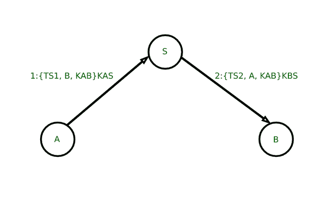

# 什么是广口蛙？

> 原文:[https://www.geeksforgeeks.org/what-is-wide-mouth-frog/](https://www.geeksforgeeks.org/what-is-wide-mouth-frog/)

广口蛙协议是一种计算机网络验证协议，通常用于不安全的网络。它允许人们通过网络通信来相互验证他们的身份，它还有助于防止[重放攻击](https://www.geeksforgeeks.org/replay-attack/)，或[窥探](https://www.geeksforgeeks.org/snooping-tcp/)，并提供任何改变的检测和任何不想要的阅读的预防。这可以通过 BAN(Burrows-Abadi-Needham)逻辑来证明。但是，为了避免主动攻击，必须使用某种形式的消息身份验证或身份验证加密。

该协议可以在安全协议符号中指定如下，其中用户 A 正在使用服务器 S 向用户 B 验证自己:

*   其中用户 A、用户 B 和可信服务器的身份分别为 A、B 和 S。
*   用户 A 和服务器 S 生成的时间戳分别是 TS1 和 TS2。
*   只有 A 和 s 知道的对称密钥 KAS
*   生成的对称密钥 KAB，它将是用户 A 和用户 B 之间会话的会话密钥。
*   只有甲乙双方知道的对称密钥 KBS

```
A  → S: A, {T{S1}, B, K{AB}}K{AS}
S  → B: {T{S2}, A, K{AB}}K{BS}
```



**广口蛙协议**

### **广口蛙协议的工作:**

为了理解工作原理，让我们考虑一下广口青蛙协议的例子:

```
M1 A → S: {T{S1}.B.K{AB}}SKey(A)  
M2 S → B: {T{S2}.A.K{AB}}SKey(B)  
```

这里，服务器与 A 和 B 共享两个不同的密钥，即 SKey(A)和 SKey(B)；该协议的目的是在用户 A 和用户 B 之间建立会话密钥 K{AB}，并验证 A 到 B，之后用户 A 创建会话密钥，并将其与时间戳 TS1 一起定向到服务器；然后，服务器将密钥连同新的时间戳 TS2 一起发送给用户 B。通常使用时间戳，以便用户可以获得他们接收的消息是最近创建的指示。应该注意的是，为了传递和这个机制的工作，不同用户的时钟需要同步；每个用户的时钟对协议的安全性至关重要。

为了理解这个协议，我们需要了解如何在 **Casper** 中建模时间，Casper 语法的一些其他特性，以及选择要检查的系统的语用学。为此，让我们考虑运行该协议的四个不同系统。FDR 发现对系统 A 没有攻击，尽管它在其他系统上发现了三种不同的攻击。大型系统需要更多的时间来检查，所以一个实用的方法是从一个较小的系统开始，然后逐步升级。毫无疑问，我们检查的系统 D 在某种程度上是为允许特定攻击而定制的；尽管如此，系统 A、B 和 C 都是应该经常考虑的系统的例子。

大多数协议的建模一般都很简单；下面给出了一些要点。

```
#Free variables
A, B : User
S : Server
SKey : User → SKeys
KAB : SEKey
TS1, TS2 : TimeStamp
InverseKeys = (SKey, SKey)
```

卡斯帕脚本中的大多数类型名称都可以由用户选择，尽管时间戳是一个例外。

[时间戳](https://www.geeksforgeeks.org/introduction-to-timestamp-and-deadlock-prevention-schemes-in-dbms/)由自然数在 Casper 中建模。因此，与发送消息所花费的时间相比，不要假设时间单位的大小；在同一时间单位内可能出现许多消息，也有可能某些时间单位可能在连续消息之间传递。

```
#Processes
INITIATOR (A, S, KAB) knows SKey(A)
RESPONDER(B) knows Skey(B)
SERVER(s) knows SKey
#Protocol description
0\. → A : B
1\. A → S : {B, TS1, K{AB}}{SKey(A)}
[TS1==now or TS1+1==now]
2\. S → B : {A, TS2, K{AB}}{SKey(B)}
[TS2==now or TS2+1==now]
```

**广口蛙协议**中的用户获得一条消息，他们可以检查他们收到的时间戳是否是最近的。它们是由获取前面消息的用户完成的；如果检查失败，用户可以中止运行。

```
#Specification  
TimedAgreement(A, B, 2, [KAB])
```

要求是，如果响应用户 B 与用户 A 一起完成了协议的运行，那么用户 A 应该已经在前两个时间单位内运行了协议；此外，这两个用户应该批准 KAB 的值，并且 A 和 b 的运行之间必须有一对一的关系。所有这些在时间戳上执行的测试都允许每个一次单位的延迟，因此最大可能延迟两次单位。

然而，为了使这个规范有任何成功的机会，在 S 检查消息 1 和发送消息 2 之间需要有一个可以忽略的延迟。

我们现在来看系统 A，考虑一个只有单个发起方用户 A 和单个响应方用户 B 的系统，两者都可以运行一次协议；使所有的数据类型尽可能小，并与这个系统保持一致。一般来说，实际变量的描述比较简单；这里唯一的新特性是时间是如何建模的:

```
#Actual variables
User A, User B, kcbt : User
mkcbt : Server
KAB : SessionKey
TimeStamp = 0 .. 0
MaxRunTime = 0
```

```
#System
INITIATOR(User A, mkcbt, KAB)
RESPONDER(User B)
SERVER(mkcbt)
```

```
#Functions
symbolic ServerKey
```

```
#Intruder Information
Intruder = kcbt
IntruderKnowledge = {User A, User B, kcbt, mkcbt, SKey(kcbt)}
```

这里我们假设入侵者可以产生所有时间戳；因此，它们不必包含在入侵者的初始知识中。因此，当使用 Casper 编译上述文件时，FDR 无法发现对后续系统的任何攻击。

现在，让我们看看系统 B，考虑一个系统，其中用户 A 可以作为发起者同时运行一次协议。

```
#System  
INITIATOR(user A, mkcbt, kcbt)  
RESPONDER(user A)  
SERVER(mkcbt)
```

在这里，FRD 发现协议没有正确地向响应用户 A 认证发起用户 B。因此，通过使用 FRD 调试器，我们发现攻击的形式如下所示。

```
M α.1 A → mkcbt: {B.0.KAB}SKey(A)
M β.2 Imkcbt → kcbt: {B.0.KAB}Skey(A)
```

攻击者仅仅是在用户本身重新运行用户 A 的第一条消息，他们认为这是用户 b 启动的运行的消息 2

现在，让我们看看系统 C，其中响应用户 B 可以顺序运行协议两次。

```
#System
INITIATOR(A, mkcbt, KAB)
RESPONDER(B) ; RESPONDER(B)
SERVER(mkcbt)
```

如果用户可以多次运行该协议，则可能会受到攻击；尽管通常情况下，攻击者可以使用第一次运行的信息来伪造第二次运行。

```
#System
INITIATOR(A, mkcbt, KAB)
RESPONDER(B)
RESPONDER(B)
SERVER(mkcbt)
```

现在，在这种情况下，FCR 告诉我们用户 A 没有被正确认证。因此，FDR 调试器可用于展示以下一些攻击，因为这些攻击违反了内射身份验证属性。

```
M α.1 A → mkcbt : {B.0.KAB}SKey(A)
M α.2 mkcbt → B : {A.0.KAB}SKey(B)
M β.2 Imkcbt → B : {A.0.KAB}SKey(B)  
```

这里的问题是，用户 B 认为他已经完成了协议的两次运行，而用户 A 只想执行一次运行。在这里，攻击者基本上将 mkcbt 的消息重放给用户 B，这样用户 B 就认为用户 A 正在尝试建立第二个会话。

现在，让我们看看系统 D，在这里攻击者可以打破两次单位限制。也就是说，用户 B 在用户 a 的相应运行之后完成了两次以上的运行

```
TimeStamp = 0 . . 3
#System
INITIATOR(A, mkcbt, KAB)
RESPONDER(B)
SERVER(mkcbt) ; SERVER(mkcbt) ; SERVER(mkcbt)
```

检查系统后，故障诊断与排除查看启动器用户 A 是否未按照上述时间规范进行身份验证。因此，在使用调试器后，可以发现以下攻击。

```
M α.1 A → mkcbt : {B.0.KAB}SKey(A)
M α.2 mkcbt → IB : {A.0.KAB}SKey(B)
                   tock
M β.1 IB → mkcbt : {A.0.KAB}SKey(B)
M β.2 mkcbt → IA : {B.1.KAB}SKey(A)
                     tock
M γ.1 IA → mkcbt : {B.1.KAB}SKey(A)
M γ.2 mkcbt → IB : {A.2.KAB}SKey(B)
                     tock
M δ.1 Imkcbt → B : {A.2.KAB}SKey(B)
```

### **广口协议中的问题:**

*   它需要一个全球时钟。
*   服务器 S 可以访问所有的密钥。
*   会话密钥 KAB 的值由用户 A 确定。
*   它只能在有效的时间戳周期内重播消息。
*   用户 A 不确定用户 B 是否存在。
*   这是一个有状态的协议。