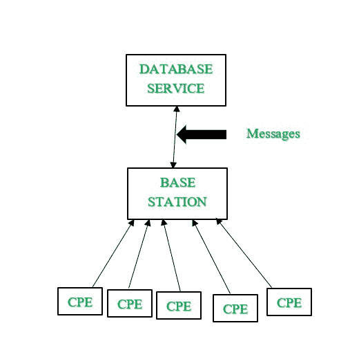

# 什么是 WRAN(无线区域网)？

> 原文:[https://www . geesforgeks . org/what-is-wran-wireless-regional-area-network/](https://www.geeksforgeeks.org/what-is-wran-wireless-regional-area-network/)

代表无线区域网络的 WRAN 是专为农村地区、发展中国家和人口密度低的地方设计和建立的。IEEE 802.22 是为无线区域网开发的标准，它使用[射频](https://www.geeksforgeeks.org/introduction-of-radio-frequency-identification-rfid/)(射频)频谱的空白来提供难以到达的区域的广播连接。空白是频谱中未使用的部分。这是在认知无线电的帮助下完成的，认知无线电是为无线系统设计的，以避免干扰和拥挤。

WRAN 是在电视频谱中未使用的频道中进行的，以获得低频信号的更好传播。WRAN 是第一个在全球范围内以较少干扰有效管理未使用的电视频谱宽带的系统。

**WRAN 的需求:**
使用频谱需要的前提条件很高，整个频谱的使用效率不高。2004 年至 2005 年的一份报告宣称，整个频谱只有 5.2%在使用，这就需要设计一个网络，能够有效利用频谱中剩余的未使用频段。以前的系统不足以覆盖整个地理区域，包括农村地区。但是，有必要向该地区的人民提供服务，因为许多国家仍处于发展中国家，有许多农村地区。电视频谱是专门为 WRAN 选择的，因为它有大量空闲频道，WRAN 的设备不需要获得许可。所以，成本是可以承受的。

**拓扑在 WRAN 使用:**
IEEE 802.22 使用**点到多点网络拓扑**，这意味着单个基站可以为多个用户站提供服务。此设置的要求是必须安装一个基站和任意数量的客户驻地设备。基站控制所有射频活动。BS 和 CPE 的关系是主从关系。所涉及的功能是射频感应和接收或发送信号。射频检测由基站定期执行，报告由中央处理器发送给基站。基于该报告，基站决定必须使用哪个空闲频谱信道来承载与基站的通信。CPE 设计有两个天线。一个天线用于与基站通信。另一根全向天线用于收集报告和测量结果。

**WRAN 数据库接口模型:**

WRAN 的数据库接口模型

根据规定，数据库的 WRAN 接口必须直接连接在基站和数据库服务之间，而不是单独的 CPE 本身。这是因为基站必须找到除了单个 CPE 之外的所有 CPE 共有的空闲信道。

**WRAN 的考虑:**
在设计 WRAN、PHY 考虑和 MAC 考虑时，有两层需要仔细考虑。

**PHY 对价(实物对价):**

*   WRAN 应该有很高的表现率。它还必须在经济和技术上高效。
*   CPE 必须具有承受各种条件的能力，并且它们还应该具有从一个频道跳到另一个频道的灵活性，而在传输中没有任何错误。
*   它必须在带宽调整、编码技术等方面高度灵活。
*   发射功率控制和频率捷变是设计 WRAN 的两个重要因素。

**媒体访问控制考虑因素:**

*   基站是主控方，这意味着未经基站批准，任何其他 CPE 不得发起或承载任何传输。
*   CPE 应该负责识别正确的空闲信道，并且应该通知基站它的存在。
*   基站的循环频谱检测和来自 CPE 的反馈传输必须在传输期间继续，因为如果需要改变信道，它可以在任何时间执行。
*   基站在每帧开始时向中央处理器发送前导信号，以将其消息与电视广播消息区分开来。

**频谱感知:**
频谱感知由客户驻地设备(CSP)执行。CSP 观察并记录射频，以找到电视频谱中未使用的频道。

**带内频谱感知:**
它发现频谱中未使用的信道，这些信道可用于认知无线电用户的传输。有两种类型，精细检测和快速检测。

**精细感知:**

*   当基站发现需要更精确的测量时，就会进行精细感知。
*   检测时间最长为 25–30 毫秒。
*   在精细感知中，CSP 侧重于感知可能是频谱(电视)主要用户的信号。

**快速感应:**

*   传感任务执行得很快。
*   使用的算法是能量检测算法。
*   检测时间为 1 毫秒。

**WRAN 的应用:**
IEEE 802.22 的主要应用是在偏远地区、农村地区或简单的偏远地区提供无线宽带。WRAN 允许音频和视频、语音、数据的传输，并支持服务质量。在农村地区，较低频率的使用是有效的，这是由于认知无线电的所需条件，其经历的低频传输被合法地接受用于电视广播和无线麦克风。从频谱中识别出未使用的频道，然后使用卫星传送电视信号。WRAN 被广泛应用于创业公司和小企业。

**WRAN 优势:**

*   WRAN 网络的用户是未经许可的，这意味着 IEEE 802.22 具有成本效益。
*   覆盖的地理范围高于其他 IEEE 802 标准。
*   通过使用未使用的信道，以有效的方式使用频谱。
*   WRAN 提供的服务范围很广，如数据、语音、视频等。
*   WRAN 向农村地区提供广播服务。

**WRAN 的劣势:**

*   与 IEEE 802 的其他标准相比，IEEE 802.22 中的传播延迟更大。
*   自我共存:802.22 的重叠网络
*   隐藏现任者:可被 CPE 感知但不能被基站感知的频谱称为隐藏现任者。

IEEE 802.22 标准的增强版分别使用图着色模型和多重广播解决了自共存和隐藏在位问题。