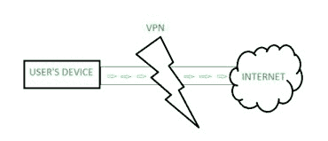

# VPN 需要制定什么样的政策和流程？

> 原文:[https://www . geeksforgeeks . org/VPN 需要制定什么样的政策和程序/](https://www.geeksforgeeks.org/what-kind-of-policies-and-procedures-needed-to-be-developed-for-vpn/)

[VPN](https://www.geeksforgeeks.org/virtual-private-network-vpn-introduction/) 的完整形式是虚拟专用网络，当不同的节点或计算机组合在一起，在公共网络上形成一个专用网络时，那么它就被称为 VPN，

这是一种用于为无线热点和互联网等私有和公共网络增加安全性和隐私的技术。虚拟专用网络主要被公司用来保护他们的敏感数据。在虚拟专用网的帮助下，企业确保了安全，任何拦截加密数据的人都无法读取。

虚拟专用网络

**优势:**

*   外出旅行时，虚拟专用网允许任何组织的员工安全地访问公司内部网。
*   个人互联网用户也使用虚拟专用网络来保护他们的无线交易，以保护个人身份和位置。
*   这所教育大学还使用虚拟专用网络来连接他们在世界各地的校园。
*   通过消除对昂贵的长途租用线路的需求，虚拟专用网可以为组织节省资金，
*   虚拟专用网降低了长途电话费和卸载支持成本。

**为什么 VPN 流行:**

*   在不受信任的公共网络上，虚拟专用网络提供安全和加密的通信。
*   一般来说，组建专网的成本很高，但是在 VPN 的帮助下，我们几乎可以免费实现专网。
*   即使网络资源不在同一个局域网上，我们也可以在虚拟专用网络的帮助下访问它们。

**优势:**

*   提高安全性和隐私性
*   与所有设备兼容
*   能够绕过限制性网络
*   如果需要，它允许我们修改 IP 地址。

**缺点:**

*   降低连接速度
*   需要额外路由器
*   可靠性

**VPN 需要制定的政策和程序:**

**VPN 的政策是:**
一般组织员工及其授权的第三方都会使用 VPN。用户选择互联网服务提供商，并可以进行协调安装和支付相关费用。

*   可以使用具有强大的一次性密码身份验证(令牌设备)的公钥或私钥系统来控制 VPN。
*   在虚拟专用网特权的帮助下，员工可以处理不允许访问内部网络的未授权用户。
*   不允许双(分割)隧道，只允许一个网络。
*   一个公司的所有计算机都必须使用最新的防病毒软件才能通过 VPN 连接到网络。

**开发 VPN 需要的程序:**
现在让我们看看开发 VPN 应该遵循的步骤是:

*   单击任务栏上的搜索栏，然后键入 VPN。
*   然后选择更改虚拟专用网络选项。
*   打开设置应用程序，转到网络和互联网>虚拟专用网络。
*   选择添加虚拟专用网连接。
*   输入您的虚拟专用网连接的详细信息。
*   在“虚拟专用网提供商”下，单击菜单，并选择窗口(内置)。您也可以将“虚拟专用网类型”更改为“自动”，将“登录信息类型”更改为“用户名和密码”。
*   现在输入“连接名称”和“服务器名称或地址”。
*   在底部添加虚拟专用网的用户名和密码。