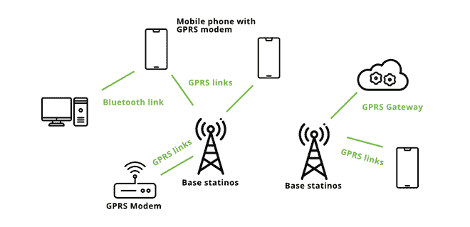

# GPRS 传输什么信号？

> 原文:[https://www . geeksforgeeks . org/GPRS 中传输什么信号/](https://www.geeksforgeeks.org/what-signals-are-transferred-in-gprs/)

通用分组无线服务(GPRS)是一种分组和数据传输服务，旨在取代 2G 全球移动通信系统中可用的电路交换服务。GPRS 允许互联网持续连接到移动电话和手持设备。它基于使用现有服务的 GSM 服务，如短信和电路交换电话网络和连接。

通用分组无线业务

### 特征

*   数据速率范围从 56 kbps 到最大 114 kbps。
*   短信服务。
*   具有不间断功能的互联网接入。
*   彩信。
*   在手持设备上使用即时消息。
*   点对点/多点服务。
*   需要安全传输数据包。
*   对高数据速率日益增长的需求。
*   基于服务质量的订阅需求

*比如*，我们来讨论一下在 GPRS 网络中是如何跟踪移动台的位置的？

考虑手机跟踪，这是一个识别手机位置的过程，无论手机在哪里(固定的还是移动的)。

*   限制可能会受到各种创新的影响，例如在组织的蜂窝塔和电话之间利用无线电信号的多点定位(双曲线定位，或精确定位物体的过程)，或基本上利用全球定位系统。
*   要找到一部使用多种无线电信号的手机，无论如何，它都应该产生非活动信号来联系附近的接收线塔，但这种交互不需要正常的呼叫。
*   全球移动通信系统(GSM)依靠移动电话的标志团结来关闭天线杆。
*   便携式定位可用于基于位置的管理，揭示手机的真实组织。电信组织利用这一点来粗略测量手机区域，随后同样测量其客户端。

### **在 GPRS 中传输的信号类型**

*   一般来说，GPRS 使用 2.5 代的 GSM 信号。
*   GSM 和 GPRS 的无线接口是一样的。
*   GPRS 使用 GMSK 调制和 900 / 1800 兆赫频带。
*   需要单独的硬件和端口。

### **GPRS 的应用:**

*   车辆定位
*   家庭自动化
*   网页浏览
*   远程局域网接入
*   文档共享。

### **优势:**

*   GPRS 为用户提供高速数据服务。
*   通过应用 GPRS，更多的信息可以通过互联网在移动设备之间交换。
*   对于用户来说，计费是基于服务质量和传输的数据量，而不是像 GSM 那样基于连接时间。
*   它吸引了更多的顾客。
*   与 GSM 相比，部署成本较低
*   由于效率高，它减少了资源的滥用。

### **缺点:**

*   现实中速度有点低。
*   现在使用 GPRS 的移动台，不能接收直接的 GPRS 呼叫。
*   运营商可能会决定根据时间而不是数量收费
*   所有用户的有限小区容量。