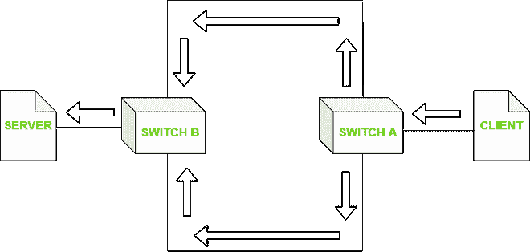

# 什么是广播风暴？

> 原文:[https://www.geeksforgeeks.org/whats-a-broadcast-storm/](https://www.geeksforgeeks.org/whats-a-broadcast-storm/)

在这篇文章中，我们将讨论一场**广播风暴**及其影响，以及我们如何消除它们。

A [广播风暴](https://www.geeksforgeeks.org/redundant-link-problems-in-computer-network/)基本上是在很短的时间内突然出现大量广播数据包的情况。由于广播风暴，网络质量显著下降。它会导致计算机网络上广播和多播流量的累积。

这种情况会导致消耗所有的网络，所以，它将无法传输正常的流量。导致这种情况的广播数据包通常称为切尔诺贝利数据包。

广播风暴

**广播数据包的类型:**

主要有三种类型的广播数据包:

*   广播
*   多点传送
*   单播

广播数据包使用空气作为媒介，以相同的频率向任何听众传输广播。广播数据包以下列方式使用目的报头:

*   第二层广播
*   255.255.255.255(第 3 层广播)

**广播风暴的根本原因:**

*   当用户想要连接到特定的网络集线器，但是由于错误，它连接到了另一个交换机端口。这将捕获所有帧，并将它们保持在循环中。例如，当计算机在连接到无线网络的同时连接到端口时，网络将设置为桥接模式。
*   **不适当的 VLAN** 配置设置会造成循环，最终导致广播风暴。
*   **太大的广播域–**如果广播太大，那么一个域中的流量与广播域的大小成正比，即 L2 VLAN 或 L3 子网中的主机数量。
*   **通过 DHCP 大量请求 IP 地址–**DHCP 是网络主机从网络控制器获取 IP 地址最简单的方法。DHCP 使用广播或单播数据包作为其媒介。例如，当网络在中断后恢复在线时，该网络上的所有成员都会尝试获取该 IP 地址。

**防止广播风暴的步骤:**

*   防病毒防火墙可用于检测和移除恶意的和故意引起的广播风暴，以破坏网络。
*   ARP 表被清除的频率越高，广播请求发生的频率就越高。
*   风暴协议和等效控制技术允许限制广播数据包。
*   禁用第 3 层设备上的广播。如果风暴源自广域网，那么关闭 IP 定向广播将解决问题。
*   分割广播域将有助于转移广播流量。通过创建一个新的 VLAN 网络，我们可以将一半以上的流量转移到另一个网络。这将大大有助于减少风暴。
*   交换机的定期维护确保它们不会面临任何硬件故障。
*   检查交换机中的环路有助于非托管交换机的上游。为了响应广播，不受管理的交换机有时会向网络发送大量不必要的流量。

综上所述，以下因素在制造广播风暴中发挥了有效作用:

*   糟糕的网络管理
*   网络监控不力
*   廉价枢纽和港口的使用
*   网络配置不当
*   缺乏网络图设计，这是正确管理和为所有网络流量路由提供指导所必需的