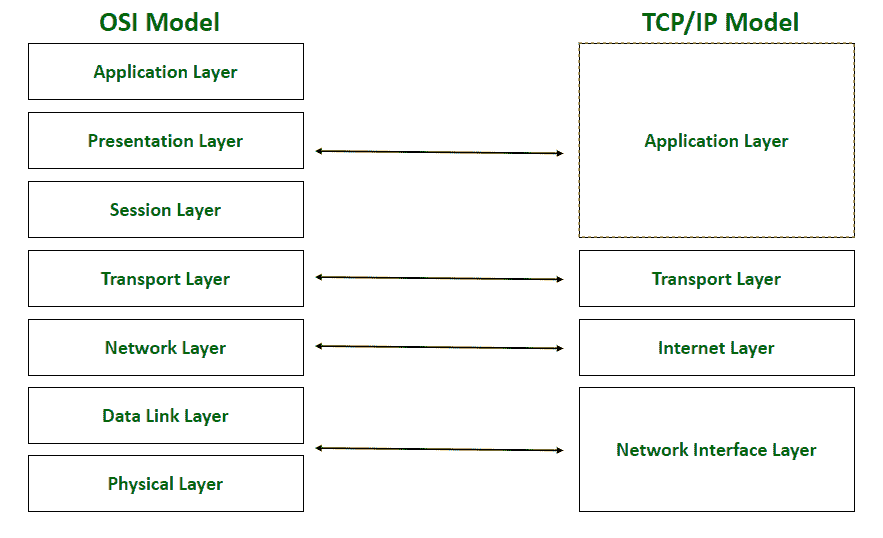

# 为什么现场视察参考模型很重要？

> 原文:[https://www . geesforgeks . org/为什么 osi 参考模型很重要/](https://www.geeksforgeeks.org/why-does-the-osi-reference-model-matter/)

OSI(开放系统互连)模型是描述不同计算机系统中软件应用程序之间信息移动的参考模型。它是计算机网络中使用的七层模型。它有助于在考虑现有网络标准的同时开发新标准。随着网络领域需求的动态变化， [TCP/IP 模型](https://www.geeksforgeeks.org/tcp-ip-model/)已经变得更加流行，但是 [**OSI 模型**](https://www.geeksforgeeks.org/videos/what-is-osi-model-in-computer-networking/) 仍然是网络工程师的基本框架。OSI 模型层可以与 TCP/IP 层相关联，以了解 TCP/IP 模型。

现场视察与传输控制协议模型的关系

如今，TCP/IP 模型比现场视察模型更常见，但它仍然被用作一个理论概念，用于联系计算机网络中的不同技术。现场视察模型仍然适用的原因如下:

1.  [**识别威胁**](https://www.geeksforgeeks.org/threats-to-information-security/) **:** OSI 模型有助于识别整个网络中的威胁。它帮助信息技术专家检测网络过程中任何阶段出现的网络问题，并排除此类问题。它还用于使用模型层对组织的资产和数据进行资产盘点和分类，并根据受这些问题影响的层来解决网络中的漏洞和安全事件。
2.  **以数据为中心的安全态势:**它提供了一个对组织资源进行盘点的框架，因此具有以数据为中心的视角，有助于识别网络中的数据安全风险领域。它提供了关于模型每一层的详细信息，这些信息在选择正确的工具以在正确的现场视察层中提供更好的数据可见性方面起着关键作用。现场视察模型对于网络内的合规性也很重要，因为它确保网络内的控制是根据数据环境开发的。
3.  **安全云采用:**在过去几年中，云计算的普及程度显著提高，许多组织都在向云迁移，因为它的好处，但云系统存在某些安全问题，如数据泄露、恶意软件注入、不安全的 API、数据丢失等。现场视察模型在迁移到云时非常有用，因为它以数据为中心的观点有助于理解云的采用可能给网络带来的数据安全风险。这使组织能够制定更好的策略来决定采用哪种类型的云系统来减少这些安全问题。
4.  [**【安全云基础设施】**](https://www.geeksforgeeks.org/cloud-computing-security/) **:** OSI 模型优先考虑网络安全，因此可用于易出现不同安全问题的云系统，如数据泄露、恶意软件注入、不安全的 API、数据丢失等。现场视察模型是通用的，可以以不同的方式应用于云基础设施。它对组织的安全资源和资产进行盘点，并以有利于网络安全计划的方式进行修改。

因此，现场视察模型很重要，因为它构成了系统互连标准发展的基础，同时考虑了整个参考模型中的现有标准。此外，它有助于有效地理解其他网络模型和技术。它为开发者提供了一个清晰的框架，这样他们创建的数字通信产品和软件程序就可以进行互操作。