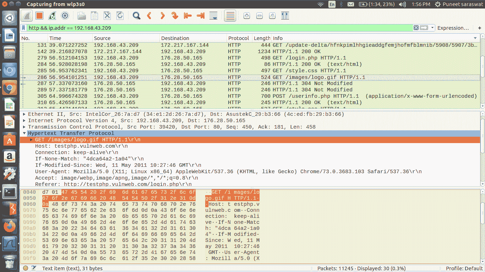
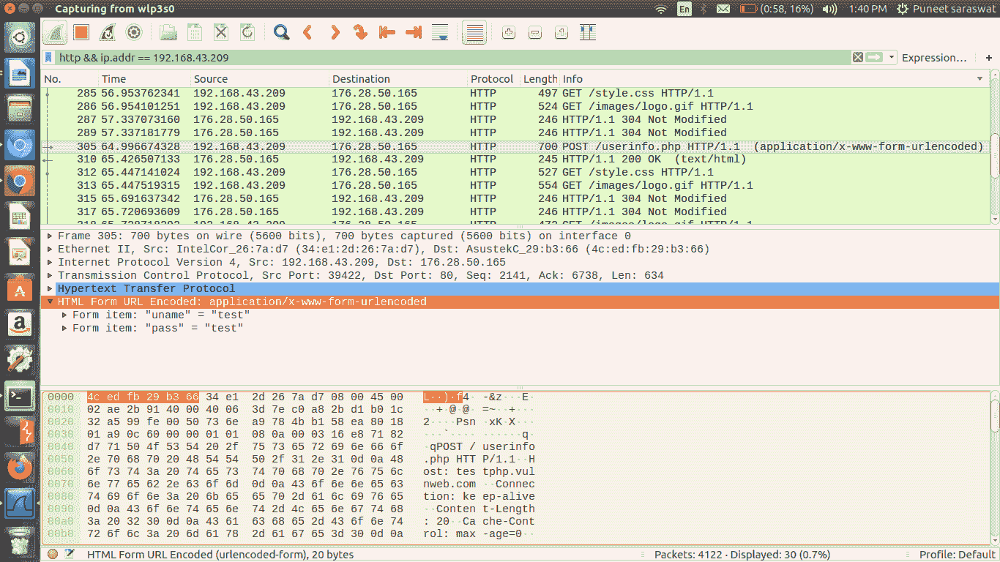

# 为什么 HTTP 不安全？

> 原文:[https://www.geeksforgeeks.org/why-http-is-not-secure/](https://www.geeksforgeeks.org/why-http-is-not-secure/)

我们每个人至少有一次遇到这样的说法:

> "在输入您的私人信息之前，请确保 abc 网站使用 HTTPS . "

如果答案是肯定的，那么你有没有试图找到这种说法背后的原因。让我们找出原因。

在继续下一步之前，必须明确两点-

1.  **[HTTP](https://www.geeksforgeeks.org/http-non-persistent-persistent-connection/) :**
    超文本传输协议(HTTP)是用于访问万维网的核心通信协议。
    采用基于消息的模型，客户端发送请求消息，服务器返回响应消息。
2.  **[HTTPS](https://www.geeksforgeeks.org/https-full-form/) :**
    超文本传输协议 Secure (HTTPS)显然它的名字表明这是 HTTP 的一个安全进步。它基本上是与 HTTP 相同的应用层协议，但是它是通过安全传输机制进行隧道传输的。

需要理解的一点是，HTTP 以纯文本形式传输数据，而 HTTPS 为数据添加了加密层。
现在我们已经了解到，HTTP 在通信时不会加密我们的数据，这意味着位于网络上适当位置的攻击者可以窃听或查看我们的数据。

让我们潜得更深！
为了开始我们的探索，我们使用 Linux 机器和 wireshark 作为数据包分析工具(它们用于网络分析)。

首先，我们必须设置 wireshark 来监控所有正在进行的 HTTP 流量，因为我们将进入 wireshark 中的
以下过滤器，仅获取 HTTP 请求:

```
http && ip.addr == "ip address" 
```

现在，我们能够监控所有正在进行的流量，如图所示:



您可能认为攻击者只能看到您的浏览，但如果受害者尝试登录，他也可以获得您的凭据让我们看看现在访问一个页面并输入凭据假设用户名='test '和密码='test '，然后按 login。当我们切换回 wireshark 并找到相应的请求时，我们能够看到我们输入的用户名和密码。



但是，如果我们试图分析 HTTPS 请求的数据包，由于加密，它不会透露任何凭据。

**结论:**
一定要确保你在和 HTTPS 打交道，尤其是在处理凭证或进行任何类型的交易时。