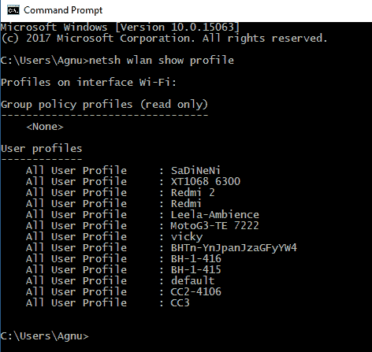
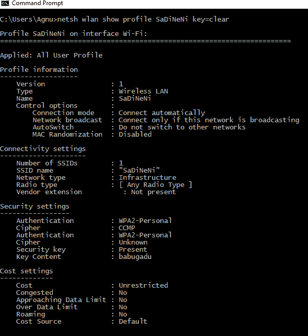
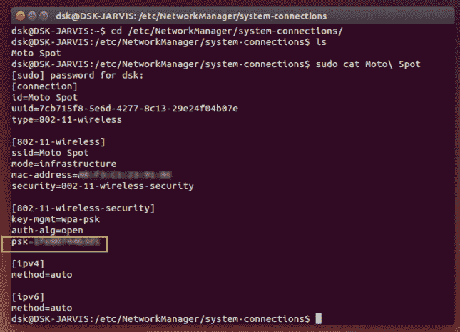

# Windows/Linux 中所有连接网络的 Wi-Fi 密码

> 原文:[https://www . geesforgeks . org/wi-fi-password-connected-networks-window slinux/](https://www.geeksforgeeks.org/wi-fi-password-connected-networks-windowslinux/)

**窗户**

命令提示符，也称为 cmd.exe 或 cmd(以其可执行文件名命名)，对于喜欢命令界面而不是图形用户界面的人来说是一个很好的工具。图形用户界面中还有很多功能没有实现，可以通过 CMD 访问。在这篇文章中，我将分享如何使用 CMD 查找所有连接设备的密码。

在继续之前，您应该知道一件事，每当您连接到无线网络并输入密码时，Windows 都会创建该无线网络的无线局域网配置文件。这些无线局域网配置文件与其他所需的无线网络配置文件的详细信息一起存储在计算机中。

我们可以稍后通过简单地使用 Windows CMD 来发现这些无线局域网配置文件。您可以使用简单的命令找出所有连接的网络及其密码。这些命令还可以发现当前未连接但以前连接过的网络的无线密码。因此，即使当您离线或连接到任何其他网络时，它也能工作。

**注意:以下命令只能由管理员**执行

**1)打开命令提示符，以管理员身份运行**

2) **键入“网络无线局域网显示配置文件”**–它将显示以前连接到计算机的所有无线网络配置文件

2)键入此命令，不带引号“netsh WLAN show profile SaDiNeNi key = clear”

**应采取的预防措施:**

1)键入网络无线局域网显示配置文件(它将显示连接的不同无线网络)

2)键入网络无线局域网删除配置文件名称=“配置文件名称”(删除所需的配置文件)

Linux

要通过命令行找到保存的 wifi 密码，请按照以下步骤操作:登录 Ubuntu，打开“终端”，输入以下命令。

**1)键入 CD/etc/network manager/系统连接/–它包含 Wi-fi 的配置文件**

2)ls-a 型

现在，您将获得保存在电脑上的 wifi 网络名称。现在输入以下命令，并输入您想要查找密码的 wifi 网络名称。您可以在“PSK”=“PASSWORD”中找到您的密码。

**3) sudo cat WIFI_SSID_Name**

**应采取的预防措施:**

1)sudo ls-l/etc/Network manager/system-connections/

要列出所有文件，在找到要删除的网络后，使用以下命令删除它们:

2)sudo RM/etc/NetwOrk manager/系统连接/NETWORK_NAME

本文由**阿卡什·莎兰**供稿。如果你喜欢 GeeksforGeeks 并想投稿，你也可以使用[contribute.geeksforgeeks.org](http://www.contribute.geeksforgeeks.org)写一篇文章或者把你的文章邮寄到 contribute@geeksforgeeks.org。看到你的文章出现在极客博客主页上，帮助其他极客。

如果你发现任何不正确的地方，或者你想分享更多关于上面讨论的话题的信息，请写评论。