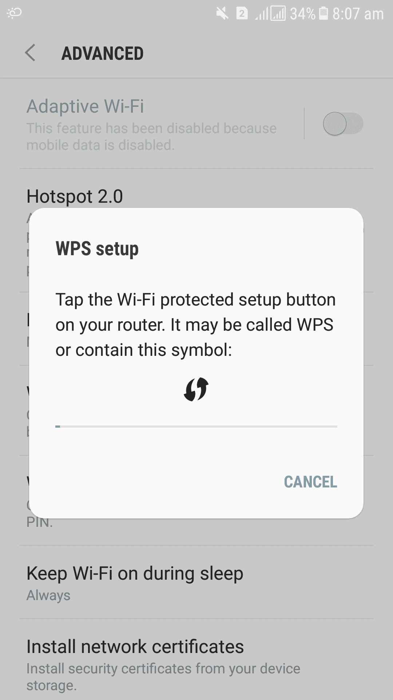

# Wifi 保护设置(WPS)

> 原文:[https://www.geeksforgeeks.org/wifi-protected-setup-wps/](https://www.geeksforgeeks.org/wifi-protected-setup-wps/)

**Wifi 保护设置(WPS)** 是一种无线网络安全标准，试图以更快、更简单的方式在路由器和无线设备之间建立连接。WPS 仅适用于使用受 *Wifi 保护访问个人(WPA)* 或 *Wifi 保护访问 2 (WPA2)* 个人安全协议保护的密码的无线网络。WPS 在使用不受欢迎的有线等效隐私(WEP)安全性的无线网络上不起作用，任何有基本技能的黑客都可以轻松破解这种安全性。

在标准设置中，只有知道网络名称(也称为服务集标识符(SSID))及其密码(也称为 WPA-PSK 密钥)后，才能将无线设备连接到无线网络。如果您想将智能手机或笔记本电脑等设备连接到无线网络，那么在您的设备上，您必须首先选择要连接的网络，然后输入其安全密码。

**WPS 能做什么？**
WPS 有时可以简化连接过程。以下是 **WPS 连接**的执行方式:

1.  首先，按下路由器上的 WPS 按钮，打开新设备的发现。然后在设备上选择要连接的网络。设备会自动连接到无线网络，无需输入网络密码。

2.  像无线打印机或范围扩展器这样的设备有自己的 WPS 按钮，可用于快速连接。通过按下路由器上的 WPS 按钮，然后按下这些设备，这些设备可以连接到无线网络。在这个过程中不需要输入任何数据。WPS 会自动发送网络密码，这些设备会记住密码以备将来使用。这些设备将来将能够连接到同一网络，而无需再次使用 WPS 按钮。

3.  第三种方法是使用八位数的个人识别码。所有启用 WPS 的路由器都有一个自动生成的个人识别码，用户无法配置。该个人识别码可以在路由器的 WPS 配置页面上找到。有些设备没有 WPS 按钮，但有了 WPS 支持，它们会要求输入个人识别码。如果输入了个人识别码，他们会验证自己并连接到无线网络。

4.  最后一种方法还包括使用八位数的个人识别码。一些没有 WPS 按钮但支持 WPS 的设备会生成客户端个人识别码。可以在路由器的无线配置面板中输入该个人识别码，然后路由器将使用它将该设备添加到网络中。

前两种方法速度很快，但后两种方法在将设备连接到无线网络所需的时间方面没有任何优势。需要输入*八位 PIN* ，输入无线网络密码只是速度慢。连接到无线网络的第四种方法甚至更慢，因为需要访问路由器的无线配置部分，并且由客户端设备键入个人识别码。

**WPS 的优势–**

*   WPS 为网络上启用了 WPS 的接入点自动配置网络名称(SSID)和 WPA 安全密钥。

*   连接启用 WPS 的设备时，不需要知道 SSID 安全密钥或密码。

*   WPS 密钥是随机生成的，因此没有人能够猜测或计算出您的安全密钥或密码。

*   不需要输入十六进制代码或密码短语的长序列。

*   可扩展认证协议(EAP)用于通过空中安全地交换信息和网络凭证，这是 WPA2 使用的认证协议之一。

**WPS 的缺点–**

*   WPS 不支持无线设备在没有接入点的情况下直接相互通信的网络模式。

*   如果网络上的 WiFi 设备经过 WPS 认证或兼容 WPS，则无法使用 WPS。

*   很难将非 WPS 客户端设备添加到网络中，因为 WPS 技术会生成十六进制字符的长序列。