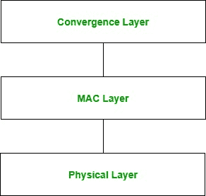

# 计算机网络中的 WiMax

> 原文:[https://www.geeksforgeeks.org/wimax-in-computer-network/](https://www.geeksforgeeks.org/wimax-in-computer-network/)

WiMax 代表**微波接入的全球互操作性**。该技术基于 IEEE 802.16。它用于提供更高的数据速率和更大的覆盖范围。它基于城域网技术。它的射程可达 50 公里。它可以提供高达 70 兆位/秒的速度，并且可以在非视距环境下工作。这项技术快速、方便、经济。

**架构:**

1.  **物理层:**
    该层负责信号的编码和解码，管理比特的发送和接收。它将 MAC 层帧转换成要传输的信号。在这一层上使用的调制方案包括:QPSK、QAM-16 和 QAM-64。

2.  **MAC 层:**
    该层提供 WiMax 协议栈汇聚层和物理层之间的接口。它提供点对多点通信，并基于 CSMA/CA(载波侦听多路访问和冲突避免)。

3.  **汇聚层:**
    该层提供外部网络的信息。它接受较高层协议数据单元，并将其转换为较低层协议数据单元。它根据所使用的服务提供功能。

**应用:**

*   视频流
*   （同 VoiceoverInternetProtocol）网络电话
*   电视会议
*   网络学习