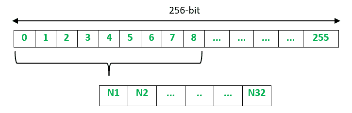

# 温特尼茨一次性签名方案

> 原文:[https://www . geeksforgeeks . org/winter nitz-一次性签名方案/](https://www.geeksforgeeks.org/winternitz-one-time-signature-scheme/)

**Winternitz 一次性签名(WOTS)** 是一种抗量子的数字签名方案，使用相对较小的密钥和签名大小。由于它是一次性签名方案，因此只能用于对一条消息进行安全签名。

假设爱丽丝想对她发给鲍勃的信息进行数字签名，这个过程可以用三个步骤来解释:密钥生成、签名生成和签名验证。

**密钥生成:**

1.  Alice 需要创建一个密钥对——私钥和公钥。
2.  为了创建私钥，随机数生成器用于生成 32 个 256 位随机数。私钥只有爱丽丝知道。
3.  为了创建公钥，32 个数字中的每一个都被散列 256 次，以获得另一组 32 个 256 位数字。公钥与每个人共享。

**签名生成:**

1.  Alice hashes the message using SHA 256 which produces a 256-bit digest. This digest is split up into 32 8-bit values (N1, N2, …, N32).

    

2.  Alice 将每个 8 位值散列 256-N 次，其中 N 是 8 位值的值。例如，如果 N1 是 8 位值 10001000 = 136，那么 N1 将被散列 256-136 = 120 次。对每个 8 位值执行此操作后，将生成数字签名。

**签名验证:**

1.  Bob 使用 SHA-256 对消息进行哈希处理，生成 32 个 8 位值的摘要(N1、N2、…、N32)。
2.  Bob 然后根据消息哈希值给出的次数对签名值进行哈希运算(N1、N2、…、N32)。
3.  鲍勃将结果与爱丽丝的公钥进行了比较。如果它们匹配，则签名有效。