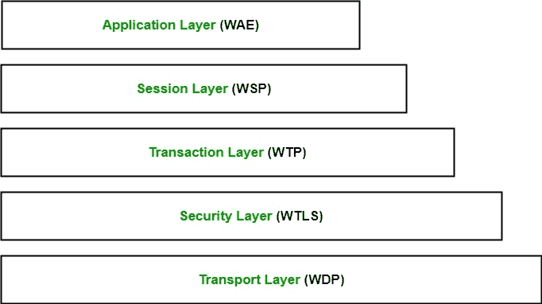

# 无线应用协议

> 原文:[https://www . geesforgeks . org/wireless-application-protocol/](https://www.geeksforgeeks.org/wireless-application-protocol/)

**WAP** 代表**无线应用协议**。这是一个为微浏览器设计的协议，它支持在移动设备上访问互联网。它使用标记语言 WML(无线标记语言，而不是 HTML)，WML 被定义为 XML 1.0 应用程序。它支持为移动设备创建 web 应用程序。1998 年， *WAP 论坛*由埃里克森、摩托罗拉、诺基亚和 Unwired Planet 创立，旨在通过协议标准化各种无线技术。

WAP 协议是 WAP 论坛各成员共同努力的结果。2002 年，WAP 论坛与行业其他各种论坛合并，形成**开放移动联盟(OMA)** 。

**WAP 模式:**
用户在移动设备中打开迷你浏览器。他选择了一个他想看的网站。移动设备使用 WAP 协议通过网络向 WAP 网关发送 URL 编码请求。

WAP 网关将这个 WAP 请求转换成常规的 HTTP URL 请求，并通过互联网发送。请求到达指定的网络服务器，它像处理任何其他请求一样处理请求，并通过 WML 文件中的 WAP 网关将响应发送回移动设备，该文件可以在微浏览器中看到。

**WAP 协议栈:**

1.  **应用层:**
    该层包含*无线应用环境(WAE)* 。它包含移动设备规范和内容开发编程语言，如 WML。
2.  **会话层:**
    该层包含*无线会话协议(WSP)* 。它提供快速连接暂停和重新连接。
3.  **交易层:**
    该层包含*无线交易协议(WTP)* 。它运行在 UDP(用户数据报协议)之上，是 TCP/IP 的一部分，并提供事务支持。
4.  **安全层:**
    该层包含*无线交易层安全(WTLS)* 。它提供数据完整性、隐私和身份验证。
5.  **传输层:**
    该层包含*无线数据报协议*。它向 WAP 协议栈的更高层呈现一致的数据格式。