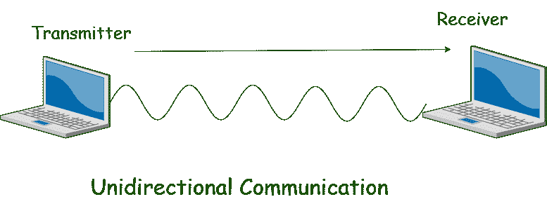
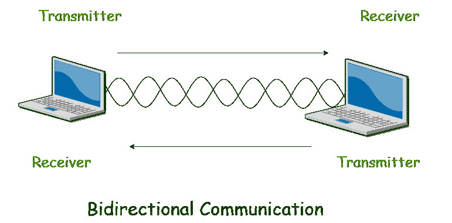
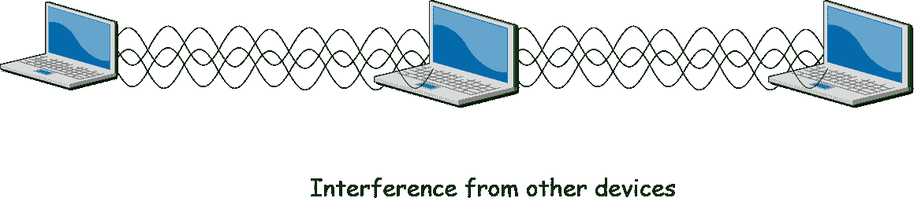
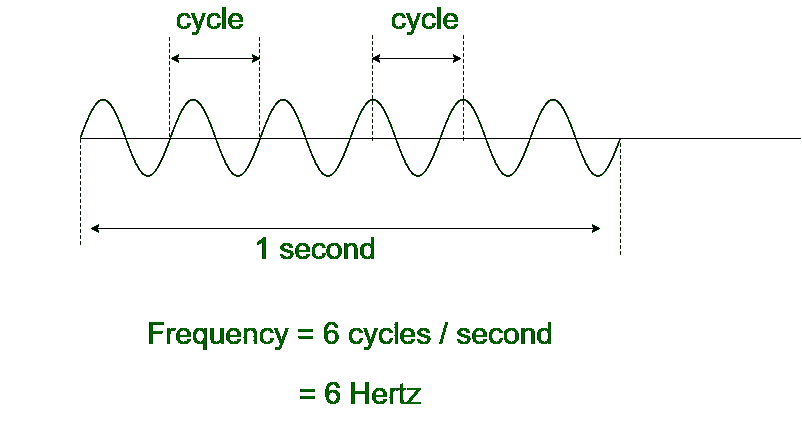
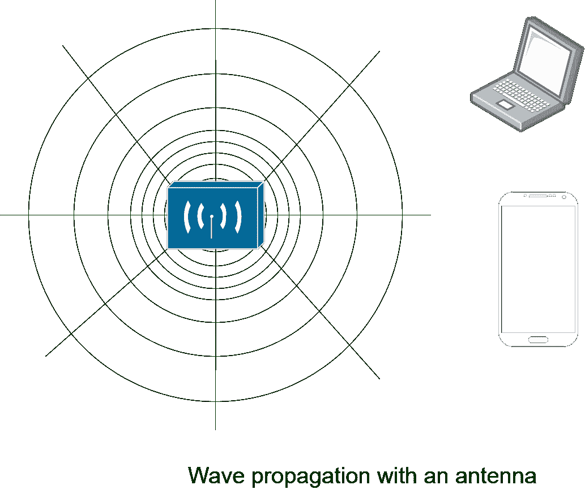

# 无线通信|第 1 套

> 原文:[https://www.geeksforgeeks.org/wireless-communication-set-1/](https://www.geeksforgeeks.org/wireless-communication-set-1/)

在谈论无线媒体之前，我们需要先谈谈有线媒体。有线网络是一种有限的媒介。数据通过电线或电缆的路径传输。在设备先进和数量巨大的现代，有线通信媒介对流畅的通信施加了限制。有线网络存在各种问题。考虑一种情况，您希望连接到您周围的 10 个或更多设备。

您需要完全相同数量的端口才能连接到设备，但是大量的端口似乎不切实际，但是使用无线网络，这很容易做到

顾名思义，无线网络不需要用电线或电缆连接。便利性和移动性成为其主要特征。许多不同的无线设备可以轻松无缝地连接到网络。当无线数据在空中传输时，无线通信必须受到一些限制。
这些是:

*   所有无线设备都必须遵循一个通用标准，即 IEEE 802.11
*   无线覆盖必须在设备预期使用的地方。

**注–**

*   有线网络符合 802.3 标准
*   无线网络符合 IEEE 标准 802.11

> **IEEE** 代表**“电气和电子工程师协会”**，是一个由工程师组成的发布和管理电气和电子设备标准的组织。

**无线通信基础知识:**
无线通信通过射频(射频)在自由空间进行，一台设备，**发射器**向另一台设备发送信号，**接收器**。两个设备(发射机和接收机)必须使用相同的频率(或信道)才能相互通信。如果大量无线设备同时通信，射频会相互干扰。干扰随着设备数量的增加而增加。





无线设备共享广播时间，就像有线设备连接到共享介质并共享公共带宽一样。为了有效使用媒体，所有无线设备都以半双工模式运行，以避免冲突或干扰。在传输开始之前，遵循 IEEE 802.11 标准的设备必须检查信道是否可用和畅通。

**注意–**
无线通信总是半双工的，因为传输使用相同的频率或信道。为了实现全双工模式，设备使用不同的频率或信道传输和
接收信号。你可以说无线通信是全双工的，但从技术上讲不是。

**无线电频率:**
在自由空间中，发送器(发送器)向一段电线(天线)发送交流电。这就形成了一个移动的电场和磁场，并以行波的形式消失。如图所示，电场和磁场彼此成直角移动。信号必须通过上下循环保持变化或交替，以保持电场和磁场的循环和推进。一个波每秒吸收的周期数叫做波的频率。
所以，

```
frequency = no of cycles per second 
```



电磁波不是直线传播的。它们通过向远离天线的所有方向扩展来传播。就像你看到了当你把一块石头扔进一个水体时，波浪在水中行进。



**频率单位名称:**

<center>

| 单位 | 缩写 | 意义 |
| 赫兹 | 赫兹 | 每秒周期数 |
| 千赫 | 千赫(= kilohertz) | 1000 赫兹 |
| 兆赫 | 兆赫 | 1000000 赫兹 |
| 千兆赫 | 千兆赫 | 100000000 赫兹 |

</center>