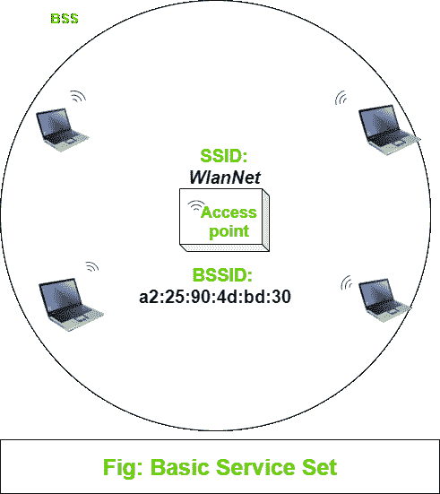
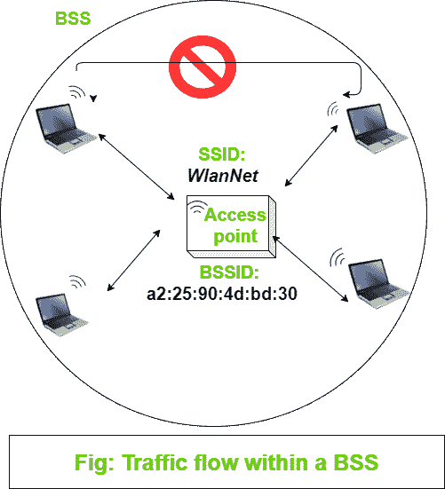
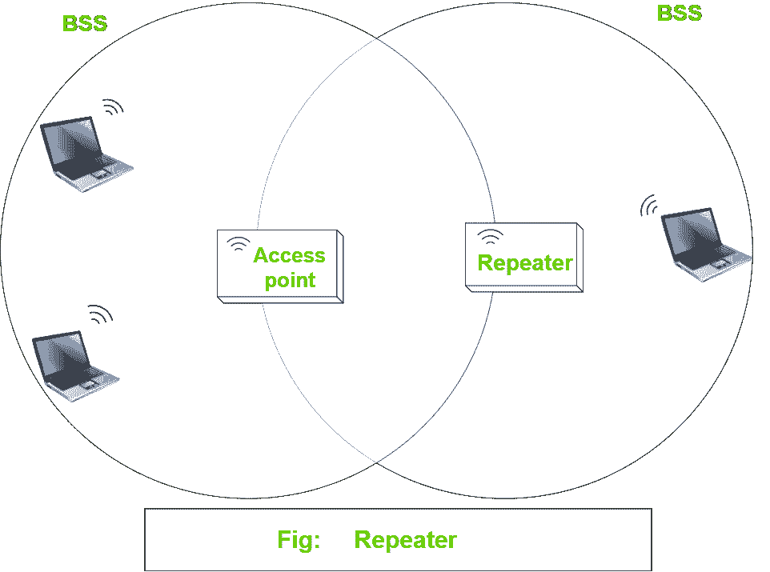

# 无线通信|第二套

> 原文:[https://www.geeksforgeeks.org/wireless-communication-set-2/](https://www.geeksforgeeks.org/wireless-communication-set-2/)

先决条件–[无线通信|设置 1](https://www.geeksforgeeks.org/wireless-communication-set-1/)

**基本服务集:**
我们知道无线通信是通过空中进行的。为了规范与设备的连接，我们需要使每个无线服务区域成为一个围绕固定设备形成的封闭的移动设备组。在移动设备开始数据通信之前，它们必须公布自己的能力，然后应该授予加入许可。这种安排有一个定义的术语，IEEE 称这个标准为基本服务集(T4)。

每个基站的中心都有一个接入点(接入点)，它提供构成无线通信基础设施所需的服务。接入点以基础设施模式运行，并使用单个无线信道。所有想要连接到接入点的设备必须使用相同的信道。

因为基站的操作依赖于接入点，所以基站被限制在接入点覆盖的区域内，即接入点的信号可到达的区域。这个区域被称为基本服务区(BSA)或小区。细胞通常呈圆形，中心为 AP。接入点是基站的单一联系点。接入点根据自己的媒体访问控制地址使用唯一的基站标识符(T0)基站标识符(T1)，向小区中的所有设备通告它的存在。

接入点还通告一个称为服务集标识符( **SSID** )的人类可读文本字符串，以唯一标识接入点。你可以说 BSSID 是一个机器可读的唯一标签来识别无线服务，SSID 是一个人类可读的服务标签。

移动设备加入基站被称为关联。一旦关联，设备将成为基站服务客户端或 802.11 站。只要设备连接到接入点，所有数据通信都通过接入点，使用 BSSID 作为源地址和目的地址。你可以想一想为什么所有的流量都要经过 AP？他们可以简单地直接与其他设备通信，而无需 AP 作为中间人。如果我们不这样做，那么整个无线服务点都将白费。通过接入点发送数据，使其稳定可控

**中继器:**
无线基础设施中的接入点通常连接回交换网络。基站的信号覆盖范围有限。为了扩大信号覆盖范围，我们可以增加额外的接入点，但在某些情况下，不可能增加额外的接入点。这种情况下的解决方案是中继器。中继器只是在中继器模式下配置的接入点。无线中继器将信号作为输入，并在中继器周围的新小区中重新传输信号。中继器使用两个发射机和接收机，将原始信号和重复信号隔离在不同的信道上。

