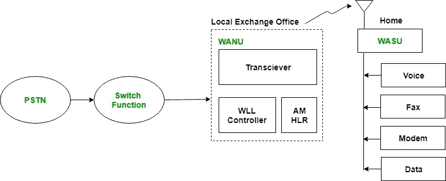

# 无线本地环路

> 原文:[https://www.geeksforgeeks.org/wireless-local-loop/](https://www.geeksforgeeks.org/wireless-local-loop/)

本地环路是从用户电话到本地中心局的电路线路。但是，由于用户数量较少和安装成本增加，实施本地环路对运营商来说是有风险的，尤其是在农村和偏远地区。因此，解决方案是使用无线本地环路(WLL)，它使用无线链路而不是铜线将用户连接到本地中心局。

**WLL 架构:**

**WLL 组件:**

1.  **PSTN:**
    它是公共交换电话网，是一个电路交换网络。它是世界上相互连接的电路交换电话网络的集合。
2.  **切换功能:**
    切换功能在各种广域网之间切换 PSTN。
3.  **WANU:**
    是无线接入网单元的简称。它存在于当地的交易所。所有本地 WASUs 都连接到它。其功能包括:认证、操作&维护、路由、收发语音和数据。它由以下子组件组成:
    *   收发器:发送/接收数据。
    *   WLL 控制器:它与 WASU 一起控制无线本地环路组件。
    *   艾米:它是访问管理器的简称。它负责身份验证。
    *   HLR:它是家庭位置登记的缩写。它存储所有本地 WASUs 的详细信息。
4.  **WASU:**
    It is short for Wireless Access Subscriber Units. It is present at the house of the subscriber. It connects the subscriber to WANU and the power supply for it is provided locally.

    **WLL 优势:**

    *   它消除了网络连接的第一英里或最后一英里建设。
    *   由于不使用传统铜线，成本低。
    *   由于无线通信中使用了数字加密技术，因此更加安全。
    *   高度可扩展，因为它不需要安装更多的电线来扩展它。

    **WLL 特色:**

    *   通过调制解调器连接互联网
    *   数据服务
    *   话音业务
    *   传真电话业务