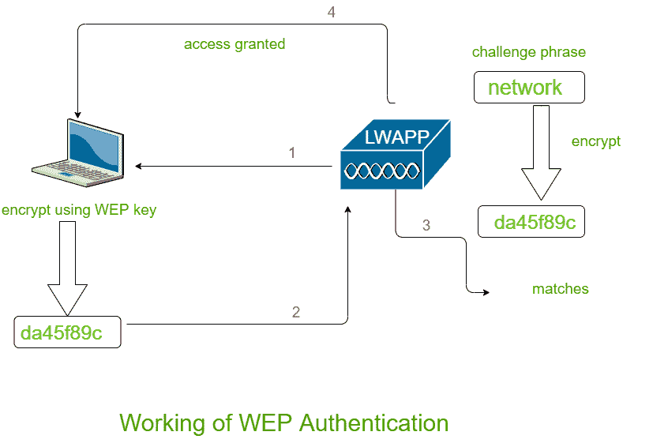
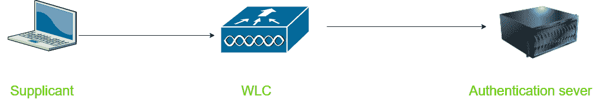

# 无线安全|设置 1

> 原文:[https://www.geeksforgeeks.org/wireless-security-set-1/](https://www.geeksforgeeks.org/wireless-security-set-1/)

无线网络为最终用户提供了各种舒适性，但实际上他们的工作非常复杂。背后有许多协议和技术在为用户提供稳定的连接。通过有线传输的数据包为用户提供了安全感，因为通过有线传输的数据可能不会被窃听者听到。

为了确保无线连接的安全，我们应该**关注**以下领域–

*   识别无线网络的端点和最终用户，即身份验证。
*   保护无线数据包不被中间人窃取，即隐私。
*   保持无线数据包完整，即完整性。

我们知道无线客户端与接入点形成关联，并通过空中来回传输数据。只要所有的无线设备都遵循 802.11 标准，它们都是共存的。但并非所有的无线设备都是友好和值得信赖的，一些流氓设备可能会对无线安全构成威胁。流氓设备可能会窃取我们的重要数据或导致网络不可用。

无线安全通过以下方式**保证-**

*   **证明**
*   **隐私和完整性**

**在本文中，我们将讨论身份验证。身份验证过程大致有两种类型:有线等效隐私(WEP)和可扩展身份验证协议(802.1x/EAP)。
这些解释如下。**

****1。有线等效隐私(WEP) :**
对于空中传输的无线数据，开放式身份验证不提供安全性。
WEP 使用 RC4 密码算法对每一帧进行加密。RC4 密码还在发送端加密数据，在接收端解密数据，使用一串位作为密钥，称为 WEP 密钥。**

**WEP 密钥可以用作身份验证方法或加密工具。客户端只有拥有正确的 WEP 密钥才能与 AP 关联。AP 通过使用挑战短语来测试 WEP 密钥的知识。客户端用自己的密钥对短语进行加密，然后发送回 AP。AP 将收到的加密帧与他自己的加密短语进行比较。如果两者都匹配，则授予对关联的访问权限。**

****

****2。可扩展认证协议(802.1x/EAP) :**
在 WEP 认证中，无线客户端的认证在接入点本地进行。但是随着 802.1x 的出现，情况发生了变化。基础架构中增加了专用的身份验证服务器。有三个设备参与–**

1.  ****请求者–**
    请求访问的设备。**
2.  ****认证器–**
    提供网络接入的设备通常是无线局域网控制器(WLC)。**
3.  ****认证服务器–**
    获取客户端凭据并拒绝或授予访问权限的设备。**

****

**EAP 进一步分为四种类型，相互之间有一些修改-**

*   **跳跃**
*   **快速执行**
*   **PEAP**
*   **电子信息管理系统**