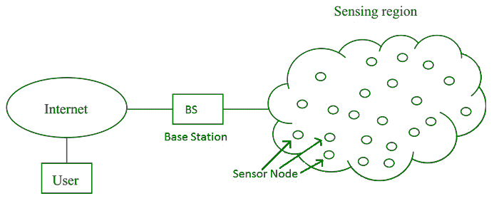

# 无线传感器网络(WSN)

> 原文:[https://www.geeksforgeeks.org/wireless-sensor-network-wsn/](https://www.geeksforgeeks.org/wireless-sensor-network-wsn/)

**无线传感器网络(WSN)** 是一种无基础设施的无线网络，以自组织方式部署在大量无线传感器中，用于监控系统、物理或环境条件。

在 WSN，传感器节点与板载处理器一起使用，用于管理和监控特定区域的环境。它们连接到基站，基站在 WSN 系统中充当处理单元。
WSN 系统中的基站通过互联网连接以共享数据。

WSN 可以用于数据的处理、分析、存储和挖掘。

**WSN 的应用:**T2】

1.  物联网(IOT)
2.  安全监控和威胁检测
3.  环境温度、湿度和气压
4.  周围环境的噪音水平
5.  医疗应用，如患者监护
6.  农业
7.  滑坡探测

**WSN 的挑战:**

1.  服务质量
2.  安全问题
3.  能量效率
4.  网络流通量
5.  表演
6.  应对节点故障的能力
7.  跨层优化
8.  大规模部署的可扩展性

**WSN 的组成部分:**

1.  **传感器:**
    WSN 的传感器用于捕捉环境变量，并用于数据采集。传感器信号被转换成电信号。
2.  **无线节点:**
    用于接收传感器产生的数据，并将其发送到无线局域网接入点。它由微控制器、收发器、外部存储器和电源组成。
3.  **无线局域网接入点:**
    它接收无线节点无线发送的数据，通常是通过互联网。
4.  **评估软件:**
    无线局域网接入点接收到的数据由一个称为评估软件的软件处理，该软件向用户呈现报告，以便进一步处理数据，该数据可用于数据的处理、分析、存储和挖掘。