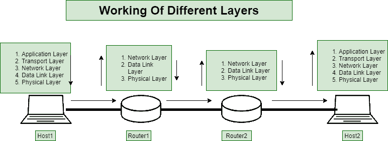
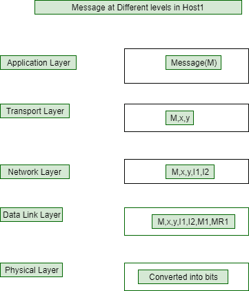
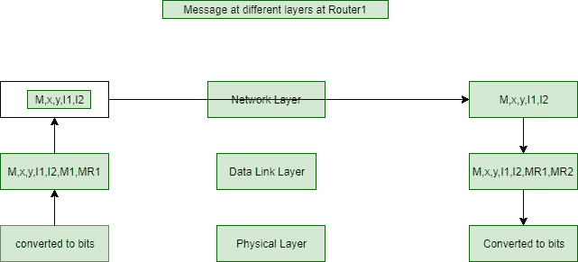
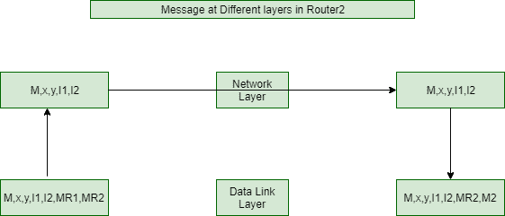
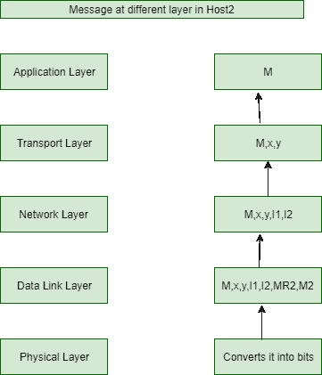

# 计算机网络中不同层的工作

> 原文:[https://www . geesforgeks . org/计算机网络中不同层的工作/](https://www.geeksforgeeks.org/working-of-different-layers-in-computer-network/)

有没有想过不同的网络层是如何合作发送信息的？在进入细节之前，让我们先了解一些基本术语。

*   一个**默认网关**作为一个接入点或 IP 路由器，联网的计算机使用它向另一个网络或互联网中的计算机发送信息。
*   **地址解析协议(ARP)请求**是将 IP 地址转换为 MAC 地址的协议。
*   一个**路由表**是一组规则，通常以表格格式查看，用于确定通过互联网协议(IP)网络传输的数据包将被定向到哪里。

一般来说，主机或计算机有所有层(从应用层到物理层)，路由器有网络、数据链路层和物理层。

现在让我们借助一个例子来理解不同层的工作。

假设您想要向主机 2 上的应用程序发送消息(假设它存在于不同的网络中)。
假设主机 1 的 IP 和 MAC 地址为 M1 I1，主机 2 的 IP 和 MAC 地址为 M2 I2。假设主机 1 的默认网关是路由器 1(IP 地址是 IR1，Mac 地址是 MR1)，主机 2 的默认网关是路由器 2 (IP 地址是 IR2，Mac 地址是 MR2)。

**At host 1:**
假设应用层想要向 host2 发送消息 M。主机 1 的应用层将其交给主机 1 的传输层。传输层将向消息 M 添加报头，其中包含主机 1、主机 2(x，y)的端口号。因此，现在消息将是(M，x，y)，这将被提供给主机 1 的网络层。网络层还会在消息中添加一个报头，其中包含主机 1 和主机 2 的 Ip 地址。

现在消息将是(M，x，y，I1，I2)，并且它将被提供给数据链路层。数据链路层还会在将消息发送到物理层之前为其添加一个报头。由于主机 2 不在同一个网络中，它会将主机 1 的 mac 地址和默认网关的 mac 地址放在一起(它会通过发送 ARP 请求知道 mac 地址)。现在消息将是(M，x，y，I1，I2，M1，MR1)，这将被给予物理层。物理层将给定的消息转换成比特，并将其发送给路由器 1。

**在路由器 1:**
物理层会将这些位转换为消息，并在看到路由器 1 的 Mac 地址后通知数据链路层应该处理这个数据包。路由器 1 的数据链路层看到数据包后，会向数据链路层主机 1 发送确认，并在将信息发送到路由器 1 的网络层之前，删除主机 1 动态链接库中添加的报头信息。网络层得到的消息是(M，x，y，I1，I2)。

网络层看到目的地的 Ip 地址，如果目的地不在它的网络中，它将决定把它转发给路由器 2。路由器 1 的网络层在看到路由器 1 的路由表后决定它，并将决定它。现在路由器的动态链接库给消息添加了报头。这一次，源 mac 地址将是 MR1，目的 MAC 地址将是 MR2(使用它发现的 Arp)。这样，接收者只知道源的 Ip 地址，而永远不会知道源的 mac 地址。现在消息将是(M，x，y，I1，I2，MR1，MR2)并且它将被给予物理层。物理层将其转换为比特并发送给路由器 2。

**在路由器 2:**
物理层将把比特转换成消息，并通知路由器 2 的 DLL。现在路由器 2 的动态链接库会在看到消息后向路由器 1 的动态链接库发送一个确认。路由器 2 的动态链接库将删除媒体访问控制地址，并将其提供给网络层。

现在，网络层发现主机 2 位于路由器 2 所连接的网络中，因此它将向主机 2 发送消息。网络层在看到路由器 2 上的路由表后发现主机 2 在同一个网络中。现在，动态链接库将添加带有路由器 2(发送方)和 M2(目的地)mac 地址的报头信息(它使用 ARP 请求找到)。现在，消息将是(M，x，y，I1，I2，MR2，M2)，并将被提供给物理层，物理层将其转换为位并将其发送到主机 2。

**在 Host2:**
物理层会将其转换为比特，并将消息交给 DLL。动态链接库向路由器 2 的动态链接库发送确认，并删除消息中的媒体访问控制地址，该地址将被提供给 NL。现在，网络层将删除 IP 地址，并赋予它传输层。

现在，传输层将向主机 1 的传输层发送确认(如果是 TCP，因为它有主机 1 的 IP 地址。该消息将是(M，y，x，I2，I1))，并删除端口号，并将该消息提供给位于 y 的进程(或应用程序)

**注:**

1.  由于传输层负责端到端连接，主机 2 的传输层向主机 1 的传输层发送确认。
2.  数据链路层负责跳间连接，每次路由器/主机收到数据包时，都会向相应的数据链路层发送确认。
3.  网络层处理位级错误，传输层处理数据包错误。
4.  路由器的媒体访问控制地址是临时的，因为网络服务提供商通常会更改包含媒体访问控制地址的网卡。因此，默认网关 IP 地址是主机和其他路由器共享的，而不是 MAC 地址。

这是来自一台主机的消息如何传递到不同网络上的另一台主机。