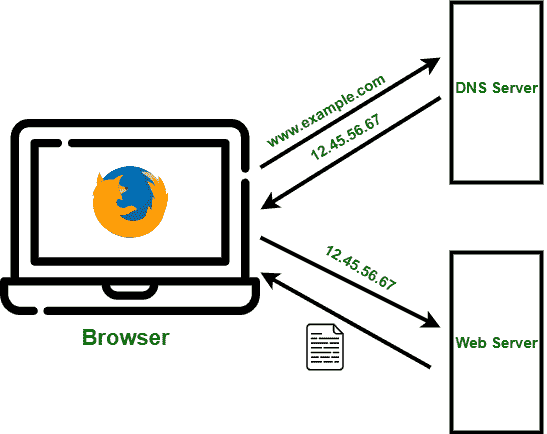

# 域名系统(DNS)服务器工作

> 原文:[https://www . geesforgeks . org/工作域名系统-dns-server/](https://www.geeksforgeeks.org/working-of-domain-name-system-dns-server/)

先决条件–[应用层域名系统(DNS)](https://www.geeksforgeeks.org/domain-name-system-dns-in-application-layer/)

在网络世界中，计算机不像人类那样用名字来表示，而是用数字来表示，因为这是计算机和其他类似设备在网络上相互交谈和识别的方式，这是通过使用数字(如 IP 地址)来实现的。

另一方面，人类习惯于用名字而不是数字，无论是直接和另一个人说话，还是识别一个国家、地方或事物，人类都用名字而不是数字来识别。所以为了弥合计算机和人类之间的通信鸿沟，让很多网络工程师的通信变得更加容易，开发了域名系统。

域名系统代表**域名系统**。

DNS 将名称解析为数字，更具体地说，它将域名解析为 IP 地址。因此，如果你在你的网络浏览器中输入一个网址，域名系统会将这个名字解析成一个数字，因为计算机只知道数字。

**工作:**
如果你想去某个网站，你会打开你的网络浏览器，输入那个网站的域名。让我们利用 google.com。现在从技术上来说，你真的不需要在 google.com 输入来检索谷歌网页，如果你已经知道谷歌的 IP 地址是什么，你可以输入 IP 地址，但是由于我们不习惯记忆和处理数字，尤其是当互联网上有数百万个网站时，我们可以输入域名，让域名系统为我们转换成 IP 地址。

回到我们的例子，当你在你的网络浏览器上输入 google.com 的时候，域名系统服务器会搜索它的缓存，为这个域名找到一个匹配的 IP 地址，当它找到它的时候，它会把这个域名解析成谷歌网站的 IP 地址，一旦这样做了，那么你的计算机就可以和谷歌网络服务器通信并检索网页。

所以 DNS 基本上像电话簿一样工作，当你想找一个号码的时候，你不是先查号码，你先查名字，然后它会给你号码。因此，为了更详细地说明这一点，让我们来看看域名系统采取的步骤。因此，当您在网络浏览器中键入 google.com 时，如果您的网络浏览器或操作系统在自己的缓存内存中找不到 IP 地址，它会将查询发送到下一级，即所谓的解析服务器。解析器服务器基本上是您的 ISP 或互联网服务提供商，因此当解析器收到此查询时，它将检查自己的缓存内存以查找 google.com 的 IP 地址，如果找不到，它将向下一级(根服务器)发送查询。根服务器是域名系统层次结构中最顶层的服务器。

从 a.root-servers.net 到 m.root-servers.net，共有 13 套这样的根服务器，它们战略性地分布在世界各地，由 12 个不同的组织运营，每套根服务器都有自己独特的 IP 地址。因此，当根服务器收到对 google.com 的 IP 地址的查询时，根服务器不知道什么是 IP 地址，但是根服务器知道在哪里发送解析器来帮助它找到 IP 地址。因此根服务器会将解析器定向到 TLD 或顶级域服务器。com 域。所以解析器现在会向 TLD 服务器询问 google.com 的 IP 地址。

顶级域服务器存储顶级域的地址信息，例如。com 和。net，。org 等等。这个特殊的 TLD 服务器管理。google.com 是其中的一部分。因此，当 TLD 服务器收到 google.com 的 IP 地址查询时，TLD 服务器不知道 google.com 的 IP 地址。因此，TLD 将引导解析器到下一个也是最后一个级别，即权威的名称服务器。因此，解析器将再次向权威名称服务器询问 google.com 的 IP 地址。权威的名称服务器负责了解域的一切，包括 IP 地址。

他们是最终的权威。

因此，当权威域名服务器收到来自解析器的查询时，域名服务器将以 google.com 的 IP 地址进行响应。最后，解析器会告诉你的电脑 google.com 的 IP 地址，然后你的电脑现在可以检索谷歌网页。需要注意的是，一旦解析器接收到 IP 地址，它将把它存储在缓存中，以防它接收到另一个针对 google.com 的查询。因此，它不必再经历所有这些步骤。

DNS 服务器有不同类型的记录来有效地管理解析并提供关于域的重要信息。这些记录是缓存在 DNS 服务器中的详细信息。每个记录都有一个相关的 TTL(生存时间)值(以秒为单位)，这些值设置 DNS 服务器中缓存记录的过期时间，根据 DNS 提供商的不同，该时间范围为 60 到 86400。

*   a 记录–指向托管网站的机器的 IPv4 地址
*   AAAA 记录–指向托管网站的机器的 IPv6 地址
*   MX–指向电子邮件服务器
*   CNAME–别名的规范名称将主机名指向主机名
*   ANAME–自动解析别名，工作方式类似于 cname，但将主机名指向主机名的 IP
*   NS–子域的名称服务器
*   PTR–IP 地址到主机名
*   SOA–包含关于域名系统区域的管理信息
*   SRV–其他服务的服务记录
*   TXT–文本记录，主要用于验证、SPF、DKIM、DMARC 等
*   CAA–SSL/TLS 证书的证书颁发机构记录

[DNSSEC(域名系统安全扩展)](https://en.wikipedia.org/wiki/Domain_Name_System_Security_Extensions)是添加到域名系统中的加密认证协议套件，用于保护域名系统免受恶意行为者使用伪造或操纵的域名系统数据的攻击，例如通过对域名系统区域进行数字签名而导致的域名系统缓存中毒。DNSSEC 不提供数据保密；特别是，所有 DNSSEC 响应都经过身份验证，但没有加密。DNSSEC 仍有待一些注册服务商和注册机构实施