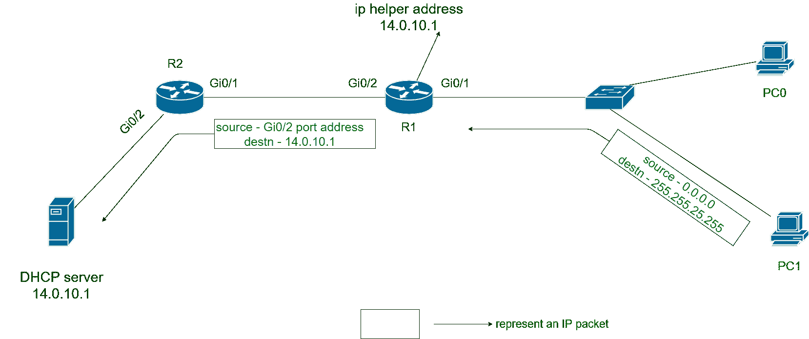

# 动态主机配置协议的工作

> 原文:[https://www . geesforgeks . org/working-of-dynamic-host-configuration-protocol/](https://www.geeksforgeeks.org/working-of-dynamic-host-configuration-protocol/)

[动态主机配置协议(DHCP)](https://www.geeksforgeeks.org/dynamic-host-configuration-protocol-dhcp/) 是一种网络管理协议，用于在网络中动态分配 IP 地址&其他网络配置信息，如默认网关、掩码、DNS 服务器地址等。

DHCP 服务器自动为网络中的各种设备分配 IP 地址。这又减少了网络管理员手动为各种设备分配 IP 地址的工作。

自动 IP 地址分配过程经历四个消息交换。这些消息缩写为发现、提供、请求和确认。下表给出了这四条消息的详细信息。

| 消息 | 详述 |
| --- | --- |
| 发现 | 这是 DHCP 客户端发送的发现 DHCP 服务器的消息。 |
| 提供 | 由 DHCP 服务器发送，以向客户端租用唯一的 IP 地址和其他所需的参数。 |
| 请求 | 由 DHCP 客户端发送，要求服务器租用报价消息中列出的参数。 |
| 确认 | 由 DHCP 服务器发送，用于向客户端分配 IP 地址、掩码、默认路由器和 DNS 服务器地址。 |

但是有冲突，DHCP IP 地址租用使用第三层协议，即互联网协议。这意味着 DHCP 使用 IP 数据包。但是我们知道主机最初没有 IP 地址，那么它们是如何形成 IP 包的呢？实际上他们为此使用了两个保留的 IP 地址。

1.  **0 . 0 . 0 . 0–**
    为尚未分配 IP 地址的主机保留用作发件人地址的 IP 地址。
2.  **255 . 255 . 255 . 255–**
    这是本地广播 IP 地址。发送到该地址的数据包通过本地数据链路广播。路由器不会转发包含此地址作为目的地址的数据包。

但是，仍然存在问题。如果 DHCP 服务器在本地局域网上不可用，并且存在于本地局域网之外，该怎么办？DORA 消息需要交换。为此目的，在路由器中配置“IP 助手地址”，它实际上是 DHCP 服务器的 IP 地址。

现在，包含 255.255.255.255 的数据包被更新为 IP 助手地址作为目的地址。这有助于在本地局域网之外交换朵拉消息。

**Figure –** DHCP messages exchange with help of IP helper address

1.  PC1 发送发现消息，但在本地局域网中找不到 DHCP 服务器。
2.  R1 现在接收 IP 数据包，并将目的地址更改为 DHCP 服务器地址，即 14.0.10.1，并将发送方地址更改为其自己的输出接口地址，即 Gi0/2 接口地址。R1 这样做是因为配置了 IP 助手地址。
3.  DHCP 服务器接收到 R1 转发的 IP 数据包，并对该发现消息做出响应。
4.  服务器现在发送要约消息，源地址作为自己的 IP 地址，目的地址作为 R1 的 Gi0/2 接口地址。实际上它颠倒了收到的 IP 包的地址。
5.  R1 收到要约消息并将其转发给 PC1。
6.  请求和确认消息也按照上述步骤进行交换。