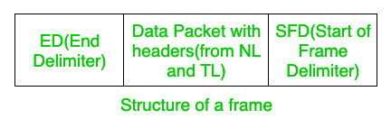
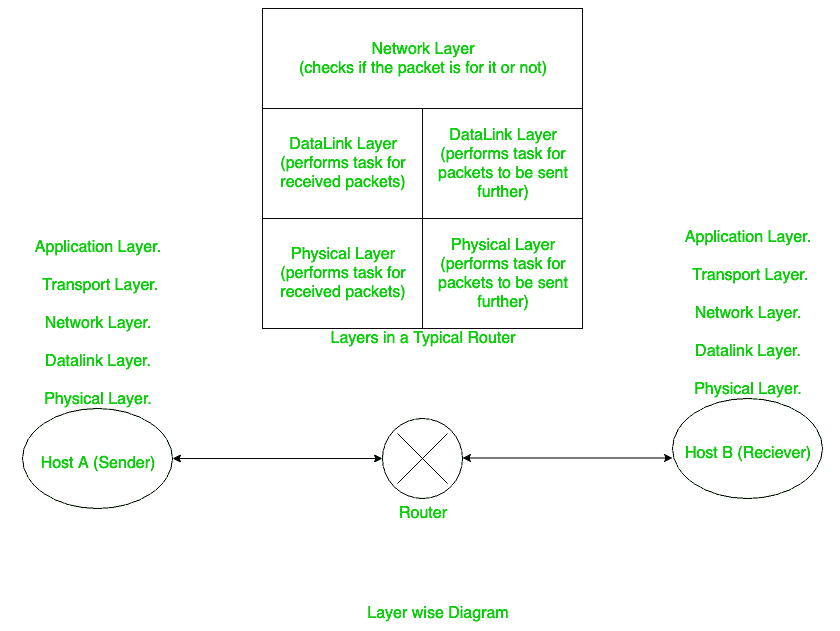
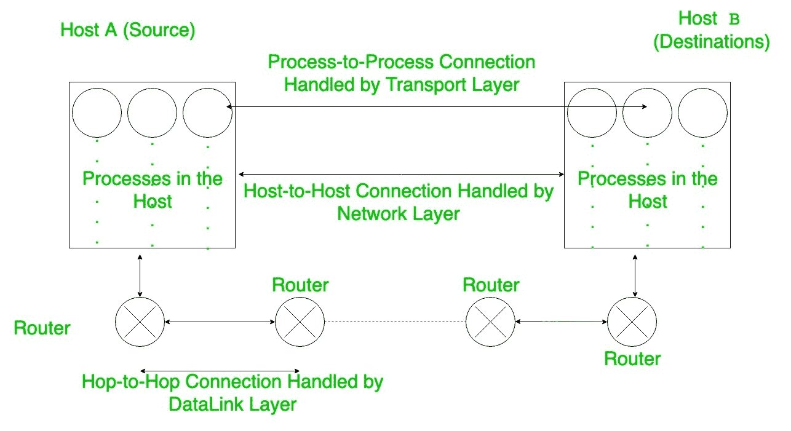

# 国际标准化组织现场视察模型的工作

> 原文:[https://www.geeksforgeeks.org/working-of-iso-osi-model/](https://www.geeksforgeeks.org/working-of-iso-osi-model/)

国际标准化组织开放系统互连(ISO-OSI)表示将相互关联的功能组合在一起。

[现场视察模型](https://www.geeksforgeeks.org/layers-of-osi-model/)中正确通信所需的功能可分为两种类型:-

**1。强制功能:**
在这里，功能的实现不是可选的，也就是说，为了正确的通信，必须实现这些功能。

```
(i) Error Control
(ii) Flow Control
(iii) Access Control
(iv) Multiplexing and De-Multiplexing
(v) Addressing, etc. 
```

**2。可选功能:**
这里功能的实现是可选的，也就是说这些功能的实现不是必须的。

```
(i) Encryption/ Decryption
(ii) Check Pointing.
(iii) Routing, etc. 
```

路由是可选的，即使使用洪泛，我们也可以在计算机网络中维持。

现在，ISO-OSI 模型说明了将相似的功能组合在一起的原因，这里我们将解释为什么我们需要不同的层来实现高效的路由。

1.  每一层都可以实现类似的功能，每一层都可以执行一些特定的任务。
2.  它甚至有助于将那些相似函数中使用的所有变量组合在一起，从而保护一层中的变量，而不是分散在所有层中(因此这有点像*封装*)。
3.  现在，由于每一层都在执行一些特定的任务，所以我们只对我们的层感到困惑，而不知道底层是如何实现的(这就是抽象层)。
    简单来说，我们可以说我们只关心我们从一个层得到什么函数，而不关心我们如何得到它。
4.  这有助于*测试*，这意味着每一层都可以单独测试，因此如果有错误，很容易发现。

现在 ISO-OSI 模型中的[层:-](https://www.geeksforgeeks.org/layers-of-osi-model/)

```
1. Application Layer
2. Presentation Layer
3. Session Layer
4. Transport Layer
5. Network Layer
6. Data link Layer
7. Physical Layer 
```

前 3 层通常用于特定用户。

**1。** [**【物理层】**](https://practice.geeksforgeeks.org/problems/explain-functions-of-presentation-layer) **:**
它处理我们的比特数据如何被转换成各种信号，以及这些信号如何在路由器和主机之间传输。

它处理如下概念

*   **传输–**表示它处理信道是单工、半双工还是全双工。
*   **拓扑–**它决定网络的拓扑结构。例如:总线拓扑、星形拓扑、环形拓扑等。
*   **编码–**它决定使用哪种编码将 0 和 1 转换成波，并通过通道发送。

**2。** [**数据链路层**](https://www.geeksforgeeks.org/data-link-layer-in-osi-model/) **:**
数据链路层的主要功能有:-

*   **流量控制–**基本上，流量控制是指发送方发送的速率应该与接收方接收和处理数据的速率有所偏差。如果不维护接收器，数据包就会丢失。这些流量控制还有助于确定算法，我们将在该算法中重复发送丢失的数据包的过程。
    说明使用哪个流量控制器(西&西或 GBN 或 SR)。
*   **错误控制–**这里实现了有助于错误检测的功能。这里实现了循环冗余校验算法来检测错误。
*   [**成帧**](https://www.geeksforgeeks.org/framing-in-data-link-layer/)**–**这个的任务是把从上面几层收到的数据包(来自网络层的数据报)放入帧中发送出去。这些帧有一个 SFD(起始帧定界符)，用于提醒路由器有新的数据包到来。当我们使用可变长度帧表示数据包结束时，这些数据包甚至可以有一个结束分隔符。



为了标记这个 ED，使用了两种策略:[字符填充，和位填充](https://www.geeksforgeeks.org/difference-between-byte-stuffing-and-bit-stuffing/)。

数据链路层本身分为两部分:

1.  [**LLC(逻辑链路控制)**](https://practice.geeksforgeeks.org/problems/what-is-logical-link-control)**–**主要处理[流量控制](https://practice.geeksforgeeks.org/problems/what-is-flow-control-in-tcp)和[错误控制](https://www.geeksforgeeks.org/error-control-in-tcp/)。
2.  [**MAC(媒体访问控制)**](https://practice.geeksforgeeks.org/problems/what-is-media-access-controlmac)**–**它处理成帧、访问控制方法、错误控制(是的，它也处理)[物理寻址](https://www.geeksforgeeks.org/introduction-of-mac-address-in-computer-network/)。

**3。** [**网络层**](https://www.geeksforgeeks.org/tag/cn-network-layer/) **:**
该层处理主机到主机的连接，即该层关注数据包如何从一台主机(发送方)无误地传输到另一台主机(接收方)。该层使用逻辑[寻址](https://www.geeksforgeeks.org/introduction-of-classful-ip-addressing/)，这对于整个互联网中的设备来说是唯一的。

它还处理数据包到达所需主机的交换。数据包的交换是通过使用路由表来完成的。



该层还执行[拥塞控制](https://www.geeksforgeeks.org/congestion-control-in-computer-networks/)的任务。

最重要的是，该层还执行数据包的**分段**。当数据包要通过最大传输单位较少的网络传输时的[分段](https://www.geeksforgeeks.org/fragmentation-network-layer/)。因此，数据报在这里被分段，以便它们可以通过该网络成功传输。

**4。** [**【传输层】**](https://www.geeksforgeeks.org/transport-layer-responsibilities/) **:**
该层处理端到端连接，这意味着该层对于数据包到达主机的确切端口非常重要。网络层会将数据包传送给主机，但传输层是帮助数据包到达指定端口的层。

传输层的其他功能有流量控制(使用 [SR 协议](https://www.geeksforgeeks.org/sliding-window-protocol-set-3-selective-repeat/))、[差错控制](https://www.geeksforgeeks.org/error-control-in-tcp/)、分段、[复用和解复用](https://www.geeksforgeeks.org/multiplexing-and-demultiplexing-in-transport-layer/)、[拥塞控制](https://www.geeksforgeeks.org/congestion-control-in-computer-networks/)。

**5。** [**会话层**](https://practice.geeksforgeeks.org/problems/explain-the-functions-of-session-layer) **:**
主要处理:-

*   认证和授权
*   检查点
*   同步
*   操作的逻辑分组(即，要么所有操作，要么没有操作)

**6。** [**表示层**](https://practice.geeksforgeeks.org/problems/explain-functions-of-presentation-layer) **:**
该层主要处理:-

*   [加密和解密](https://www.geeksforgeeks.org/difference-between-encryption-and-decryption/)
*   压缩

现在在学习了重要图层的功能之后。现在让我们看看它到底是如何工作的。考虑一下我们想要使用 GfG(GeeksforGeeks)的情况。然后，当我们开始发送一些数据时，在从初始层([应用程序](https://www.geeksforgeeks.org/tag/cn-application-layer/))通过后，数据将到达传输层，在传输层，源和目的地的端口号被添加到数据包中。然后数据包被送到网络层，现在网络层将添加源和目的地的 IP 地址，以便发送方和接收方之间进行适当的通信。

之后，数据包被发送到数据链路层，在此添加源和目的地的[媒体访问控制地址](https://www.geeksforgeeks.org/difference-between-mac-address-and-ip-address/)。

现在需要注意的一件重要的事情是，最初通过逻辑上的**和**对子网掩码和目的 IP 地址进行 and 运算，我们试图找到目的网络的条目。如果路由表中没有条目，那么我们使用默认网关(路由器)的 mac 地址作为目的 mac 地址。现在，为了找到路由器的媒体访问控制地址，主机发送 ARP 请求，以便接收媒体访问控制地址。

[ARP(地址解析协议)](https://www.geeksforgeeks.org/how-address-resolution-protocol-arp-works/)请求就像说请把你的 MAC 地址发给我，IP 地址是这个(逻辑上)。

在数据链路层中，有时也会执行分段，以便数据包能够适合网络的 MTU(如前所述)。



在所有这些数据包被送到[物理层](https://practice.geeksforgeeks.org/problems/explain-working-of-physical-layer)并被传输之后。

现在，当数据包到达路由器(它的 mac 地址写在数据包中)时，路由器接受该数据包，然后删除报头并将其提供给该路由器的网络层，并在那里通过检查路由器中的目的 ip 来检查数据包是给它还是给其他人。然后，路由器再次执行 DLL 的上述过程。重复此过程，直到数据包到达目的网络。

到达目的主机后，DLL 删除报头并将数据包交给 NL，然后 NL 发现数据包是给它的。因此，数据被提供给主机的指定端口。因此，最终在成功接收到数据包后，传输层会向主机发送一个确认，表明数据包已成功传送，并且发回的确认将经过上述步骤。

路由器的数据链路层也在收到数据包后给出确认。