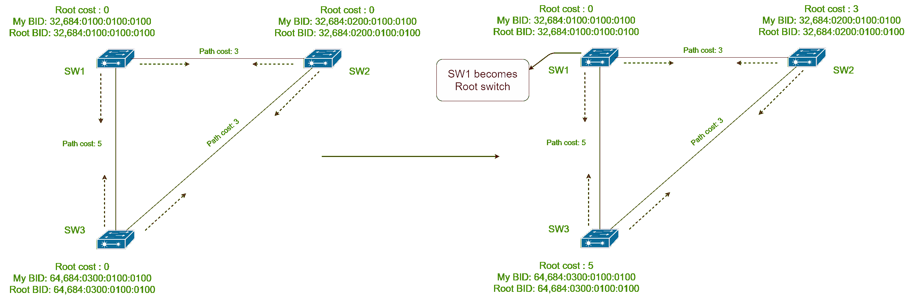
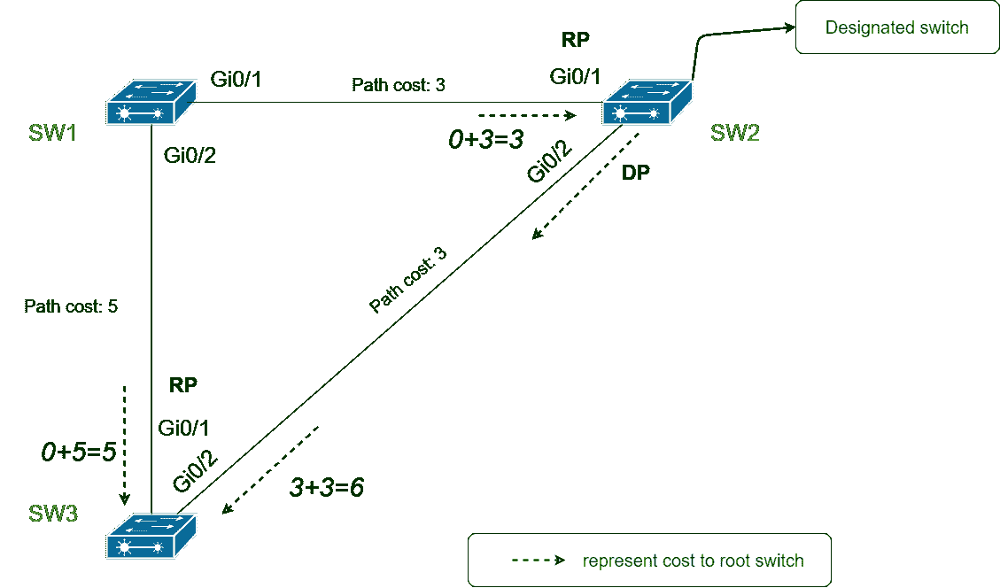

# 生成树协议(STP)的工作

> 原文:[https://www . geesforgeks . org/工作生成树-协议-stp/](https://www.geeksforgeeks.org/working-of-spanning-tree-protocol-stp/)

[生成树协议(STP)](https://www.geeksforgeeks.org/introduction-of-spanning-tree-protocol-stp/) 通过将交换机接口置于转发或阻塞状态来防止帧循环。

交换机如何决定哪个接口应该处于转发或阻塞状态。我们将在本文中学习这个问题的答案。在我们继续之前，我们必须了解一些条款。

*   **BID–**
    代表桥牌 ID。它是每个交换机独有的 8 字节值。前两个字节是优先级字节，其余六个字节包含交换机的内置 MAC 地址。
*   **路径成本–**
    是根据接口速度给两个接口之间的链接赋予的数值。链接速度越高，成本越低。

*   **BPDU –**
    Bridge protocol data unit is a message that switches exchange b/w them. Commonly used BPDU is Hello. It contains cost and BID.

    **注意–**
    我们使用“桥”这个词，虽然涉及到交换机，因为 STP 是在交换机之前引入的。网桥是第一个使用 STP 的设备。因此，各种术语包括“桥”字。

    为了选择转发和阻塞状态的接口，STP 使用三个标准:

    *   根开关的选择。它的所有接口都处于转发状态。
    *   所有其他非根交换机构成一个根端口。根端口是到根交换机路径开销最小的端口。所有根端口都处于转发状态。
    *   从每台交换机到根交换机的最小路径开销称为该交换机的根开销。在所有交换机中，根开销最小的交换机成为指定交换机。计算根开销的指定交换机端口成为指定端口(DP)。DP 处于转发状态。

    

    | S.no | 港口特征 | 受威胁人民协会指出 |
    | --- | --- | --- |
    | 1. | 根交换机的所有端口 | 转发状态 |
    | 2. | 非根交换机的根端口 | 转发状态 |
    | 3. | 指定港口 | 转发状态 |
    | 4. | 所有其他工作端口 | 阻塞状态 |

    

    **选举根交换机:**
    局域网中的所有交换机相互交换 Hello BPDU。首先，所有交换机都认为自己是根交换机，但根交换机是根据交换机的 BID 选择的。BID 中优先级较低的交换机被选为根交换机。

    如果优先级位被绑定，那么在 Hello BPDU 中具有较低 MAC 地址的交换机被选择为根交换机。在下图中，SW1 在比较了局域网中每台交换机的 BID 后成为根交换机。

    

    
**Figure –** Root switch election

    **在非根交换机上选择根端口:**
    每个交换机中到根交换机的路径开销最小的端口被选为该交换机的根端口。在下图中，SW2 和 SW3 的 Gi0/1 端口被选为根端口(RP)。

    

    
**Figure –** Root port selection on Non-root switches
