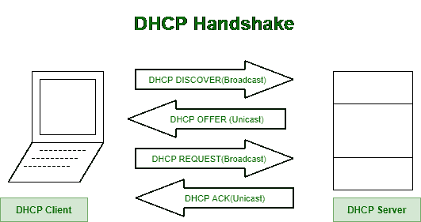

# 网络请求的工作

> 原文:[https://www.geeksforgeeks.org/working-of-web-request/](https://www.geeksforgeeks.org/working-of-web-request/)

要连接到互联网上的网页，以下步骤和协议起着至关重要的作用:

1.  Computer connecting to a network cannot perform anything without an IP address. So, [Dynamic Host Configuration Protocol (DHCP)](https://www.geeksforgeeks.org/dynamic-host-configuration-protocol-dhcp/) runs on client computer to obtain IP address, address of first-hop router, and address of DNS server.

    

    *   **Step-1:** DHCP Server Discovery.
        Here, newly arriving host finds DHCP Server.
        The client sends [DHCP](https://www.geeksforgeeks.org/dhcp-full-form/) to discover message within UDP segment with destination port 67\. UDP packet is encapsulated in an IP datagram with a broadcast IP destination address of 255.255.255.255 and a source IP address of 0.0.0.0 as client doesn’t yet have an IP address.

        DHCP 客户端将 IP 数据报传递给链路层，然后链路层将此帧广播给子网中的所有节点。

    *   **步骤 2:** DHCP 服务器在收到 DHCP 发现消息时响应客户端。
        服务器提供消息包含接收到的发现消息的事务标识、客户端的建议 IP 地址、网络掩码和 IP 地址租用时间(即 IP 地址将有效的时间)。
    *   **步骤 3:** DHCP 请求。
        客户端响应其 DHCP 请求消息，回显配置参数。
    *   **第 4 步:** DHCP 确认。
        DHCP 服务器创建包含客户端 IP 地址的 DHCP 确认。客户端的第一跳路由器的 IP 地址、域名系统服务器的名称和 IP 地址。
2.  客户端接收包含 DHCP ACK 的以太网帧，从以太网帧中提取 IP 数据报，从 IP 数据报中提取 [UDP 段](https://www.geeksforgeeks.org/user-datagram-protocol-udp/)，最后从 UDP 段中提取 DHCP ACK 消息。客户端记录其 IP 地址，域名服务器的 IP 地址。它还会在转发表中添加一个默认网关地址的条目。
3.  客户端操作系统创建包含网页域名的 DNS 查询消息。该域名系统查询消息被封装在 UDP 段中，该段被进一步放入带有源 IP 地址和[域名系统服务器](https://www.geeksforgeeks.org/domain-name-server-dns-in-application-layer/)在 DHCP 确认中返回的 IP 地址的 IP 数据报中。最后，封装到以太网帧中。
4.  客户端不知道网关路由器的媒体访问控制地址。为了获取第一跳路由器和本地 DNS 服务器的 MAC 地址，客户端使用 **[ARP 协议](https://www.geeksforgeeks.org/how-address-resolution-protocol-arp-works/)。**
    *   **步骤-1:** ARP 查询消息。
        客户端在[以太网帧](https://www.geeksforgeeks.org/ethernet-frame-format/)内创建此消息，广播目的地址为 FF:FF:FF:FF:FF，并将其发送到交换机，交换机再广播到所有连接的设备。
    *   **Step-2:** ARP Reply Message –
        On receiving ARP Query Message, router replies with ARP Reply Message giving [MAC Address](https://www.geeksforgeeks.org/difference-between-mac-address-and-ip-address/) of router interface.

        现在，客户端在以太网帧中有地址，并将该帧发送到交换机，交换机将该帧传送到网关路由器。

5.  从校园网转发到康卡斯特网络的 IP 数据报，使用 [RIP](https://www.geeksforgeeks.org/routing-information-protocol-rip/) 、 [OSPF](https://www.geeksforgeeks.org/open-shortest-path-first-ospf-protocol-fundamentals/) 、IS-IS 和/或 [BGP](https://www.geeksforgeeks.org/border-gateway-protocol-bgp/) 路由协议创建的转发表路由到 DNS 服务器。
6.  接收 IP 数据报的域名系统服务器提取域名系统查询消息并查找网页。域名系统服务器创建包含主机名到 IP 地址映射的**域名系统回复消息**，并将域名系统回复消息封装在 UDP 段中，并进一步封装在带有客户端 IP 地址的 IP 数据报中。IP 数据报被转发回客户端。
7.  由于客户端已经收到网页的 IP 地址，现在它将发送 **HTTP 请求**，尽管“第一跳路由器”网页不在本地 DNS 服务器中。要发送 HTTP 请求，客户端首先打开**到网络服务器的 TCP 套接字**，通过三方握手**建立 TCP 连接(SYN - >确认- > SYNACK)。**
8.  HTTP 请求消息被分段并封装成 IP 数据报，再进一步封装成以太网帧，最后发送到第一跳路由器。收到帧后，路由器将它们向上传送到 IP 层，检查路由表，并通过正确的接口转发数据包。
9.  当接收到 IP 数据包时，托管网页的服务器将通过 HTTP 响应消息将网页发送回客户端。
10.  HTTP 响应消息将被封装到 [TCP](https://www.geeksforgeeks.org/tcp-ip-model/) 数据包中，并进一步封装到 IP 数据包中，通过跟随 IP 路由器，消息将到达我们的第一跳路由器，然后该路由器通过将数据包封装到以太网帧中将数据包转发给客户端。