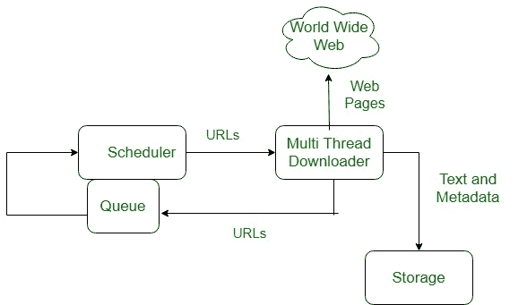

# 万维网(WWW)

> 原文:[https://www.geeksforgeeks.org/world-wide-web-www/](https://www.geeksforgeeks.org/world-wide-web-www/)

**万维网**简称 WWW，俗称网络。万维网是由欧洲核子研究中心于 1989 年发起的。

**历史:**
这是一个由蒂莫西·伯纳尔(Timothy Berner)的李(Lee)在 1989 年创建的项目，目的是让研究人员在欧洲核子研究中心有效地合作。是一个名为万维网联盟(W3C)的组织，它是为网络的进一步发展而开发的。这个组织由蒂姆·伯纳尔的李指导，他也被称为网络之父。

**系统架构:**
从用户的角度来看，网络是由一个巨大的、遍布全球的文档或网页连接组成的。每个页面都可能包含指向世界任何地方的其他页面的链接。网页可以使用浏览器进行检索和查看，其中流行的有 internet explorer、Netscape Navigator、Google、Chrome 等。浏览器获取请求的页面，解释页面上的文本和格式化命令，并在屏幕上显示正确格式化的页面。

网络工作的基本模型如下图所示。这里，浏览器正在客户端机器上显示网页。当用户点击链接到 abd.com 服务器上的页面的一行文本时，浏览器通过向 abd.com 服务器发送请求页面的消息来跟随超链接。

这里，浏览器在客户端机器上显示网页，当用户点击链接到 abd.com 网页的一行文本时，浏览器通过向 abd.com 服务器发送请求该网页的消息来跟随超链接。

**WWW 的工作:**
万维网基于几种不同的技术:网络浏览器、超文本标记语言(HTML)和超文本传输协议(HTTP)。

网络浏览器用于访问网页。网络浏览器可以定义为在互联网上显示文本、数据、图片、动画和视频的程序。万维网上的超链接资源可以使用网络浏览器提供的软件界面来访问。最初，网络浏览器只用于网上冲浪，但现在它们变得更加普遍。网络浏览器可以用于多种任务，包括进行搜索、邮寄、传输文件等等。一些常用的浏览器是互联网浏览器，Opera Mini，谷歌 Chrome。

**WWW 的特点:**

*   超文本信息系统
*   跨平台
*   分布的
*   开放标准和开源
*   使用网络浏览器为许多服务提供单一界面
*   动态的、互动的和不断发展的。
*   “Web 2.0”

**网页组件:**网页有 3 个组件:

1.  **统一资源定位符(URL):** 作为网络资源的系统。
2.  **超文本传输协议(HTTP):** 指定浏览器和服务器的通信。
3.  **超文本标记语言(HTML):** 定义网页的结构、组织和内容。