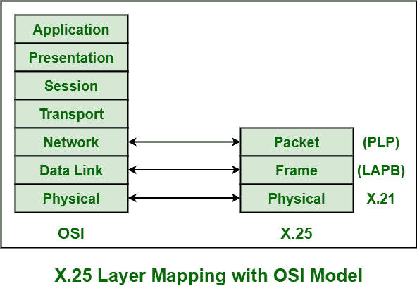
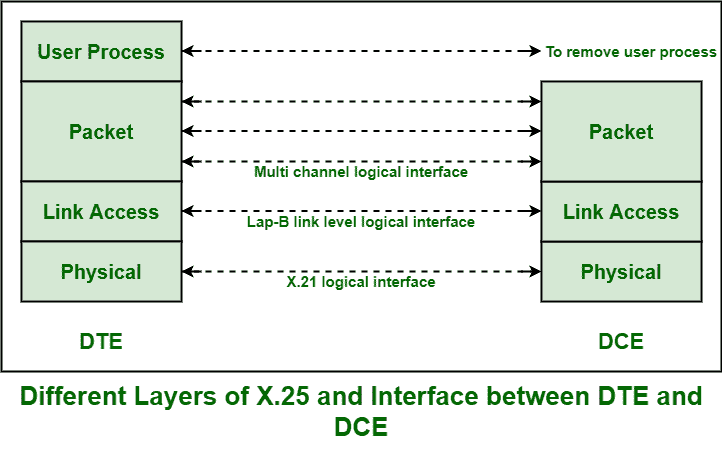

# X.25 结构

> 原文:[https://www.geeksforgeeks.org/x-25-structure/](https://www.geeksforgeeks.org/x-25-structure/)

X.25 通常是由国际电信联盟(国际电联)开发的协议。它通常允许各种逻辑通道使用同一条物理线路。它基本上定义了一系列特别是由国际电联发布的文件。这些文件也被称为 X.25 建议。X.25 还支持通过 multFiplexing 数据包以及借助虚拟通信通道进行各种对话。X.25 基本上包含或适合于网络的[开放系统互连(OSI)](https://www.geeksforgeeks.org/osi-full-form/) 参考模型的下三层。

这三个协议层是:

1.  物理层
2.  框架层
3.  数据包层

这些解释如下。

1.  **Physical Layer :**
    This layer is basically concerned with electrical or signaling. The physical layer interface of X.25 also known as X.21 bis was basically derived from RS-232 interface for serial transmission.

    这一层提供了各种传输或传送一些电信号的通信线路。链接通常需要 X.21 实现者。

2.  **[Data Link Layer](https://www.geeksforgeeks.org/layers-of-osi-model/) :**
    Data link layer is also known as Frame Layer. This layer is an implementation or development of ISO [High-Level Data Link Layer (HDLC)](https://www.geeksforgeeks.org/basic-frame-structure-of-hdlc/) standard which is known as LAPB (Link Access Procedure Balanced). It also provides a communication link and transmission hat is error-free among any two physically connected nodes or X.25 nodes.

    LAPB 还允许 DTE(数据终端设备)或 DCE(数据电路终端设备)简单地开始或结束通信会话或开始数据传输。这一层是 X.25 协议最重要和最基本的部分之一。该层还提供了一种机制，用于在传输过程中检查每一跳。这项服务还确保了面向比特的、无差错的、有序的数据帧或数据包传送。

    有许多协议可用于帧级，如下所示:

    *   **链路接入过程平衡(LAPB)–**
        由 ITU-T 建议 X 指定，通常源自 HDLC。它是最常用的允许建立逻辑连接的协议。
    *   **链路接入协议(LAP)–**
        这个协议很少使用。这通常用于在点对点链路上成帧和传输数据包。
    *   **链路接入程序 D 信道(LAPD)–**
        它用于通过 D 信道传送或传输数据。它还允许通过数据通道在数据终端设备之间传输数据，尤其是在数据终端设备和综合业务数字网节点之间。
    *   **逻辑链路控制(LLC)–**
        用于管理和确保数据传输的完整性。它还允许通过局域网通道传输 x25 数据包或帧。
3.  **Packet Layer :**
    Packet layer is also known as Network Layer protocol of X.25\. This layer generally governs the end-to-end communications among various DTE devices. It also defines how to address and deliver X.25 packets among end nodes and switches on a network with the help of PVCs (Permanent Virtual Circuits) or SVCs (Switched Virtual Circuits). This layer also governs and manages set-up and teardown and also flow control among DTE devices as well as various routing functions along with multiplexing multiple logical or virtual connections.

    该层还定义和解释数据包的格式，以及数据帧的控制和传输过程。该层还负责建立连接、传输数据帧或数据包、结束或终止连接、错误和流量控制、通过外部虚拟电路传输数据包。

    