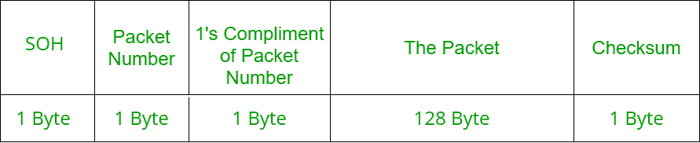

# XMODEM 文件传输协议

> 原文:[https://www . geesforgeks . org/xmodem-file-transfer-protocol/](https://www.geeksforgeeks.org/xmodem-file-transfer-protocol/)

**XMODEM** 是一种文件传输协议，可以让用户在不同的电脑之间传输文件。

**历史:**
XMODEM 是由**沃德·克里斯滕森**在 **1977** 开发的，从那以后共享文件的方法发生了变化。由于实现简单，它在早期的公告板系统(BBS)市场上变得非常流行。然而，随着调制解调器速度的提高，它变得低效。对此的解决方案导致了 XMODEM 的几个修改版本的开发，以提高性能并解决文件共享协议的其他问题。XMODEM 是历史上修改最多的计算机程序。

**功能:**
XMODEM 将原始数据分解成一系列“数据包”，发送给接收方。它还包含附加信息，允许接收器确定该数据包是否被正确接收。如果遇到错误，则在接收方请求后重新发送数据包。由于一串坏包，传输被中止。

下表显示了传输过程中使用的各种符号及其含义–

| 标志 | 描述 |
| 段开销 | 标题的开始 |
| 磁带结束符 | 传输结束符 |
| 命令正确应答 | 承认 |
| (电传等的)否定应答(negative acknowledge) | 不承认 |
| 信息组传送结束(End of Transmission Block) | 字组传送结束字符 |
| 能 | 取消 |

**包结构:**
XMODEM 的原始包结构如下–

**校验和**是以 256 为模的数据包中所有字节的总和。换句话说，它可以通过丢弃求和结果中除八个最低有效位以外的所有位来计算。就这样。例如，如果对仅包含两个字节的微小数据包使用这种校验和方法，其中两个字节携带值 130 和 130，则这些代码的总和为 260，得到的校验和为 4。这确保校验和仅存储在 8 位。

**传输方法:**
传输由接收器驱动，即在接收器发送初始 ***NAK*** 之前，发射器不会发送任何数据。发射机等待，直到接收机发送一个 ***NAK*** 字节。 ***NAK*** 字节是接收器准备启动的信号。这是显示文件传输准备开始的初始字节。如果接收器花费太长时间或发生错误，则发送器将停止等待或“超时”。

如果超时，文件传输将重新开始。如果由于缺少***【EOT】***字符，接收方在 10 秒内未收到有效数据包，但仍在等待数据，则发送***【NAK】***。

接收器执行以下任务，一次传输一个数据包–

1.  它检查发送的包号是否与实际包号匹配，即在包中检查第 2 个字节。如果出现任何差异，它会发送一个***【CAN】***字节来取消传输。
2.  它将 1 的补码和第 3 位及第 2 位的包号相加，以检查它们的总和是否为 255。如果出现任何差异，它会发送一个***【CAN】***字节来取消传输。
3.  数据包的校验和在检索后计算，并与数据包末尾从发送方收到的校验和进行比较。如果条件 SUM = CHECKSUM 为真，则接收器向发射器发送一个 ***确认*** 字节，这是按顺序发送下一个数据包的指示。如果条件不满足，则发送一个 ***NAK*** 字节，指示发送器再次发送该字节。

**传输完成:**
如果发送方发送 ***EOT*** 字节而不是 ***SOH*** 字节，则接收方发送 ***NAK*** 字节。

如果紧接着发送器发送另一个***【EOT】***，则接收器发送一个 ***ACK*** 字节，传输完成。接收器能够通过发送一个 ***CAN*** 字节来随时取消传输，而发送器只能通过发送一个 ***CAN*** 字节来取消块之间的传输。