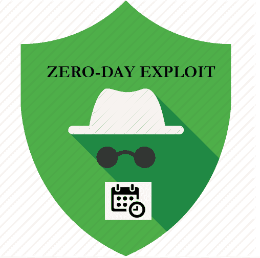
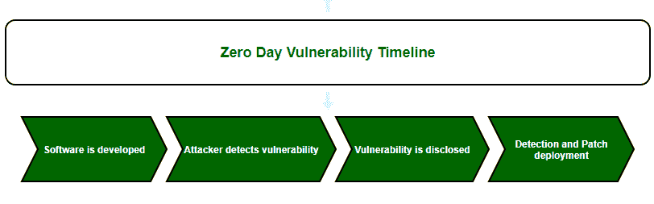

# 零日利用(网络安全攻击)

> 原文:[https://www . geesforgeks . org/zero-day-exploit-cyber-security-attack/](https://www.geeksforgeeks.org/zero-day-exploit-cyber-security-attack/)

在这个信息技术时代，大多数网络空间容易受到不同类型的攻击。

**零日利用**是一种网络安全攻击，发生在制造商检测到软件、硬件或固件缺陷的同一天。因为安全漏洞上次被利用已经是零天了，所以攻击被称为零天利用或零天攻击。这种网络攻击被认为是危险的，因为开发者没有机会修复这个缺陷。零日攻击通常针对大型组织、政府部门、固件、硬件设备、[物联网](https://www.geeksforgeeks.org/internet-of-things-and-careers-in-iot/)、能够访问有价值业务数据的用户等。

**零日漏洞利用的工作方式:**
在不知道存在安全漏洞的情况下开发和发布软件。攻击者在开发人员识别或修复该漏洞之前识别或利用该漏洞。尽管该漏洞仍然是开放且未修补的，但黑客会利用这种情况发布恶意软件来攻击该软件。攻击者攻击目标后，公众或开发人员会识别攻击并尝试找出补丁。开发人员确定修复并发布更新，以安全保护其新用户。

**零日利用检测:**
检测到零日利用的概率很小，或者换句话说，攻击没有留下检测的机会。但是很少有方法可以识别现有的已知漏洞。

1.  **基于签名–**
    在该方法中，可以借助模式匹配检测已知漏洞的出现模式。尽管这种方法无法检测用于零日攻击的恶意软件代码，但它能够检测到可能导致零日漏洞的已知攻击，如 SQL 注入攻击。虽然开发人员可能无法检测零日攻击，但系统防火墙可能能够检测并防御少数已知的特定攻击类型，如 [XSS](https://www.geeksforgeeks.org/what-is-cross-site-scripting-xss/) 、 [SQL 注入](https://www.geeksforgeeks.org/sql-injection-2/)等。
2.  **统计技术–**
    通过监控正常活动，该技术学习网络的正常行为。当系统发现任何偏离正常配置文件的情况时，它将检测到漏洞的可能性。
3.  **基于行为的–**
    基于行为的检测的实现通常依赖于“蜜罐”。蜜罐是一种安全机制，用于检测黑客或黑客企图的存在。
4.  **混合技术–**
    这种混合技术利用了统计、行为和传统的基于签名的防御机制的优势。它们相对更有效，因为任何单一检测技术的弱点都不会破坏安全性。

**零日漏洞利用预防:**
由于零日漏洞利用不易被发现，因此零日漏洞利用的预防变得困难。几乎没有任何方法可以防止零日利用，因为我们事先对它的发生没有任何概念。

我们可以选择以下任何策略来降低风险:

*   [IP 安全协议(IPSec)](https://www.geeksforgeeks.org/ip-security-ipsec/) 的实现。
*   虚拟局域网的使用。
*   部署[入侵检测系统(IDS)](https://www.geeksforgeeks.org/intrusion-detection-system-ids/) 或[入侵防御系统(IPS)](https://www.geeksforgeeks.org/intrusion-prevention-system-ips/) 。
*   网络访问控制协议的使用。
*   安全方案的使用，如保护无线电脑网络安全系统 2。
*   保持所有系统最新。
*   执行定期漏洞扫描。

**零日利用的示例案例:**

*   **CVE-2016-4117–**
    这次零日攻击利用了 Adobe Flash Player 中一个以前未被发现的缺陷。
*   **CVE-2016-0167–**
    这是针对 win32k Windows 图形子系统微软 Windows 的特权提升攻击。
*   **CVE-2017-0199–**
    这次零日攻击利用了 Microsoft Office RTF 文档中一个以前未公开的漏洞。
*   **Stuxnet 蠕虫–**
    这种零日攻击，目标是监控和数据采集(SCADA)系统。