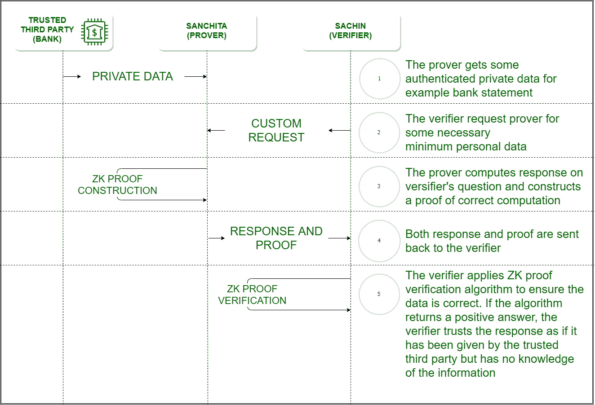

# 零知识证明

> 原文:[https://www.geeksforgeeks.org/zero-knowledge-proof/](https://www.geeksforgeeks.org/zero-knowledge-proof/)

**零知识证明(ZKP)** 是最初由麻省理工学院研究人员沙菲·戈德瓦瑟、希尔维奥·米卡利和查理斯·拉考夫在 20 世纪 80 年代提出的加密方案。

零知识协议是概率性的评估，这意味着它们不能像简单地披露全部信息那样肯定地证明某件事。它们提供了不可链接的信息，可以一起显示断言的有效性是可能的。

目前，网站将用户密码作为输入，然后将其哈希与存储的哈希进行比较。同样，银行要求您的信用评分为您提供贷款，让您的隐私和信息泄露风险由主机服务器控制。如果可以使用 ZKP，则验证者不知道客户端的密码，并且登录仍然可以被验证。在 ZKP 之前，我们总是质疑证明者的合法性或证明系统的合理性，但 ZKP 质疑验证者的道德。如果验证者试图泄露信息怎么办？

**例-1:一个色盲的朋友和两个球:**
有两个朋友萨钦和桑奇塔，其中桑奇塔是色盲。萨钦有两个球，他需要证明两个球的颜色不同。桑奇塔在背后随机切换球，并展示给萨钦，萨钦必须告诉她球是否被切换。如果球的颜色相同，而萨钦提供了错误的信息，他回答正确的概率是 50%。当活动重复几次时，萨钦用错误信息给出正确答案的概率明显较低。在这里，萨钦是“证明者”，桑奇塔是“验证者”。颜色是要执行的算法的绝对信息，它被证明是可靠的，而不会向验证者透露颜色信息。

**示例-2:寻找瓦尔多:**
寻找瓦尔多是一个游戏，你必须从上面拍摄的一大群人的快照中找到一个叫瓦尔多的人。萨钦有一个寻找瓦尔多的算法，但他不想把它透露给桑奇塔。桑奇塔想购买算法，但需要检查算法是否有效。萨钦在纸板上切了一个小洞，放在沃尔多的上方。萨钦是“证明者”，桑奇塔是“验证者”。算法是在零知识的情况下证明的。

**零知识证明的性质:**

*   **零知识–**
    如果该语句为真，验证者将不会知道该语句或曾经是。这里的语句可以是绝对值，也可以是算法。
*   **完整性–**
    如果陈述是真实的，那么诚实的验证者最终会被说服。
*   **可靠性–**
    如果证明者不诚实，他们就无法让验证者相信证据的可靠性。

**零知识证明类型:**

1.  **交互式零知识证明–**
    它要求验证者不断询问一系列关于证明者所拥有的“知识”的问题。上面找到沃尔多的例子是交互式的，因为“证明者”做了一系列的动作来向验证者证明知识的正确性。
2.  **非交互式零知识证明–**
    要让“交互式”解决方案发挥作用，验证者和证明者都需要同时在线，这使得在现实世界的应用中难以扩展。非交互式零知识证明不需要交互式过程，避免了共谋的可能性。它需要挑选一个散列函数来随机挑选验证者的挑战。1986 年，菲亚特和沙米尔发明了菲亚特-沙米尔启发式，成功地将交互式零知识证明转变为非交互式零知识证明。