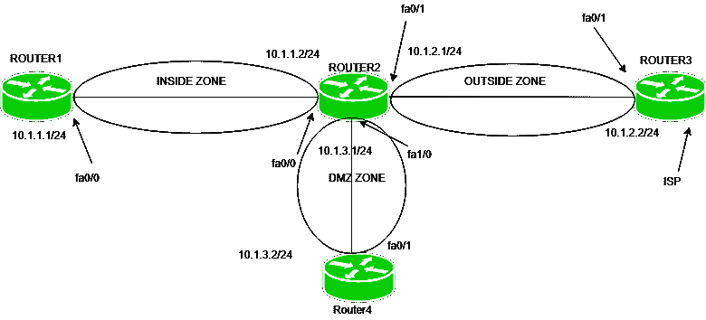

# 基于区域的防火墙配置

> 原文:[https://www . geesforgeks . org/基于区域-防火墙-配置/](https://www.geeksforgeeks.org/zone-based-firewall-configuration/)

先决条件–[基于区域的防火墙](https://www.geeksforgeeks.org/computer-network-zone-based-firewall/)
基于区域的防火墙是状态防火墙的一种高级方法。在有状态防火墙中，包含源 IP 地址、目标 IP 地址、源端口号和目标端口号的条目是为有状态数据库中受信任(私有)网络生成的流量维护的。这将只包括使用状态数据库的私有(受信任)网络的响应流量。

**基于区域的防火墙程序:**

1.  **创建区域并为其分配接口–**
    在基于区域的防火墙中，会创建逻辑区域。一个区域被分配给一个接口。默认情况下，不允许从一个区域到另一个区域的流量。
2.  **创建类别映射–**
    创建区域后，会创建一个类别映射策略，该策略将识别应用策略的流量类型，如 ICMP。
3.  **创建策略地图并将类别地图分配给策略地图–**
    在类别地图中识别流量类型后，我们必须定义必须对流量采取的操作。该操作可以是:
    *   **检查:**与 CBAC 检查相同，即只允许来自被检查的外部网络的流量(内部(可信)网络的返回流量)。
    *   **丢弃:**这是所有流量的默认操作。策略映射中配置的类别映射可以配置为丢弃不需要的流量。
    *   **通行:**这将允许从一个区域到另一个区域的交通。与检查操作不同，它不会为流量创建会话状态。如果我们想允许来自相反方向的流量，应该创建相应的策略。
4.  **配置区域对并分配策略–**
    区域对仅针对一个方向进行配置。策略定义了识别哪些流量(什么类型的流量)，然后应采取什么措施(拒绝检查、允许)。然后，我们必须将此策略应用于区域对。

**配置:**



如图所示，4 台路由器相互连接，即路由器 1 的 fa0/0 接口上有 ip 地址 10.1.1.1/24，路由器 2 的 fa0/0 接口上有 IP 地址 10.1.1.2/24，fa0/1 接口上有 10.1.3.1/24，路由器 3 的 fa0/1 接口上有 IP 地址 10.1.2.2/24，路由器 4 有 10 . 1 . 3 . 1/24

首先，我们必须执行路由，以便路由器可以相互连接。
在路由器 2 上配置 RIP:

```
Router2(config)#router rip
Router2(config-router)#network 10.1.1.0
Router2(config-router)#network 10.1.2.0
Router2(config-router)#network 10.1.3.0
Router2(config-router)#no auto-summary

```

现在，给出路由器 1 上的默认路由:

```
Router1(config)#ip route 0.0.0.0 0.0.0.0 10.1.1.2 
```

给出路由器 2 上的默认路由

```
Router3(config)#ip route 0.0.0.0 0.0.0.0 10.1.2.1
```

在路由器 4 上给出默认路由

```
Router4(config)#ip route 0.0.0.0 0.0.0.0 10.1.3.1
```

现在，我们必须在 RIP 中重新分发默认路由:

```
Router2(config)#router rip
Router2(config-router)#default-information originate 
```

这些路由器将能够相互 ping 通。
现在，配置基于区域的防火墙。
在这种情况下，我们将只允许从内部区域到外部区域的 ICMP 流量和 telnet 流量。

为了完成这项任务，将采取以下步骤:

1.  **Create zones and assign interfaces to zone –**
    First, we have to configure a name for zone and then apply it to the interface (here, Router2). Configuring the zones and name them as inside, outside and dmz.

    ```
    Router2(config)#zone security inside
    Router2(config-sec-zone)#exit 
    Router2(config)#zone security outside 
    Router2(config-sec-zone)#exit
    Router2(config)#zone security dmz 
    Router2(config-sec-zone)#exit
    ```

    现在，将区域应用于接口。

    ```
    Router2(config)#interface fa0/0
    Router2(config-if)#zone-member security inside
    Router2(config)#interface fa0/1
    Router2(config-if)#zone-member security outside
    Router2(config)#interface fa1/0
    Router2(config-if)#zone-member security dmz
    ```

    将区域应用到接口后，路由器将无法相互 ping 通，因为默认情况下，从一个区域到另一个区域的流量将被丢弃(根据默认策略)。

2.  **Create a class-map –**
    Class-map will be created to identify the type of traffic in which we want to perform the operation.
    Configuring class-map stating the type of traffic on which inspection will be performed.

    ```
    Router2(config)#class-map type inspect match-any in-out
    Router2(config-cmap)#match protocol icmp
    Router2(config-cmap)#match protocol telnet
    ```

    match-any 表示类映射中的任何语句匹配，例如，对于 telnet 或 ICMP。我们已经给班级地图命名了。

3.  **Create policy-map and apply class-map to the policy-map –**
    Policy-map will be configured to mention what operation (inspect, drop or pass) will be performed. In our scenario, we will use inspect i.e only that traffic will enter from outside to inside zone if it has an entry in stateful database (replies of traffic initiated in inside zone).

    ```
    Router2(config)#policy-map type inspect in-out
    Router2(config-pmap)#class in-out
    Router2(config-pmap-c)#inspect
    ```

    在这里，我们已经配置了一个名为 input 的策略映射，并为它分配了一个类映射(名为 in-out)，将要采取的操作是 inspect。
    这里我们取了类图和策略图的同名。可以取不同的名字，但那样会很复杂。

4.  **Create zone-pair and apply policy-map to the zone-pair –**
    Create zone pair specifying the source and the destination zone and apply the policy-map to the zone-pair.

    ```
    Router2(config)#zone-pair security in-outpair source inside destination outside
    Router2(config-sec-zone-pair)#service-policy type inspect in-out
    ```

    这里，在第一个命令中，请注意 in-outbir 是区域对的名称，其中内部区域将是源，外部区域将是目标。

    这意味着已经在从内部区域到外部区域的方向上定义了区域对。在第二个命令中，in-out 是策略映射的名称。
    现在，内部区域将对外部区域设备进行 ping 和 telnet，但反之亦然，我们必须定义单独的区域对。此外，请注意，内部区域设备将能够到达外部区域设备，但不能到达 DMZ 区域，因为没有为其定义区域对。