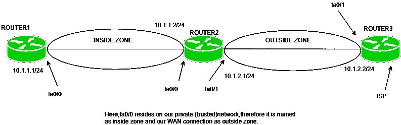
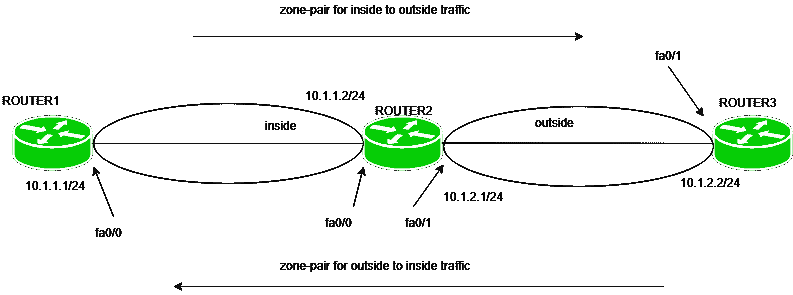

# 基于区域的防火墙

> 原文:[https://www.geeksforgeeks.org/zone-based-firewall/](https://www.geeksforgeeks.org/zone-based-firewall/)

防火墙是一种网络安全系统，它根据定义的规则监视传入或传出的数据包并采取相应的措施。它可以是硬件设备或软件。

负担不起硬件防火墙设备的组织使用替代方案，即通过使用 CBAC 或基于区域的防火墙在思科 IOS 路由器上实施防火墙功能。CBAC 是基于区域的防火墙的前身。

**基于区域的防火墙–**
基于区域的防火墙是状态防火墙的一种高级方法。在有状态防火墙中，维护有状态数据库，其中记录了源 IP 地址、目的 IP 地址、源端口号、目的端口号。因此，仅允许回复，即如果流量是从网络内部生成的，则仅允许来自网络外部的回复(网络内部流量)。

思科 IOS 路由器可以通过两种方法做成防火墙:

1.  通过使用 CBAC:创建一个访问列表，并将其应用于接口，记住什么流量应该被允许或拒绝，以及在什么方向。这对管理员来说有额外的开销。
2.  使用基于区域的防火墙。

**条款:**

**1。区域–**区域是具有相同信任级别的设备所在的逻辑区域。创建区域后，会为区域分配一个接口。默认情况下，不允许从一个区域到另一个区域的流量。

例如，首先，我们创建一个名为 inner 的区域，然后如果路由器接口 fa0/0 位于我们称为 inner 的最受信任的网络上，那么 fa0/0 将被分配给 inner 区域。

**2。区域对–**策略定义了识别哪些流量(什么类型的流量)，然后应该采取什么措施(拒绝检查、允许)。然后，我们必须将这些策略应用于区域对。区域对总是单向的。如果我们想让它双向，那么我们必须创建另一个区域对。

例如，我们希望允许流量从网络内部流向外部，然后我们必须创建一个区域对。如果我们选择了检查操作，那么如果流量是从内部网络生成的(状态过滤)，则允许从网络外部进行回复。

现在，如果我们想让外部流量能够到达内部网络，那么我们必须创建一个单独的区域对。如果流量是从外部网络生成的，则该区域对将允许流量到达内部网络。

**3。自我区域–**无论发送到哪个设备，发往路由器本身的流量都称为自我区域。路由器产生的流量称为来自自身区域的流量。去往路由器的流量被视为去往自我区域的流量。默认情况下，允许进出自我区域的流量，但是可以根据应用的策略进行更改。

**工作:**
首先，定义并命名分区。尽管如此，我们可以通过有意义的命名约定给出任何名称，将区域命名为内部、外部和非军事区。

*   **内部:**最值得信任的(私有)网络。
*   **外部:**最不可信(公共)的网络。
*   **DMZ:** (公共区域)包含服务器等设备。

现在，由于已经命名了区域，因此创建了策略，这些策略将包括允许生成什么类型的流量并允许流量从网络内部通过到网络外部，以及应该对流量采取什么操作(如检查[状态检查])。

这些操作可以是:

*   **inspect:** 将在状态数据库中为协议(已应用策略)创建一个条目，以便回复(针对内部网络)可以返回。
*   **丢弃:**如果流量与策略不匹配，默认操作。
*   **通行:**允许从一个区域到另一个区域的交通，但不维持任何会话。

由于默认策略，与策略不匹配的流量将被丢弃。这些策略将为区域对中的一个方向(如从内向外)定义。

如果条件要求允许在两个方向(网络内部到外部和网络外部到内部)生成初始流量，则将创建两个独立的区域对并应用独立的策略。

**优势–**一些优势是:

1.  默认情况下，与 CBAC 不同的是，交通被封锁。在基于区域的防火墙中，不允许从一个区域到另一个区域的流量，而在 CBAC，如果没有应用显式 ACL，则允许所有流量。
2.  与 CBAC 不同，基于区域的防火墙并不严重依赖 ACL。
3.  添加另一个接口很容易，因为只需声明接口所属的区域，因为所有策略都与之前为该区域显式应用的策略相同。