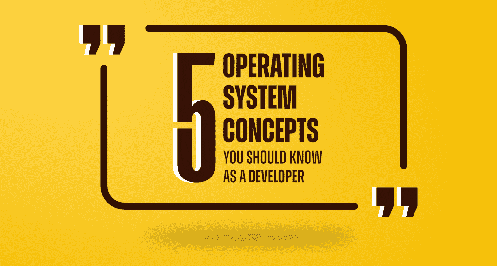

# 作为开发人员应该了解的 5 个操作系统概念

> 原文:[https://www . geesforgeks . org/5-操作系统-概念-作为开发人员您应该知道/](https://www.geeksforgeeks.org/5-operating-system-concepts-you-should-know-as-a-developer/)

作为一名开发人员，你可能已经将你的技能集中在解决问题和数据结构上。毫无疑问，这是最基本的技能之一。除此之外，你有没有试过知道还有什么更重要？假设您正在执行一个代码，但是您的程序运行太慢。你检查你的代码，你发现你的代码没有任何问题。这背后的原因可能是什么？

原因之一可能是你的操作系统。如果你需要调试你的程序，那么如果你不知道你的操作系统是如何工作的，你会怎么做呢？可能是您访问了太多文件，内存不足或交换使用率高。要解决这个问题，您当然需要了解交换或输入/输出阻塞。

你将如何与你的机器沟通？你更喜欢本地的，还是会在网上做？你有没有试过知道为什么有些程序员喜欢一个操作系统胜过另一个？

从以上所有对话中，您可能已经理解了为什么学习操作系统很重要。作为一名开发人员，我们应该理解操作系统的重要性。今天在这个博客中，我们将讨论一些操作系统的重要概念，这些概念将有助于你作为开发人员的工作。

### 1.[流程和流程管理](https://www.geeksforgeeks.org/operating-systems-gq/process-synchronization-gq/)

这个过程基本上被定义为一个正在执行的程序。这个过程应该按顺序执行。当你在一个文本文件中编写一个计算机程序，当你执行这个程序时，它就变成了你系统中的一个进程。这个过程执行程序中提到的所有任务。一个进程主要分为四个部分:堆栈、堆、文本和数据。

*   **Stack:** Stack 负责存储函数/方法参数等临时数据。它返回地址和局部变量。
*   **堆:**堆在进程运行时动态地将内存分配给进程。
*   **文本:**文本包括由程序计数器的值和存储在处理器寄存器中的数据表示的当前活动。
*   **数据:**包含全局和静态变量。

一个进程主要通过五种不同的状态…开始、就绪、运行、等待、终止或退出。

### 2.[螺纹概念](https://www.geeksforgeeks.org/thread-in-operating-system/)

您可以将线程定义为流程代码中的执行流。线程在程序计数器中记录下一步需要执行的所有指令。此外，线程包含保存当前工作变量的系统寄存器。在线程中，堆栈包含执行历史。

线程可以与其对等线程共享代码段、数据段和打开的文件。当一个代码段被一个线程改变时，所有其他线程都会看到。线程也称为轻量级进程。通过并行性可以提高应用程序的性能。

一个线程恰好属于一个进程，任何线程都不能存在于一个进程之外。线程通常用于实现 web 服务器和网络服务器。主要有两种线程…

**用户级线程:**在这个级别的线程中，线程管理内核并不知道线程的存在。线程库还维护创建和销毁线程的代码。它还包含用于在线程之间传递消息和数据的代码。还维护了用于调度线程执行和恢复线程上下文的代码。

**内核级线程:**线程级管理由内核完成。在应用程序区域，您不会找到线程管理代码。操作系统直接支持它。

内核还维护单个线程和整个进程的上下文信息。调度也是基于线程完成的。内核负责创建、调度和管理内核空间。

### 3.[调度](https://www.geeksforgeeks.org/cpu-scheduling-in-operating-systems/)

在调度中，进程管理器负责从中央处理器中移除正在运行的进程，并根据特定的策略选择另一个进程。对于多道程序设计，操作系统调度是必不可少的部分。一次可以将多个进程加载到可执行内存中。一旦加载，进程就使用时间复用来共享 CPU。

在进程调度队列中，操作系统维护所有的进程控制块。操作系统为每个进程状态维护一个单独的队列。处于相同执行状态的所有进程的进程控制块都保持在同一队列中。

您的操作系统主要维护以下重要的进程调度队列:

*   **作业队列:**它负责保存系统中的所有进程
*   **就绪队列:**主内存中所有进程都已就绪，等待执行。
*   **设备队列:**该队列存储由于输入/输出设备不可用而被阻塞的进程

### **4。内存管理**

内存管理是指操作系统处理和管理主内存的功能。在执行过程中，进程在主内存和磁盘之间来回移动。

内存位置由内存管理跟踪。每次它都会检查分配给进程的内存量。它还决定哪个进程在什么时间获得内存。此外，每当内存被释放或未分配时，它都会更新状态。操作系统在内存分配时将逻辑地址映射到物理地址。程序中主要使用三种类型的地址…

*   **符号地址:**用于源代码。变量名、常量和指令标签是符号地址空间的基本元素。
*   **相对地址:**编译时，编译器将符号地址转换为相对地址。
*   **物理地址:**加载程序负责在程序加载到主内存时生成这些地址。

### 5.[进程间通信](https://www.geeksforgeeks.org/inter-process-communication-ipc/)

在操作系统中，进程分为两种类型:独立的和合作的。独立进程不会受到其他进程执行的影响。一个协作进程受到另一个执行进程的影响。

独立进程高效执行，在这些情况下，它们的协作特性被用来提高计算速度、便利性和模块化。在这种机制中，进程被允许相互通信。沟通被视为他们之间的一种合作方式。